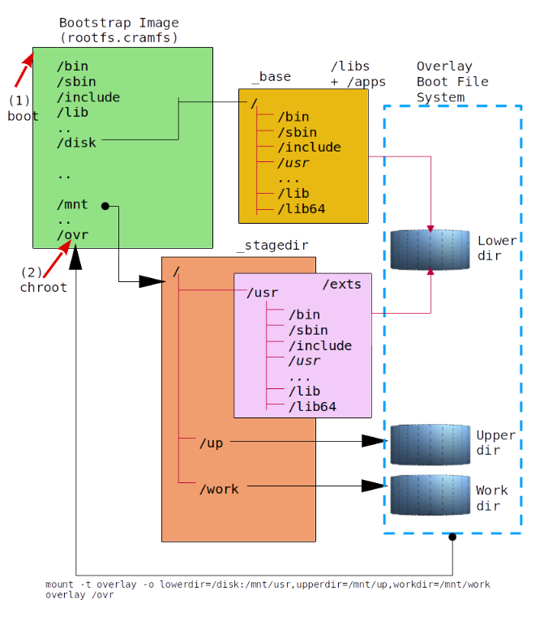

## Table of Contents
1. [Why not Yocto](#whynotyocto)
2. [MicroBSP](#microbsp)
3. [Summary](#summary)
4. [Folder Hieararchy](#folder)
5. [Overlay Root File System](#overlayrootfs)
6. [Setting up Prerequisite Utilities/Libraries](#prereq)
7. [Raspberry PI](#rpi3)
	1. [Poor man's gadgets](#rpi3_component)
	2. [How it looks](#rpi3_look)
	3. [Device operation](#rpi3_operation)
	4. [Booting Shot](#rpi3_boot)
	5. [Procedures](#rpi3_procedures)
		1. [Downloading sources](#rpi3_download)
		2. [Toolchain](#rpi3_toolchain)
		3. [Libraries, Applications, Extra Applications](#rpi3_library)
		4. [Booting Image](#rpi3_bootimage)
		5. [Creating UI image (Embedded QT - Cross-compilation)](#rpi3_ui) 
		6. [Bootable SD Card](#rpi3_sdcard)
		7. [WLAN Configuration](#rpi3_wlan)
		8. [Available Packages](#rpi3_packages)
8. [ASUS Tinker](#tinker)
	1. [Testbed components](#tinker_component)
	2. [How it looks](#tinker_look)
	3. [Device operation](#tinker_operation)
	4. [Booting Shot](#tinker_boot)
	5. [Procedures](#tinker_procedures)
		1. [Downloading sources](#tinker_download)
		2. [Toolchain](#tinker_toolchain)
		3. [Libraries, Applications, Extra Applications](#tinker_library)
		4. [Booting Image](#tinker_bootimage)
		5. [Bootable SD Card](#tinker_sdcard)
		6. [WLAN Configuration](#tinker_wlan)
		7. [Available Packages](#tinker_packages)
9. [MBSP VM](#qemu) 
	1. [Testbed components](#qemu_component)
	2. [Setup](#qemu_setup) 
	3. [Booting Shot](#qemu_boot)
	4. [Procedures](#qemu_procedures)
		1. [Downloading sources](#qemu_download)
		2. [Toolchain](#qemu_toolchain)
		3. [Libraries, Applications, Extra Applications](#qemu_library)
		4. [Platform specfic binaries ( HTTP server, currently )](#qemu_http)
		5. [Booting Image Creation](#qemu_bootimage)
		6. [Partitioning external USB disk](#qemu_partition)
		7. [Running/Stopping "output.iso"](#qemu_control)
	5. [Booting Shot from Linux Kernel 6.6.22](#qemu_boot_linux6622)
	6. [Host Network](#qemu_hostnetwork)
		1. [Realtek WLAN configuration](#qemu_realtek)
			1. [802.11a AP](#qemu_80211a_ap)
			2. [802.11g AP](#qemu_80211g_ap)
		2. [Renaming network interfaces](#qemu_renaming_ubuntu)
		3. [NAT network configuration](#qemu_nat)
		4. [DHCP/DNS configuration](#qemu_dns)
		5. [Host Network Setup Script](#qemu_script)
10. [MilkV RiscV Duo](#milkv)
	1. [Testbed components](#milkv_component)
	2. [Setup](#milkv_setup)
	3. [Booting Shot](#milkv_boot)
	4. [Procedures](#milk_procedures)
		1. [Downloading sources](#milkv_download)
		2. [Toolchain](#milkv_toolchain)
		3. [Libraries, Applications, Extra Applications](#milkv_library)
11. [Selective Compilation](#selective_compile)
12. [How Python](#python)
	1. [Setting up PIP](#python_pip)
	2. [Upgrading PIP](#python_upgrade_pip)


## Why not using Yocto  <a name="whynotyocto"></a>


* **Yocto** must be the strongest player in embedded Linux BSP(Board Support Package) tracks. In programmer's viewpoint, I think the followings are amazing characteristics of the Yocto.   
  - The greatest attraction of the Yocto is fully automatic build dependency setup. - Just user simply specify dependency with a keyword "DEPENDS", and the Yocto constructs full dependency tree and tries to build from the bottom nodes of the tree. 
  - QEMU basis cross compilation strategy provides a total environmental separation from host machine, which will not be interfered/conflicted with host machine environment.
  - No occurrence of root access authentication during compilation. - None of CLI commands beginning with "sudo" .
  - Packaging is also supported in various forms; rpm, ipk, .. 
 
* Many detail operations of Yocto are totally implemeted/abstracted from "Python" classes, and it is not easy to fully digest how they work. 

* Final usages of BSP sources for embedded system are usually limited to 2 or 3 such as cross compiler generation, building applications, required utilities and the creation of final image to be downloaded into embedded board. 


## MicroBSP  <a name="microbsp"></a>

* I want to set up simple Linux basis embedded board BSP for both **Raspberry PI 3** and **VM image (based on QEMU)M** - Yocto might be a big cat to come with for catching up these mices under coverage of my private preferences; just for build/compile/...

* **Raspberry PI** is the cheapest embedded board I can purchase easily from Amazon in less than $40, and **MBSP VM** can be easily activated in Ubuntu Linux installed PC. -  For poor system programmer like me, Raspberry PI becomes the right answer. **MBSP VM** is simply working with QEMulator.

* I want the BSP to keep folder/source structure to be easily hacked/manipulated. 

* I don't want fancy desktop environment since I have no extra mouse and keyboard to use with the raspberry pi. HDMI monitor for the PI ? Oh.. no its more than $100 on Amazon. Just simple UART connection with the embedded board will be good for me. 

* **MicroBSP** can be used for 
	- Quick verification of GNU applications in embedded environment 
	- Fast evaluation of embedded application 
	- Fast evaluation of Linux kernel features 

* MicroBSP is to assist the needs for my private individual reason and public share purposes based on its inherent flexibility and simplicity.

## Summary <a name="summary"></a>


* MicroBSP vs. Yocto 

|           | Yocto     |  MicroBSP       |
|-----------|-----------| --------------- |
| Host Cross Toolchain | Yes       |  Yes            |
| Native Cross Toolchain | Yes       |  Yes            |
| ARM CPU   | Yes       |  Yes            |
| Intel CPU | Yes       |  Yes            |
| 32bit     | Yes       |  No             |
| Packages  | rpm,ipk,..  |  No             |
| Versioning| Yes       |  No             |
| Final Images   | Yes |  Yes             |
| Core/Board Separation    | Yes |  No    |
| Kernel/Application Separation    | No   |  No    |

* 32 bit CPU board was not tested with MicroBSP. 
* Architecture(CPU core) and board is not separated in MicroBSP. - Even board A and board B are using the same core type "Cortex-A53", but we need to use 2 arch layers for both boards.  

* MicroBSP is 100% Makefile based raspberry pi software build tree. 
* Building transaction should begin with <strong>GNU cross toolchain construction</strong>.
* Everything has been tested and proved in <strong>Ubuntu 22.04</strong>.
* The followings are used to compose cross toolchain from MicroBSP. 

|  S/W       | Version  |
|------------|----------|
|   GLIBC    |  2.36    |
|            |  2.38    |
|            |          |
|   GCC      |  11.2.0  |
|            |  13.2.0  |
|            |          |
|  BINUTILS  |  2.38    |
|            |  2.42    |
|            |          |
|   BASH     |  5.1.8   |
|  BUSYBOX   |  1.35.0  |

* Version of each native applications/libraries can be found in corresponding Makefile, and the following simply enumerates a few of those. 

|  S/W       | Version  |
|------------|----------|
| OpenSSL    |  3.0     |
|   GDB      |  11.2    |
|   Perl     |  5.24.1  |
|  Python    |  3.10.8  |

* Linux kernels used for both raspberry pi and MBSP VM are as follows. 

|  Type            | Linux kernel version |
|------------------|----------------------|
| Raspberry PI     |  5.15.x              |
|                  |                      |
| MBSP VM          |  5.17.7              |
|                  |  6.6.22              |
|                  |                      |
| ASUS Tinker      |  5.15.113            |
|                  |                      |
| Milkv Duo        |  6.8.9               |
|                  |                      |

* MicroBSP has **Overlay File System** basis booting policy. 
* Total booting disk image has the following hierarchy. 


## Folder Hierarchy <a name="folder"></a>


The directory hieararchy of MicroBSP is...


```
  # ls -la
  total 260
  drwxrwxr-x 13 todd todd  4096 Nov  6 07:12 .  
  drwxrwxr-x  4 todd todd  4096 Oct 26 13:19 ..
  drwxrwxr-x  7 todd todd  4096 Oct 26 09:18 apps
  drwxrwxr-x  5 todd todd  4096 Oct 23 14:09 arch
  drwxrwxr-x  5 todd todd  4096 Oct 23 14:09 boards
  drwxrwxr-x  2 todd todd  4096 Nov  6 06:46 doc
  drwxrwxr-x 65 todd todd  4096 Nov  2 20:01 exts
  drwxrwxr-x  8 todd todd  4096 Nov  5 21:40 .git
  drwxrwxr-x  8 todd todd  4096 Oct 23 14:11 gnu
  drwxrwxr-x 37 todd todd  4096 Oct 26 09:35 libs
  -rw-rw-r--  1 todd todd 29714 Nov  3 06:51 Makefile
  -rw-rw-r--  1 todd todd 87500 Nov  6 07:12 README.md
  drwxrwxr-x  2 todd todd  4096 Nov  2 22:13 scripts
  drwxrwxr-x 43 todd todd  4096 Oct 25 20:27 uix
  #
```


|  Folders       | Description   |
|----------------|----------|
| **apps/**          | Basic application required for bootstrap disks |
| **libs/**          | Libraries  |
| **exts/**          | Libraries/Applications for high level functions  |
| **uix/**           | Graphic/Multimedia related Libraries/Applications   |


## Overlay Root File Sysyem  <a name="overlayrootfs"></a>


The following shows the structure of root file system constructed by overlay file system mount process. Overlay file system components; lower, upper, work directory is organized with folders in both **_base** and **_stagedir** created after the step **Boot Image Building** .  

|  Dir Type        |  Folders                | 
|------------------|-------------------------|
| Lower dir        |  _base , _stagedir/usr  |
| Upper dir        |  _stagedir/up           |
| Work  dir        |  _stagedir/work         |

- Upper dir and Work dir should be placed in the same disk partition so they are located in the same folder **_stagedir**. 

- **_base** is populated from both libs/ and apps/ in MicroBSP. 
- **_stagedir** is populated from exts/ folder in MicroBSP. 
- Applications in bootstrap image **rootfs.cramfs** is populated from **apps/busybox** . 



- About detail description of **overlay file system** , please refer to [How/What Overlay File System Does](https://www.datalight.com/blog/2016/01/27/explaining-overlayfs-%E2%80%93-what-it-does-and-how-it-works/).

- File system mount is achieved in two steps;
	* First, bootstrap file system is mounted at booting time
	* Second, moves to **/ovr** folder by using **"choot /ovr /etc/rc.init"** for next booting.


## Setting up Prerequisite Utilities/Libraries  <a name="prereq"></a>


- Fundamental libraries/applications will be installed by the following command.
- <strong>This can work in Ubuntu. </strong>

```
  # make installcomps
```

## Raspberry PI  <a name="rpi3"></a>


### Poor man's gadgets <a name="rpi3_component"></a>

* [Raspberry PI 3+](https://www.amazon.com/CanaKit-Raspberry-Complete-Starter-Kit/dp/B01C6Q2GSY/ref=sr_1_6?keywords=raspberry+pi+3%2B&qid=1636520388&qsid=132-7915930-0137541&sr=8-6&sres=B07BCC8PK7%2CB01C6EQNNK%2CB07KKBCXLY%2CB01C6Q2GSY%2CB01LPLPBS8%2CB07BDR5PDW%2CB07BC567TW%2CB07BFH96M3%2CB07N38B86S%2CB0778CZ97B%2CB09HGXHRLQ%2CB08C254F73%2CB08G8QYFCD%2CB01N13X8V1%2CB09HH2BFN4%2CB06W54L7B5)

* [UART Cable for Raspberry PI](https://www.amazon.com/FEANTEEK-TTL232R-Raspberry-Serial-Windows/dp/B08HLSS5T4/ref=sr_1_1_sspa?keywords=raspberry+pi+3%2B+UART+cable&qid=1636520578&sr=8-1-spons&psc=1&spLa=ZW5jcnlwdGVkUXVhbGlmaWVyPUExTEFJTFcwNlNKT0lIJmVuY3J5cHRlZElkPUEwMjc5MjEwTjlUUDBEWEtNTzJTJmVuY3J5cHRlZEFkSWQ9QTA3NDE2NTBMV0xWUDdaRlZFV0gmd2lkZ2V0TmFtZT1zcF9hdGYmYWN0aW9uPWNsaWNrUmVkaXJlY3QmZG9Ob3RMb2dDbGljaz10cnVl )

* [TP-Link USB WiFi Dongle (11ac 5GHz support - 8812bu)](https://www.amazon.com/TP-Link-usb-wifi-adapter-pc/dp/B08D72GSMS/ref=sr_1_1_sspa?crid=3OBFCJQJBXJ6U&keywords=usb+wifi+dongle&qid=1684104205&s=electronics&sprefix=usb+wifi+dongle%2Celectronics%2C150&sr=1-1-spons&psc=1&spLa=ZW5jcnlwdGVkUXVhbGlmaWVyPUEzVkE1NUFQRlJIUFdXJmVuY3J5cHRlZElkPUEwMjkxMDU5MjROQTZPNU83OExBTCZlbmNyeXB0ZWRBZElkPUEwNTgyNjIyMUFFVU1NWEpNMkE1RCZ3aWRnZXROYW1lPXNwX2F0ZiZhY3Rpb249Y2xpY2tSZWRpcmVjdCZkb05vdExvZ0NsaWNrPXRydWU=)

### How it looks <a name="rpi3_look"></a>


### Device operation <a name="rpi3_operation"></a>

* Home Gateway
* LAN
  - Ethernet : Built-in ethernet
  - WLAN1 : Raspberry PI Built-in WLAN (<strong>Broadcom BRCM43455</strong>)
* WAN
  - WLAN0 : TP-Link USB WiFi Dongle (<strong>Realtek RTL8812BU</strong>)
* UART baudrate = 921600bps (not 115200bps)

### Booting Shot <a name="rpi3_boot"></a>

  ```
U-Boot 2022.10-rc3 (May 14 2023 - 15:28:02 -0700)

DRAM:  948 MiB
RPI 3 Model B+ (0xa020d3)
Core:  63 devices, 13 uclasses, devicetree: embed
MMC:   mmc@7e202000: 0, mmc@7e300000: 1
Loading Environment from FAT... Unable to read "uboot.env" from mmc0:1... 
In:    serial
Out:   serial
Err:   serial
Net:   No ethernet found.
Hit any key to stop autoboot:  0 
switch to partitions #0, OK
mmc0 is current device
26828808 bytes read in 1116 ms (22.9 MiB/s)
32533 bytes read in 4 ms (7.8 MiB/s)
Moving Image from 0x80000 to 0x200000, end=1c90000
## Flattened Device Tree blob at 02600000
   Booting using the fdt blob at 0x2600000
   Using Device Tree in place at 0000000002600000, end 000000000260af14

Starting kernel ...

[    0.000000] Booting Linux on physical CPU 0x0000000000 [0x410fd034]
[    0.000000] Linux version 5.15.92-v8 (todd@todd-hppc) (aarch64-any-linux-gnu-gcc (GCC) 11.2.0, GNU ld (GNU Binutils) 2.38) #1 SMP PREEMPT Sun May 14 14:36:56 PDT 2023
[    0.000000] Machine model: Raspberry Pi 3 Model B+
[    0.000000] Reserved memory: created CMA memory pool at 0x0000000037400000, size 64 MiB
[    0.000000] OF: reserved mem: initialized node linux,cma, compatible id shared-dma-pool
[    0.000000] Zone ranges:
[    0.000000]   DMA      [mem 0x0000000000000000-0x000000003b3fffff]
[    0.000000]   DMA32    empty
[    0.000000]   Normal   empty
[    0.000000] Movable zone start for each node
[    0.000000] Early memory node ranges
[    0.000000]   node   0: [mem 0x0000000000000000-0x000000003b3fffff]
[    0.000000] Initmem setup node 0 [mem 0x0000000000000000-0x000000003b3fffff]
[    0.000000] On node 0, zone DMA: 19456 pages in unavailable ranges
[    0.000000] percpu: Embedded 27 pages/cpu s72600 r8192 d29800 u110592
[    0.000000] Detected VIPT I-cache on CPU0
[    0.000000] CPU features: detected: ARM erratum 843419
[    0.000000] CPU features: detected: ARM erratum 845719
[    0.000000] Built 1 zonelists, mobility grouping on.  Total pages: 238896
[    0.000000] Kernel command line: coherent_pool=1M 8250.nr_uarts=1 snd_bcm2835.enable_compat_alsa=0 snd_bcm2835.enable_hdmi=1 video=HDMI-A-1:640x480M@60D vc_mem.mem_base=0x3ec00000 vc_mem.mem_size=0x
40000000  dwg_otg.lpm_enable=0 8250.nr_uarts=1 console=ttyS0,921600 root=/dev/mmcblk0p2 rootfstype=squashfs rootwait
[    0.000000] Dentry cache hash table entries: 131072 (order: 8, 1048576 bytes, linear)
[    0.000000] Inode-cache hash table entries: 65536 (order: 7, 524288 bytes, linear)
[    0.000000] mem auto-init: stack:off, heap alloc:off, heap free:off
[    0.000000] Memory: 857568K/970752K available (13056K kernel code, 2072K rwdata, 4112K rodata, 6848K init, 939K bss, 47648K reserved, 65536K cma-reserved)
[    0.000000] SLUB: HWalign=64, Order=0-3, MinObjects=0, CPUs=4, Nodes=1
[    0.000000] ftrace: allocating 41344 entries in 162 pages
[    0.000000] ftrace: allocated 162 pages with 3 groups
[    0.000000] trace event string verifier disabled
[    0.000000] rcu: Preemptible hierarchical RCU implementation.
[    0.000000] rcu:     RCU event tracing is enabled.
[    0.000000]  Trampoline variant of Tasks RCU enabled.
[    0.000000]  Rude variant of Tasks RCU enabled.
[    0.000000]  Tracing variant of Tasks RCU enabled.
[    0.000000] rcu: RCU calculated value of scheduler-enlistment delay is 100 jiffies.
[    0.000000] NR_IRQS: 64, nr_irqs: 64, preallocated irqs: 0
[    0.000000] Root IRQ handler: bcm2836_arm_irqchip_handle_irq
[    0.000000] arch_timer: cp15 timer(s) running at 19.20MHz (phys).
[    0.000000] clocksource: arch_sys_counter: mask: 0xffffffffffffff max_cycles: 0x46d987e47, max_idle_ns: 440795202767 ns
[    0.000001] sched_clock: 56 bits at 19MHz, resolution 52ns, wraps every 4398046511078ns
[    0.000361] Console: colour dummy device 80x25
[    0.000440] Calibrating delay loop (skipped), value calculated using timer frequency.. 38.40 BogoMIPS (lpj=19200)
[    0.000479] pid_max: default: 32768 minimum: 301
[    0.000644] LSM: Security Framework initializing
[    0.000942] Mount-cache hash table entries: 2048 (order: 2, 16384 bytes, linear)
[    0.000987] Mountpoint-cache hash table entries: 2048 (order: 2, 16384 bytes, linear)
[    0.002523] cgroup: Disabling memory control group subsystem
[    0.006286] rcu: Hierarchical SRCU implementation.
[    0.008209] smp: Bringing up secondary CPUs ...
[    0.009678] Detected VIPT I-cache on CPU1
[    0.009757] CPU1: Booted secondary processor 0x0000000001 [0x410fd034]
[    0.011341] Detected VIPT I-cache on CPU2
[    0.011396] CPU2: Booted secondary processor 0x0000000002 [0x410fd034]
[    0.012933] Detected VIPT I-cache on CPU3
[    0.012983] CPU3: Booted secondary processor 0x0000000003 [0x410fd034]
[    0.013181] smp: Brought up 1 node, 4 CPUs
[    0.013244] SMP: Total of 4 processors activated.
[    0.013264] CPU features: detected: 32-bit EL0 Support
[    0.013283] CPU features: detected: CRC32 instructions
[    0.013838] CPU: All CPU(s) started at EL2
[    0.013913] alternatives: patching kernel code
[    0.015403] devtmpfs: initialized
[    0.034774] Enabled cp15_barrier support
[    0.034831] Enabled setend support
[    0.034863] KASLR disabled due to lack of seed
[    0.035121] clocksource: jiffies: mask: 0xffffffff max_cycles: 0xffffffff, max_idle_ns: 1911260446275000 ns
[    0.035165] futex hash table entries: 1024 (order: 4, 65536 bytes, linear)
[    0.038302] pinctrl core: initialized pinctrl subsystem
[    0.040377] NET: Registered PF_NETLINK/PF_ROUTE protocol family
[    0.050381] DMA: preallocated 1024 KiB GFP_KERNEL pool for atomic allocations
[    0.050950] DMA: preallocated 1024 KiB GFP_KERNEL|GFP_DMA pool for atomic allocations
[    0.052301] DMA: preallocated 1024 KiB GFP_KERNEL|GFP_DMA32 pool for atomic allocations
[    0.052533] audit: initializing netlink subsys (disabled)
[    0.052984] audit: type=2000 audit(0.052:1): state=initialized audit_enabled=0 res=1
[    0.053755] thermal_sys: Registered thermal governor 'step_wise'
[    0.054030] cpuidle: using governor menu
[    0.054352] hw-breakpoint: found 6 breakpoint and 4 watchpoint registers.
[    0.054612] ASID allocator initialised with 65536 entries
[    0.054817] Serial: AMBA PL011 UART driver
[    0.064396] bcm2835-mbox 3f00b880.mailbox: mailbox enabled
[    0.079056] raspberrypi-firmware soc:firmware: Attached to firmware from 2023-03-17T10:52:42, variant start
[    0.080049] raspberrypi-firmware soc:firmware: Firmware hash is 82f3750a65fadae9a38077e3c2e217ad158c8d54
[    0.137920] bcm2835-dma 3f007000.dma: DMA legacy API manager, dmachans=0x1
[    0.143005] SCSI subsystem initialized
[    0.143345] usbcore: registered new interface driver usbfs
[    0.143436] usbcore: registered new interface driver hub
[    0.143527] usbcore: registered new device driver usb
[    0.143926] usb_phy_generic phy: supply vcc not found, using dummy regulator
[    0.144195] usb_phy_generic phy: dummy supplies not allowed for exclusive requests
[    0.144546] pps_core: LinuxPPS API ver. 1 registered
[    0.144567] pps_core: Software ver. 5.3.6 - Copyright 2005-2007 Rodolfo Giometti <giometti@linux.it>
[    0.144604] PTP clock support registered
[    0.146865] clocksource: Switched to clocksource arch_sys_counter
[    0.267374] VFS: Disk quotas dquot_6.6.0
[    0.267499] VFS: Dquot-cache hash table entries: 512 (order 0, 4096 bytes)
[    0.267722] FS-Cache: Loaded
[    0.268014] CacheFiles: Loaded
[    0.281594] NET: Registered PF_INET protocol family
[    0.282019] IP idents hash table entries: 16384 (order: 5, 131072 bytes, linear)
[    0.283508] tcp_listen_portaddr_hash hash table entries: 512 (order: 1, 8192 bytes, linear)
[    0.283567] Table-perturb hash table entries: 65536 (order: 6, 262144 bytes, linear)
[    0.283601] TCP established hash table entries: 8192 (order: 4, 65536 bytes, linear)
[    0.283868] TCP bind hash table entries: 8192 (order: 5, 131072 bytes, linear)
[    0.284080] TCP: Hash tables configured (established 8192 bind 8192)
[    0.284350] UDP hash table entries: 512 (order: 2, 16384 bytes, linear)
[    0.284417] UDP-Lite hash table entries: 512 (order: 2, 16384 bytes, linear)
[    0.284776] NET: Registered PF_UNIX/PF_LOCAL protocol family
[    0.286011] RPC: Registered named UNIX socket transport module.
[    0.286036] RPC: Registered udp transport module.
[    0.286055] RPC: Registered tcp transport module.
[    0.286073] RPC: Registered tcp NFSv4.1 backchannel transport module.
[    0.290141] hw perfevents: enabled with armv8_cortex_a53 PMU driver, 7 counters available
[    1.623074] Initialise system trusted keyrings
[    1.623549] workingset: timestamp_bits=46 max_order=18 bucket_order=0
[    1.633540] zbud: loaded
[    1.635859] squashfs: version 4.0 (2009/01/31) Phillip Lougher
[    1.636477] FS-Cache: Netfs 'nfs' registered for caching
[    1.637414] NFS: Registering the id_resolver key type
[    1.637475] Key type id_resolver registered
[    1.637496] Key type id_legacy registered
[    1.637655] nfs4filelayout_init: NFSv4 File Layout Driver Registering...
[    1.637678] nfs4flexfilelayout_init: NFSv4 Flexfile Layout Driver Registering...
[    1.637749] ntfs: driver 2.1.32 [Flags: R/W].
[    1.638063] ntfs3: Max link count 4000
[    1.638479] fuse: init (API version 7.34)
[    1.710323] Key type asymmetric registered
[    1.710349] Asymmetric key parser 'x509' registered
[    1.710451] Block layer SCSI generic (bsg) driver version 0.4 loaded (major 247)
[    1.710477] io scheduler mq-deadline registered
[    1.710498] io scheduler kyber registered
[    1.711724] crc32: CRC_LE_BITS = 64, CRC_BE BITS = 64
[    1.711747] crc32: self tests passed, processed 225944 bytes in 552656 nsec
[    1.711926] crc32c: CRC_LE_BITS = 64
[    1.711945] crc32c: self tests passed, processed 225944 bytes in 64792 nsec
[    1.748458] crc32_combine: 8373 self tests passed
[    1.785010] crc32c_combine: 8373 self tests passed
[    1.790940] bcm2708_fb soc:fb: FB found 1 display(s)
[    1.804867] Console: switching to colour frame buffer device 80x30
[    1.810152] bcm2708_fb soc:fb: Registered framebuffer for display 0, size 640x480
[    1.898561] Serial: 8250/16550 driver, 1 ports, IRQ sharing enabled
[    1.901365] bcm2835-rng 3f104000.rng: hwrng registered
[    1.902122] vc-mem: phys_addr:0x00000000 mem_base=0x3ec00000 mem_size:0x40000000(1024 MiB)
[    1.903709] gpiomem-bcm2835 3f200000.gpiomem: Initialised: Registers at 0x3f200000
[    1.920803] brd: module loaded
[    1.933941] loop: module loaded
[    1.976236] Loading iSCSI transport class v2.0-870.
[    1.979416] usbcore: registered new interface driver lan78xx
[    1.979507] usbcore: registered new interface driver smsc95xx
[    1.979547] dwc_otg: version 3.00a 10-AUG-2012 (platform bus)
[    2.180394] Core Release: 2.80a
[    2.180422] Setting default values for core params
[    2.180459] Finished setting default values for core params
[    2.380905] Using Buffer DMA mode
[    2.380926] Periodic Transfer Interrupt Enhancement - disabled
[    2.380945] Multiprocessor Interrupt Enhancement - disabled
[    2.380963] OTG VER PARAM: 0, OTG VER FLAG: 0
[    2.380989] Dedicated Tx FIFOs mode
[    2.381711] 
[    2.381725] WARN::dwc_otg_hcd_init:1072: FIQ DMA bounce buffers: virt = ffffffc009ef9000 dma = 0x00000000f7810000 len=9024
[    2.381777] FIQ FSM acceleration enabled for :
[    2.381777] Non-periodic Split Transactions
[    2.381777] Periodic Split Transactions
[    2.381777] High-Speed Isochronous Endpoints
[    2.381777] Interrupt/Control Split Transaction hack enabled
[    2.381899] 
[    2.381912] WARN::hcd_init_fiq:496: MPHI regs_base at ffffffc009acd000
[    2.381970] dwc_otg 3f980000.usb: DWC OTG Controller
[    2.382013] dwc_otg 3f980000.usb: new USB bus registered, assigned bus number 1
[    2.382074] dwc_otg 3f980000.usb: irq 74, io mem 0x00000000
[    2.382137] Init: Port Power? op_state=1
[    2.382156] Init: Power Port (0)
[    2.382597] usb usb1: New USB device found, idVendor=1d6b, idProduct=0002, bcdDevice= 5.15
[    2.382628] usb usb1: New USB device strings: Mfr=3, Product=2, SerialNumber=1
[    2.382653] usb usb1: Product: DWC OTG Controller
[    2.382675] usb usb1: Manufacturer: Linux 5.15.92-v8 dwc_otg_hcd
[    2.382698] usb usb1: SerialNumber: 3f980000.usb
[    2.383626] hub 1-0:1.0: USB hub found
[    2.383712] hub 1-0:1.0: 1 port detected
[    2.385826] usbcore: registered new interface driver usb-storage
[    2.385895] i2c_dev: i2c /dev entries driver
[    2.390482] sdhci: Secure Digital Host Controller Interface driver
[    2.390506] sdhci: Copyright(c) Pierre Ossman
[    2.391100] sdhci-pltfm: SDHCI platform and OF driver helper
[    2.393998] ledtrig-cpu: registered to indicate activity on CPUs
[    2.394360] hid: raw HID events driver (C) Jiri Kosina
[    2.394594] usbcore: registered new interface driver usbhid
[    2.394616] usbhid: USB HID core driver
[    2.395113] ashmem: initialized
[    2.402248] NATBYP module ver 1.5.1 (2023.05)
[    2.404089] xt_time: kernel timezone is -0000
[    2.404297] ipip: IPv4 and MPLS over IPv4 tunneling driver
[    2.405081] gre: GRE over IPv4 demultiplexor driver
[    2.405240] ipt_CLUSTERIP: ClusterIP Version 0.8 loaded successfully
[    2.405302] Initializing XFRM netlink socket
[    2.406145] NET: Registered PF_INET6 protocol family
[    2.408277] Segment Routing with IPv6
[    2.408361] In-situ OAM (IOAM) with IPv6
[    2.409620] sit: IPv6, IPv4 and MPLS over IPv4 tunneling driver
[    2.411132] ip6_gre: GRE over IPv6 tunneling driver
[    2.427133] bpfilter: Loaded bpfilter_umh pid 129
[    2.428234] NET: Registered PF_PACKET protocol family
[    2.428323] NET: Registered PF_KEY protocol family
[    2.428483] Bridge firewalling registered
[    2.428636] 8021q: 802.1Q VLAN Support v1.8
[    2.428770] Key type dns_resolver registered
[    2.428820] Key type ceph registered
[    2.429649] libceph: loaded (mon/osd proto 15/24)
[    2.429674] mctp: management component transport protocol core
[    2.429694] NET: Registered PF_MCTP protocol family
[    2.431290] registered taskstats version 1
[    2.431332] Loading compiled-in X.509 certificates
[    2.432111] Key type .fscrypt registered
[    2.432134] Key type fscrypt-provisioning registered
[    2.448636] uart-pl011 3f201000.serial: cts_event_workaround enabled
[    2.448876] 3f201000.serial: ttyAMA0 at MMIO 0x3f201000 (irq = 99, base_baud = 0) is a PL011 rev2
[    2.453186] bcm2835-aux-uart 3f215040.serial: there is not valid maps for state default
[    2.455581] printk: console [ttyS0] disabled
[    2.455740] 3f215040.serial: ttyS0 at MMIO 0x3f215040 (irq = 71, base_baud = 31250000) is a 16550
[    2.491074] Indeed it is in host mode hprt0 = 00021501
[    2.621517] printk: console [ttyS0] enabled
[    2.624044] bcm2835-wdt bcm2835-wdt: Broadcom BCM2835 watchdog timer
[    2.625505] bcm2835-power bcm2835-power: Broadcom BCM2835 power domains driver
[    2.628761] mmc-bcm2835 3f300000.mmcnr: mmc_debug:0 mmc_debug2:0
[    2.629595] mmc-bcm2835 3f300000.mmcnr: DMA channel allocated
[    2.657122] sdhost: log_buf @ (____ptrval____) (c4308000)
[    2.664959] usb 1-1: new high-speed USB device number 2 using dwc_otg
[    2.666041] Indeed it is in host mode hprt0 = 00001101
[    2.726922] mmc0: sdhost-bcm2835 loaded - DMA enabled (>1)
[    2.731963] of_cfs_init
[    2.732475] of_cfs_init: OK
[    2.733308] cfg80211: Loading compiled-in X.509 certificates for regulatory database
[    2.738751] cfg80211: Loaded X.509 cert 'sforshee: 00b28ddf47aef9cea7'
[    2.740305] platform regulatory.0: Direct firmware load for regulatory.db failed with error -2
[    2.741571] cfg80211: failed to load regulatory.db
[    2.745629] Waiting for root device /dev/mmcblk0p2...
[    2.769136] mmc0: host does not support reading read-only switch, assuming write-enable
[    2.773937] mmc0: new high speed SDXC card at address 0001
[    2.776503] mmcblk0: mmc0:0001 GC2QT 59.6 GiB 
[    2.779722] mmc1: new high speed SDIO card at address 0001
[    2.783771]  mmcblk0: p1 p2 p3 p4 < p5 p6 >
[    2.786132] mmcblk0: mmc0:0001 GC2QT 59.6 GiB
[    2.795276] VFS: Mounted root (squashfs filesystem) readonly on device 179:2.
[    2.800376] devtmpfs: mounted
[    2.819725] Freeing unused kernel memory: 6848K
[    2.820581] Run /sbin/init as init process
[    2.853411] usb 1-1: New USB device found, idVendor=0424, idProduct=2514, bcdDevice= b.b3
[    2.854769] usb 1-1: New USB device strings: Mfr=0, Product=0, SerialNumber=0
[    2.856767] hub 1-1:1.0: USB hub found
[    2.857461] hub 1-1:1.0: 4 ports detected
[    3.142922] usb 1-1.1: new high-speed USB device number 3 using dwc_otg
[    3.232457] usb 1-1.1: New USB device found, idVendor=0424, idProduct=2514, bcdDevice= b.b3
[    3.233632] usb 1-1.1: New USB device strings: Mfr=0, Product=0, SerialNumber=0
[    3.235690] hub 1-1.1:1.0: USB hub found
[    3.236426] hub 1-1.1:1.0: 3 ports detected
[    3.417950] EXT4-fs (mmcblk0p3): recovery complete
[    3.421232] EXT4-fs (mmcblk0p3): mounted filesystem with ordered data mode. Opts: (null). Quota mode: none.
[    3.475183] EXT4-fs (mmcblk0p5): recovery complete
[    3.484994] EXT4-fs (mmcblk0p5): mounted filesystem with ordered data mode. Opts: (null). Quota mode: none.
Mounting...
[    3.501230] overlayfs: "xino" feature enabled using 32 upper inode bits.
Device file system
Change root !!
[    3.519914] usb 1-1.1.2: new high-speed USB device number 4 using dwc_otg
[    3.610254] usb 1-1.1.2: New USB device found, idVendor=2357, idProduct=0138, bcdDevice= 2.10
[    3.611608] usb 1-1.1.2: New USB device strings: Mfr=1, Product=2, SerialNumber=3
[    3.612641] usb 1-1.1.2: Product: 802.11ac NIC
[    3.613299] usb 1-1.1.2: Manufacturer: Realtek
[    3.613931] usb 1-1.1.2: SerialNumber: 123456
[    3.882934] usb 1-1.1.1: new high-speed USB device number 5 using dwc_otg
[    3.972743] usb 1-1.1.1: New USB device found, idVendor=0424, idProduct=7800, bcdDevice= 3.00
[    3.973942] usb 1-1.1.1: New USB device strings: Mfr=0, Product=0, SerialNumber=0
mount: mounting devfs on /dev failed: Device or resource busy
[    4.186922] random: crng init done
[    4.244037] lan78xx 1-1.1.1:1.0 (unnamed net_device) (uninitialized): No External EEPROM. Setting MAC Speed
[    4.296400] lan78xx 1-1.1.1:1.0 (unnamed net_device) (uninitialized): int urb period 64
chpasswd: password for 'root' changed
[    4.336562] [NATBYP : natbyp_netde] I DEVICE(lo) UP >> WAN

XCFGD Configurator - wait 5

[    4.381214] EXT4-fs (mmcblk0p6): recovery complete
[    4.384124] EXT4-fs (mmcblk0p6): mounted filesystem with ordered data mode. Opts: (null). Quota mode: none.
Waiting it for getting ready to work..
Daemon Running...
DBG:main                :649  TEMPORARY FILE - SYNC : /var/tmp/xcfgXLYOb1B
DBG:main                :673  XML1 : /etc/config.xml
DBG:main                :669  DEV : /config/db
DBG:main                :665  STANDADLONE MODE
DBG:main                :752  TEMPORARY DIRECTORY = (/var/tmp/188)
MSG:xml_storage_open    :1222 /config/db Physical Information = ( 4 x 128 Kbytes + 2 x 1024 Kbytes ) 4 
DBG:xml_storage_open    :1253 /config/db has been opened
MSG:xml_storage_open    :1262 FILE /config/db SIZE=2621440 
DBG:xml_storage_open    :1306 HEADER[ 0 ] FLAGS=0 DIRTY=1 
DBG:xml_storage_open    :1306 HEADER[ 1 ] FLAGS=0 DIRTY=0 
DBG:xml_storage_open    :1306 HEADER[ 2 ] FLAGS=0 DIRTY=0 
DBG:xml_storage_open    :1306 HEADER[ 3 ] FLAGS=0 DIRTY=0 
MSG:xml_storage_open    :1312 xml_storage_open : HEADER ANALSYS [4/4] 
MSG:xml_storage_open    :1320 xml_storage_open : HEADER LOCATION = ( 00000000 00020000 00040000 00060000 )
MSG:xml_storage_open    :1351 DATA[ 0 ] has 8 blocks 
MSG:xml_storage_open    :1351 DATA[ 1 ] has 8 blocks 
MSG:xml_storage_open    :1364 xml_storage_open : DATA LOCATION = ( 00080000 00180000 )
DBG:xml_storage_open    :1386 /config/db configured and prepared before 
DBG:_xml_storage_header_print:862  [[DUMP]]
DBG:_xml_storage_header_print:867  INFO HEAD[ 0 ]=0x00000000 dirty=1 flags=0 crc=8111 size=932 
DBG:_xml_storage_header_print:867  INFO HEAD[ 1 ]=0x00020000 dirty=0 flags=0 crc=8e23 size=92c 
DBG:_xml_storage_header_print:867  INFO HEAD[ 2 ]=0x00040000 dirty=0 flags=0 crc=7833 size=92f 
DBG:_xml_storage_header_print:867  INFO HEAD[ 3 ]=0x00060000 dirty=0 flags=0 crc=e2c9 size=92f 
DBG:_xml_storage_header_print:870  ===========
DBG:_xml_storage_header_print:862  [[BROKEN FIXUP]]
DBG:_xml_storage_header_print:867  INFO HEAD[ 0 ]=0x00000000 dirty=1 flags=0 crc=8111 size=932 
DBG:_xml_storage_header_print:867  INFO HEAD[ 1 ]=0x00020000 dirty=0 flags=0 crc=8e23 size=92c 
DBG:_xml_storage_header_print:867  INFO HEAD[ 2 ]=0x00040000 dirty=0 flags=0 crc=7833 size=92f 
DBG:_xml_storage_header_print:867  INFO HEAD[ 3 ]=0x00060000 dirty=0 flags=0 crc=e2c9 size=92f 
DBG:_xml_storage_header_print:870  ===========
DBG:_xml_storage_header_print:862  [[DIRTY+ONDIRTY CHECK]]
DBG:_xml_storage_header_print:867  INFO HEAD[ 0 ]=0x00000000 dirty=1 flags=0 crc=8111 size=932 
DBG:_xml_storage_header_print:867  INFO HEAD[ 1 ]=0x00020000 dirty=0 flags=0 crc=8e23 size=92c 
DBG:_xml_storage_header_print:867  INFO HEAD[ 2 ]=0x00040000 dirty=0 flags=0 crc=7833 size=92f 
DBG:_xml_storage_header_print:867  INFO HEAD[ 3 ]=0x00060000 dirty=0 flags=0 crc=e2c9 size=92f 
DBG:_xml_storage_header_print:870  ===========
DBG:_xml_storage_header_print:862  [[RECOVER BLOCK PROCESS]]
DBG:_xml_storage_header_print:867  INFO HEAD[ 0 ]=0x00000000 dirty=1 flags=0 crc=8111 size=932 
DBG:_xml_storage_header_print:867  INFO HEAD[ 1 ]=0x00020000 dirty=0 flags=0 crc=8e23 size=92c 
DBG:_xml_storage_header_print:867  INFO HEAD[ 2 ]=0x00040000 dirty=0 flags=0 crc=7833 size=92f 
DBG:_xml_storage_header_print:867  INFO HEAD[ 3 ]=0x00060000 dirty=0 flags=0 crc=e2c9 size=92f 
DBG:_xml_storage_header_print:870  ===========
DBG:_xml_storage_header_print:862  [[DIRTY BLOCK PROCESS]]
DBG:_xml_storage_header_print:867  INFO HEAD[ 0 ]=0x00000000 dirty=1 flags=0 crc=8111 size=932 
DBG:_xml_storage_header_print:867  INFO HEAD[ 1 ]=0x00020000 dirty=0 flags=0 crc=8e23 size=92c 
DBG:_xml_storage_header_print:867  INFO HEAD[ 2 ]=0x00040000 dirty=0 flags=0 crc=7833 size=92f 
DBG:_xml_storage_header_print:867  INFO HEAD[ 3 ]=0x00060000 dirty=0 flags=0 crc=e2c9 size=92f 
DBG:_xml_storage_header_print:870  ===========
DBG:_xml_storage_header_print:862  [[FINALLY WRITTEN]]
DBG:_xml_storage_header_print:867  INFO HEAD[ 0 ]=0x00000000 dirty=1 flags=0 crc=8111 size=932 
DBG:_xml_storage_header_print:867  INFO HEAD[ 1 ]=0x00020000 dirty=0 flags=0 crc=8e23 size=92c 
DBG:_xml_storage_header_print:867  INFO HEAD[ 2 ]=0x00040000 dirty=0 flags=0 crc=7833 size=92f 
DBG:_xml_storage_header_print:867  INFO HEAD[ 3 ]=0x00060000 dirty=0 flags=0 crc=e2c9 size=92f 
DBG:_xml_storage_header_print:870  ===========
DBG:_xml_storage_header_fetch:767  DIRTY HEADER[ 0  ] START = 0x20000 / DATA OFFSET = 524288 FLAG=0000 
MSG:xml_storage_validate:1440 HEADER[0 ]::MAGIC=OK 
MSG:xml_storage_validate:1441 HEADER[0 ]::RSIZE=2354 
MSG:xml_storage_validate:1442 HEADER[0 ]::START=80000 
MSG:xml_storage_validate:1443 HEADER[0 ]::CRC  =8111 
MSG:xml_storage_validate:1493 Temporary XML file name : (/var/tmp/188/config.xml) 
DBG:xml_storage_validate:1507 /etc/config.xml write 2354/2354 
MSG:xml_storage_validate:1519 STORAGE VALIDATED [0] 
DBG:config_xml_merge    :401  VERSION (1.0.0.1 vs 1.0.0.1) 
DBG:config_xml_merge    :404  CURRENTLY LATEST VERSION
3
2
1


DATE 

Wed Mar  1 12:00:00 UTC 2023

Logging daemon


USER 

chpasswd: password for 'todd' changed
User [ todd/12345678 ] created

GIT 


PYTHON  


QT Runtime environment


SSH SERVER 


SSH key setup in /root/.ssh 


SSH daemon


RASPBERRY PI SPECIFIC INIT


LPPS 


INIT FILE STARTS ...

640x480x32bpp pitch 2560 type 0 visual 2 colors 16777216 pixtype 8
[WLAN] Loading all WLAN modules...
[   10.939255] 8192eu: loading out-of-tree module taints kernel.
[   10.998873] RTW: module init start
[   10.999393] RTW: rtl8192eu v5.11.2.1-18-g8e7df912b.20210527_COEX20171113-0047
[   11.000394] RTW: rtl8192eu BT-Coex version = COEX20171113-0047
[   11.001389] usbcore: registered new interface driver rtl8192eu
[   11.002209] RTW: module init ret=0
[   11.489544] RTW: module init start
[   11.490067] RTW: rtl88x2bu v5.13.1-20-gbd7c7eb9d.20210702_COEX20210316-18317b7b
[   11.491085] RTW: rtl88x2bu BT-Coex version = COEX20210316-18317b7b
[   11.492362] RTW: [HALMAC]55772M
[   11.492362] HALMAC_MAJOR_VER = 1
[   11.492362] HALMAC_PROTOTYPE_VER = 6
[   11.492362] HALMAC_MINOR_VER = 6
[   11.492362] HALMAC_PATCH_VER = 23
[   12.049741] RTW: HW EFUSE
[   12.050200] RTW: 0x000: 29 81 00 3C  09 00 A1 00  B6 04 64 10  00 00 A3 00  
[   12.051389] RTW: 0x010: 2B 2C 2C 2D  2D 2D 29 29  2A 2B 2B 14  00 00 FF FF  
[   12.052572] RTW: 0x020: FF FF 26 26  26 25 1F 1F  1F 1F 20 22  24 24 24 24  
[   12.053750] RTW: 0x030: 13 00 FF FF  00 FF 1C 00  FF FF 2A 2A  2B 2B 2B 2B  
[   12.054956] RTW: 0x040: 29 2A 2A 2A  2A 14 00 00  FF FF FF FF  28 28 28 27  
[   12.056138] RTW: 0x050: 23 22 22 21  22 24 27 27  27 27 13 00  FF FF 00 FF  
[   12.057318] RTW: 0x060: 1C 00 FF FF  FF FF FF FF  FF FF FF FF  FF FF FF FF  
[   12.058499] RTW: 0x070: FF FF FF FF  FF FF FF FF  FF FF FF FF  FF FF FF FF  
[   12.059680] RTW: 0x080: FF FF FF FF  FF FF FF FF  FF FF FF FF  FF FF FF FF  
[   12.060883] RTW: 0x090: FF FF FF FF  FF FF FF FF  FF FF FF FF  FF FF FF FF  
[   12.062064] RTW: 0x0A0: FF FF FF FF  FF FF FF FF  FF FF FF FF  FF FF FF FF  
[   12.063245] RTW: 0x0B0: FF FF FF FF  FF FF FF FF  A5 2F 1C 00  FF FF FF FF  
[   12.064425] RTW: 0x0C0: FF 01 00 11  00 00 00 00  00 FF 03 FF  FF FF FF FF  
[   12.065605] RTW: 0x0D0: FF FF FF FF  FF FF FF FF  FF FF FF FF  FF FF FF FF  
[   12.066783] RTW: 0x0E0: FF FF FF FF  FF FF FF FF  FF FF FF FF  FF FF FF FF  
[   12.067979] RTW: 0x0F0: FF FF FF FF  FF FF FF FF  FF FF FF FF  FF FF FF FF  
[   12.069159] RTW: 0x100: 57 23 38 01  E1 67 02 9C  53 22 60 F7  1E 09 03 52  
[   12.070340] RTW: 0x110: 65 61 6C 74  65 6B 0E 03  38 30 32 2E  31 31 61 63  
[   12.071520] RTW: 0x120: 20 4E 49 43  08 03 31 32  33 34 35 36  FF FF FF FF  
[   12.072698] RTW: 0x130: FF FF FF FF  FF FF FF FF  FF FF FF FF  FF FF FF FF  
[   12.073903] RTW: 0x140: 33 0A 1F 01  00 00 21 0F  FF FF FF FF  FF FF FF FF  
[   12.075083] RTW: 0x150: FF FF FF FF  FF FF FF FF  FF FF FF FF  FF FF FF FF  
[   12.076263] RTW: 0x160: FF FF FF FF  FF FF FF FF  FF FF FF FF  FF FF FF FF  
[   12.077445] RTW: 0x170: FF FF FF FF  FF FF FF FF  FF FF FF FF  FF FF FF FF  
[   12.078625] RTW: 0x180: FF FF FF FF  FF FF FF FF  FF FF FF FF  FF FF FF FF  
[   12.079806] RTW: 0x190: FF FF FF FF  FF FF FF FF  FF FF FF FF  FF FF FF FF  
[   12.081009] RTW: 0x1A0: FF FF FF FF  FF FF FF FF  FF FF FF FF  FF FF FF FF  
[   12.082188] RTW: 0x1B0: FF FF FF FF  FF FF FF FF  FF FF FF FF  FF FF FF FF  
[   12.083369] RTW: 0x1C0: FF FF FF FF  FF FF FF FF  FF FF FF FF  FF FF FF FF  
[   12.084549] RTW: 0x1D0: FF FF FF FF  FF FF FF FF  FF FF FF FF  FF FF FF FF  
[   12.085727] RTW: 0x1E0: FF FF FF FF  FF FF FF FF  FF FF FF FF  FF FF FF FF  
[   12.086930] RTW: 0x1F0: FF FF FF FF  FF FF FF FF  FF FF FF FF  FF FF FF FF  
[   12.088111] RTW: 0x200: FF FF FF FF  FF FF FF FF  FF FF FF FF  FF FF FF FF  
[   12.089290] RTW: 0x210: FF FF FF FF  FF FF FF FF  FF FF FF FF  FF FF FF FF  
[   12.090469] RTW: 0x220: FF FF FF FF  FF FF FF FF  FF FF FF FF  FF FF FF FF  
[   12.091649] RTW: 0x230: FF FF FF FF  FF FF FF FF  FF FF FF FF  FF FF FF FF  
[   12.092828] RTW: 0x240: FF FF FF FF  FF FF FF FF  FF FF FF FF  FF FF FF FF  
[   12.094029] RTW: 0x250: FF FF FF FF  FF FF FF FF  FF FF FF FF  FF FF FF FF  
[   12.095208] RTW: 0x260: FF FF FF FF  FF FF FF FF  FF FF FF FF  FF FF FF FF  
[   12.096391] RTW: 0x270: FF FF FF FF  FF FF FF FF  FF FF FF FF  FF FF FF FF  
[   12.097570] RTW: 0x280: FF FF FF FF  FF FF FF FF  FF FF FF FF  FF FF FF FF  
[   12.098748] RTW: 0x290: FF FF FF FF  FF FF FF FF  FF FF FF FF  FF FF FF FF  
[   12.099950] RTW: 0x2A0: FF FF FF FF  FF FF FF FF  FF FF FF FF  FF FF FF FF  
[   12.101131] RTW: 0x2B0: FF FF FF FF  FF FF FF FF  FF FF FF FF  FF FF FF FF  
[   12.102327] RTW: 0x2C0: FF FF FF FF  FF FF FF FF  FF FF FF FF  FF FF FF FF  
[   12.103508] RTW: 0x2D0: FF FF FF FF  FF FF FF FF  FF FF FF FF  FF FF FF FF  
[   12.104689] RTW: 0x2E0: FF FF FF FF  FF FF FF FF  FF FF FF FF  FF FF FF FF  
[   12.105890] RTW: 0x2F0: FF FF FF FF  FF FF FF FF  FF FF FF FF  FF FF FF FF  
[   12.107077] RTW: hal_com_config_channel_plan chplan:0x25
[   12.260472] RTW: [RF_PATH] ver_id.RF_TYPE:RF_2T2R
[   12.261164] RTW: [RF_PATH] HALSPEC's rf_reg_trx_path_bmp:0x33, rf_reg_path_avail_num:2, max_tx_cnt:2
[   12.262418] RTW: [RF_PATH] PG's trx_path_bmp:0x00, max_tx_cnt:0
[   12.263241] RTW: [RF_PATH] Registry's trx_path_bmp:0x00, tx_path_lmt:0, rx_path_lmt:0
[   12.264318] RTW: [RF_PATH] HALDATA's trx_path_bmp:0x33, max_tx_cnt:2
[   12.265196] RTW: [RF_PATH] HALDATA's rf_type:RF_2T2R, NumTotalRFPath:2
[   12.266103] RTW: [TRX_Nss] HALSPEC - tx_nss:2, rx_nss:2
[   12.266815] RTW: [TRX_Nss] Registry - tx_nss:0, rx_nss:0
[   12.267562] RTW: [TRX_Nss] HALDATA - tx_nss:2, rx_nss:2
[   12.267580] RTW: txpath=0x3, rxpath=0x3
[   12.267594] RTW: txpath_1ss:0x1, num:1
[   12.269338] RTW: txpath_2ss:0x3, num:2
[   12.272182] RTW: rtw_regsty_chk_target_tx_power_valid return _FALSE for band:0, path:0, rs:0, t:-1
[   12.282339] RTW: rtw_ndev_init(wlan0) if1 mac_addr=9c:53:22:60:f7:1e
[   12.284600] RTW: rtw_ndev_init(wlan1) if2 mac_addr=9e:53:22:60:f7:1e
[   12.286768] usbcore: registered new interface driver rtl88x2bu
[   12.287592] RTW: module init ret=0
[   14.305138] [NATBYP : natbyp_netde] I DEVICE(wlan0) UP >> WAN
[   14.306030] IPv6: ADDRCONF(NETDEV_CHANGE): wlan0: link becomes ready
[WLAN] Building up /var/tmp/wpa_supplicant/1.conf
ifconfig: SIOCSIFHWADDR: Operation not permitted
[WLAN] Running WPA Suppplicant !!
Successfully initialized wpa_supplicant
[   14.781147] RTW: set bssid:00:00:00:00:00:00
ioctl[SIOCSIWAP]: Operation not permitted
Waiting Connect .. 0
Waiting Connect .. 1
Waiting Connect .. 2
Waiting Connect .. 3
Waiting Connect .. 4
Waiting Connect .. 5
Waiting Connect .. 6
Waiting Connect .. 7
IPv4 DHCP ...
Waiting IP .. 0
Waiting IP .. 1
Waiting IP .. 2
[   26.220451] RTW: set bssid:10:27:f5:16:b7:30
[   26.221267] RTW: set ssid [MyHomeNetwork] fw_state=0x00000088
[   26.395574] RTW: start auth
[   26.396953] RTW: auth success, start assoc
[   26.398810] RTW: assoc success
[   26.401696] RTW: recv eapol packet 1/4
[   26.404069] RTW: ============ STA [10:27:f5:16:b7:30]  ===================
[   26.404108] RTW: send eapol packet 2/4
[   26.405059] RTW: mac_id : 0
[   26.405925] RTW: wireless_mode : 0x44
[   26.406434] RTW: mimo_type : 2
[   26.406871] RTW: static smps : N
[   26.407322] RTW: bw_mode : 80MHz, ra_bw_mode : 80MHz
[   26.408034] RTW: rate_id : 9
[   26.408431] RTW: rssi : 50 (%), rssi_level : 0
[   26.409062] RTW: is_support_sgi : Y, is_vht_enable : Y
[   26.409766] RTW: disable_ra : N, disable_pt : N
[   26.410406] RTW: is_noisy : N
[   26.410814] RTW: txrx_state : 0
[   26.411270] RTW: curr_tx_rate : CCK_1M (L)
[   26.411851] RTW: curr_tx_bw : 20MHz
[   26.412335] RTW: curr_retry_ratio : 0
[   26.412857] RTW: ra_mask : 0x00000000fffffff0
[   26.416695] RTW: recv eapol packet 3/4
[   26.418046] RTW: send eapol packet 4/4
[   26.424701] RTW: set pairwise key camid:0, addr:10:27:f5:16:b7:30, kid:0, type:AES
[   26.430379] RTW: set group key camid:1, addr:10:27:f5:16:b7:30, kid:1, type:AES
Waiting IP .. 3
Waiting IP .. 4
[WLAN] BRCM Loading modules...
[   29.691296] brcmfmac: brcmf_fw_alloc_request: using brcm/brcmfmac43455-sdio for chip BCM4345/6
[   29.693375] usbcore: registered new interface driver brcmfmac
[   29.698822] brcmfmac mmc1:0001:1: Direct firmware load for brcm/brcmfmac43455-sdio.raspberrypi,3-model-b-plus.bin failed with error -2
[   29.915489] brcmfmac: brcmf_fw_alloc_request: using brcm/brcmfmac43455-sdio for chip BCM4345/6
[   29.916951] brcmfmac: brcmf_fw_alloc_request: using brcm/brcmfmac43455-sdio for chip BCM4345/6
[   29.923309] brcmfmac: brcmf_c_preinit_dcmds: Firmware: BCM4345/6 wl0: Nov  1 2021 00:37:25 version 7.45.241 (1a2f2fa CY) FWID 01-703fd60
[   30.517193] [NATBYP : natbyp_alloc] I FLOW[0 ] ALLOCED (20.185.212.106:443 -> 192.167.0.216:41626) 
[   30.518483] [NATBYP : natbyp_alloc] I FLOW TIMER START 
[WLAN] Building up /var/tmp/hostapd/1.conf
[ETH] Ethernet and Bridge
[   31.283062] [NATBYP : natbyp_netde] I DEVICE(eth0) UP >> LAN
[   31.284310] 8021q: adding VLAN 0 to HW filter on device eth0
[   31.292626] IPv6: ADDRCONF(NETDEV_CHANGE): eth0: link becomes ready
[   31.319287] br0: port 1(eth0) entered blocking state
[   31.320173] br0: port 1(eth0) entered disabled state
[   31.321447] device eth0 entered promiscuous mode
[AP] Adding APs...
[WLAN] Running AP Suppplicant for wlan2
[   31.522863] [NATBYP : natbyp_flow_] I FLOW[0 ] CANCELLED *NO EGRESS* 
random: Trying to read entropy from /dev/random
Configuration file: /var/tmp/hostapd/0.conf
nl80211: Using driver-based roaming
nl80211: TDLS supported
nl80211: Supported cipher 00-0f-ac:1
nl80211: Supported cipher 00-0f-ac:5
nl80211: Supported cipher 00-0f-ac:2
nl80211: Supported cipher 00-0f-ac:4
nl80211: Supported cipher 00-0f-ac:6
nl80211: Using driver-based off-channel TX
nl80211: Supported vendor command: vendor_id=0x1018 subcmd=1
nl80211: Use separate P2P group interface (driver advertised support)
nl80211: Enable multi-channel concurrent (driver advertised support)
nl80211: use P2P_DEVICE support
nl80211: interface wlan2 in phy phy1
nl80211: Set mode ifindex 10 iftype 3 (AP)
nl80211: Setup AP(wlan2) - device_ap_sme=1 use_monitor=0
nl80211: Subscribe to mgmt frames with AP handle 0x24e99d70 (device SME)
nl80211: Register frame type=0xd0 (WLAN_FC_STYPE_ACTION) nl_handle=0x24e99d70 match=04
nl80211: Register frame type=0xd0 (WLAN_FC_STYPE_ACTION) nl_handle=0x24e99d70 match=0501
nl80211: Register frame type=0xd0 (WLAN_FC_STYPE_ACTION) nl_handle=0x24e99d70 match=0503
nl80211: Register frame type=0xd0 (WLAN_FC_STYPE_ACTION) nl_handle=0x24e99d70 match=0504
nl80211: Register frame type=0xd0 (WLAN_FC_STYPE_ACTION) nl_handle=0x24e99d70 match=06
nl80211: Register frame type=0xd0 (WLAN_FC_STYPE_ACTION) nl_handle=0x24e99d70 match=08
nl80211: Register frame type=0xd0 (WLAN_FC_STYPE_ACTION) nl_handle=0x24e99d70 match=09
nl80211: Register frame type=0xd0 (WLAN_FC_STYPE_ACTION) nl_handle=0x24e99d70 match=0a
nl80211: Register frame type=0xd0 (WLAN_FC_STYPE_ACTION) nl_handle=0x24e99d70 match=11
nl80211: Register frame type=0xd0 (WLAN_FC_STYPE_ACTION) nl_handle=0x24e99d70 match=12
nl80211: Register frame type=0xd0 (WLAN_FC_STYPE_ACTION) nl_handle=0x24e99d70 match=7f
nl80211: Register frame type=0xb0 (WLAN_FC_STYPE_AUTH) nl_handle=0x24e99d70 match=
nl80211: Enable Probe Request reporting nl_preq=0x24e99960
nl80211: Register frame type=0x40 (WLAN_FC_STYPE_PROBE_REQ) nl_handle=0x24e99960 match=
rfkill: initial event: idx=1 type=1 op=0 soft=0 hard=0
[   31.648542] [NATBYP : natbyp_netde] I DEVICE(wlan2) UP >> LAN
nl80211: Add own interface ifindex 11 (ifidx_reason 10)
nl80211[   31.653661] br0: port 2(wlan2) entered blocking state
: if_ind[   31.654456] br0: port 2(wlan2) entered disabled state
ices[16]: 11(10)
nl80211: Add own interface ifindex 10 (ifidx_reason -1)
nl80211: if_indices[1[   31.656222] device wlan2 entered promiscuous mode
6]: 11(10) 10(-1)
nl80211: Adding interface wlan2 into bridge br0
phy: phy1
BSS count 1, BSSID mask 00:00:00:00:00:00 (0 bits)
wlan2: interface state UNINITIALIZED->COUNTRY_UPDATE
Previous country code 00, new country code US 
Continue interface setup after channel list update
ctrl_iface not configured!
[   32.026858] [NATBYP : natbyp_flow_] I FLOW[0 ] FLUSHED 
[   32.027649] [NATBYP : natbyp_flow_] I FLOW TIMER STOP
[BRIDGE] Bridge adding wlan2
brctl: bridge br0: Device or resource busy
[WLAN] Running AP Suppplicant for wlan1
random: Trying to read entropy from /dev/random
Configuration file: /var/tmp/hostapd/1.conf
nl80211: TDLS supported
nl80211: Supported cipher 00-0f-ac:1
nl80211: Supported cipher 00-0f-ac:5
nl80211: Supported cipher 00-0f-ac:2
nl80211: Supp[   32.707803] RTW: wlan0 - hw_port : 0,will switch to port-1
orted cipher 00-0f-ac:4
nl80211: Supported cipher 00-0f-ac:6
nl80211: Supported cipher 00-0f-ac:8
nl80211: Supported cipher 00-0f-ac:9
nl80211: Supported cipher 00-0f-ac:10
nl80211: Supported cipher 00-0f-ac:11
nl80211: Supported cipher 00-0f-ac:12
nl80211: Supported cipher 00-0f-ac:13
nl80211: Supported vendor command: vendor_id=0x1a11 subcmd=4106
nl80211: Supported vendor command: vendor_id=0x1a11 subcmd=4107
nl80211: Use separate P2P group interface (driver advertised support)
nl80211: interface wlan1 in phy phy0
nl80211: Set mode ifindex 9 iftype 3 (AP)
nl80211: Setup AP(wlan1) - device_ap_sme=1 use_monitor=0
nl80211: Subscribe to mgmt frames with AP handle 0x1f237d70 (device SME)
nl80211: Register frame type=0xd0 (WLAN_FC_STYPE_ACTION) nl_handle=0x1f237d70 match=04
nl80211: Register frame type=0xd0 (WLAN_FC_STYPE_ACTION) nl_handle=0x1f237d70 match=0501
nl80211: Register frame type=0xd0 (WLAN_FC_STYPE_ACTION) nl_handle=0x1f237d70 match=0503
nl80211: Register frame [   32.721613] [NATBYP : natbyp_netde] I DEVICE(wlan1) UP >> LAN
type=0xd0 (WLAN_FC_STYPE_ACTION) nl_handle=0x1f237d70 match=0504
nl80211: Register frame type=0xd0 (WLAN_FC_STYPE_ACTION) nl_handle=0x1f237d70 match=06
nl80211: Register frame type=0xd0 (WLAN_FC_STYPE_ACTION) nl_handle=0x1f237d70 match=08
nl8021[   32.725219] br0: port 3(wlan1) entered blocking state
1: Regis[   32.726048] br0: port 3(wlan1) entered disabled state
ter frame type=0xd0 (WLAN_FC_STYPE_ACTION) nl_ha[   32.727243] device wlan1 entered promiscuous mode
ndle=0x1f237d70 match=09
nl80211: Register frame type=0xd0 (WLAN_FC_STYPE_ACTION) nl_handle=0x1f237d70 match=0a
nl80211: Register frame type=0xd0 (WLAN_FC_STYPE_ACTION) nl_handle=0x1f237d70 match=11
nl80211: Register frame type=0xd0 (WLAN_FC_STYPE_ACTION) nl_handle=0x1f237d70 match=12
nl80211: Register frame type=0xd0 (WLAN_FC_STYPE_ACTION) nl_handle=0x1f237d70 match=7f
nl80211: Register frame type=0xb0 (WLAN_FC_STYPE_AUTH) nl_handle=0x1f237d70 match=
nl80211: Enable Probe Request reporting nl_preq=0x1f237960
nl80211: Register frame type=0x40 (WLAN_FC_STYPE_PROBE_REQ) nl_handle=0x1f237960 match=
rfkill: initial event: idx=0 type=1 op=0 soft=0 hard=0
nl80211: Add own interface ifindex 11 (ifidx_reason 9)
nl80211: if_indices[16]: 11(9)
nl80211: Add own interface ifindex 9 (ifidx_reason -1)
nl80211: if_indices[16]: 11(9) 9(-1)
nl80211: Adding interface wlan1 into bridge br0
phy: phy0
BSS count 1, BSSID mask 00:00:00:00:00:00 (0 bits)
Using existing control interface directory.
wlan1: interface state UNINITIALIZED->COUNTRY_UPDATE
Previous country code 00, new country code US 
Continue interface setup after channel list update
ctrl_iface not configured!
[   33.250926] cam-dummy-reg: disabling
[BRIDGE] Bridge adding wlan1
brctl: bridge br0: Device or resource busy
[   33.885399] br0: port 1(eth0) entered blocking state
[   33.886138] br0: port 1(eth0) entered forwarding state
[   33.887903] [NATBYP : natbyp_netde] I DEVICE(br0) UP >> LAN
[   33.888741] IPv6: ADDRCONF(NETDEV_CHANGE): br0: link becomes ready
[WLAN] WiFi Monitoring Start
[IPV6] START .....
Waiting for My IP6...
Waiting 0
ip: either "dev" is duplicate, or "permanent" is garbage
Waiting 1
Waiting 2
[   36.866544] IPv6: ADDRCONF(NETDEV_CHANGE): wlan2: link becomes ready
[   36.867743] br0: port 2(wlan2) entered blocking state
[   36.868469] br0: port 2(wlan2) entered forwarding state
IPv6 address '2605:a600:1e02:743c::1/128' configured.
+++++++++++++++++++++++++++++++++++++++++++++++++++++
br0       Link encap:Ethernet  HWaddr 9E:53:22:60:F7:1E  
          inet addr:100.5.5.1  Bcast:100.5.5.255  Mask:255.255.255.0
          inet6 addr: fe80::9c53:22ff:fe60:f71e/64 Scope:Link
          UP BROADCAST RUNNING MULTICAST  MTU:1500  Metric:1
          RX packets:0 errors:0 dropped:0 overruns:0 frame:0
          TX packets:8 errors:0 dropped:0 overruns:0 carrier:0
          collisions:0 txqueuelen:1000 
          RX bytes:0 (0.0 B)  TX bytes:704 (704.0 B)

eth0      Link encap:Ethernet  HWaddr B8:27:EB:FF:90:E0  
          inet6 addr: fe80::ba27:ebff:feff:90e0/64 Scope:Link
          UP BROADCAST RUNNING MULTICAST  MTU:1500  Metric:1
          RX packets:1 errors:0 dropped:0 overruns:0 frame:0
          TX packets:15 errors:0 dropped:0 overruns:0 carrier:0
          collisions:0 txqueuelen:1000 
          RX bytes:62 (62.0 B)  TX bytes:1290 (1.2 KiB)

ip6_vti0  Link encap:UNSPEC  HWaddr 00-00-00-00-00-00-00-00-00-00-00-00-00-00-00-00  
          NOARP  MTU:1332  Metric:1
          RX packets:0 errors:0 dropped:0 overruns:0 frame:0
          TX packets:0 errors:0 dropped:0 overruns:0 carrier:0
          collisions:0 txqueuelen:1000 
          RX bytes:0 (0.0 B)  TX bytes:0 (0.0 B)

ip6gre0   Link encap:UNSPEC  HWaddr 00-00-00-00-00-00-00-00-00-00-00-00-00-00-00-00  
          NOARP  MTU:1448  Metric:1
          RX packets:0 errors:0 dropped:0 overruns:0 frame:0
          TX packets:0 errors:0 dropped:0 overruns:0 carrier:0
          collisions:0 txqueuelen:1000 
          RX bytes:0 (0.0 B)  TX bytes:0 (0.0 B)

ip6tnl0   Link encap:UNSPEC  HWaddr 00-00-00-00-00-00-00-00-00-00-00-00-00-00-00-00  
          NOARP  MTU:1452  Metric:1
          RX packets:0 errors:0 dropped:0 overruns:0 frame:0
          TX packets:0 errors:0 dropped:0 overruns:0 carrier:0
          collisions:0 txqueuelen:1000 
          RX bytes:0 (0.0 B)  TX bytes:0 (0.0 B)

lo        Link encap:Local Loopback  
          inet addr:127.0.0.1  Mask:255.0.0.0
          inet6 addr: ::1/128 Scope:Host
          UP LOOPBACK RUNNING  MTU:65536  Metric:1
          RX packets:420 errors:0 dropped:0 overruns:0 frame:0
          TX packets:420 errors:0 dropped:0 overruns:0 carrier:0
          collisions:0 txqueuelen:1000 
          RX bytes:30757 (30.0 KiB)  TX bytes:30757 (30.0 KiB)

sit0      Link encap:IPv6-in-IPv4  
          NOARP  MTU:1480  Metric:1
          RX packets:0 errors:0 dropped:0 overruns:0 frame:0
          TX packets:0 errors:0 dropped:0 overruns:0 carrier:0
          collisions:0 txqueuelen:1000 
          RX bytes:0 (0.0 B)  TX bytes:0 (0.0 B)

tunl0     Link encap:UNSPEC  HWaddr 00-00-00-00-00-00-78-06-00-00-00-00-00-00-00-00  
          NOARP  MTU:1480  Metric:1
          RX packets:0 errors:0 dropped:0 overruns:0 frame:0
          TX packets:0 errors:0 dropped:0 overruns:0 carrier:0
          collisions:0 txqueuelen:1000 
          [   37.878986] RTW: assoc success
RX bytes:0 (0.0 B)  TX bytes:0 (0.0 B)

wlan0     Link encap:Ethernet  HWaddr 9C:53:22:60:F7:1E  
          inet addr:192.167.0.216  Bcast:192.167.0.255  Mas[   37.881124] RTW: set group key camid:2, addr:9e:53:22:60:f7:1e, kid:1, type:AES
k:255.255.255.0
          inet6 addr: fe80::9e53:22ff:fe60:f71e/64 Scope:Link
[   37.882964] IPv6: ADDRCONF(NETDEV_CHANGE): wlan1: link becomes ready
          inet6 addr: 2605:a600:1e02:743[   37.884370] br0: port 3(wlan1) entered blocking state
c::1/128[   37.885210] br0: port 3(wlan1) entered forwarding state
 Scope:Global
          UP BROADCAST RUNNING MULTICAST  MTU:1500  Metric:1
          RX packets:25 errors:0 dropped:0 overruns:0 frame:0
          TX packets:14 errors:0 dropped:8 overruns:0 carrier:0
          collisions:0 txqueuelen:1000 
          RX bytes:4914 (4.7 KiB)  TX bytes:2246 (2.1 KiB)

wlan1     Link encap:Ethernet  HWaddr 9E:53:22:60:F7:1E  
          UP BROADCAST MULTICAST  MTU:1500  Metric:1
          RX packets:0 errors:0 dropped:0 overruns:0 frame:0
          TX packets:0 errors:0 dropped:0 overruns:0 carrier:0
          collisions:0 txqueuelen:1000 
          RX bytes:0 (0.0 B)  TX bytes:0 (0.0 B)

wlan2     Link encap:Ethernet  HWaddr B8:27:EB:AA:C5:B5  
          inet6 addr: fe80::ba27:ebff:feaa:c5b5/64 Scope:Link
          UP BROADCAST RUNNING MULTICAST  MTU:1500  Metric:1
          RX packets:0 errors:0 dropped:0 overruns:0 frame:0
          TX packets:2 errors:0 dropped:0 overruns:0 carrier:0
          collisions:0 txqueuelen:1000 
          RX bytes:0 (0.0 B)  TX bytes:176 (176.0 B)


nameserver 127.0.0.1
nameserver 192.167.0.1
nameserver 8.8.8.8
+++++++++++++++++++++++++++++++++++++++++++++++++++++
QT initialization

Linux Terminal ...


NTP 

[   40.986490] [NATBYP : natbyp_alloc] I FLOW[0 ] ALLOCED (40.86.187.166:443 -> 192.167.0.216:33309) 
[   40.987756] [NATBYP : natbyp_alloc] I FLOW TIMER START 
Shutting down DHCP
[   41.994857] [NATBYP : natbyp_flow_] I FLOW[0 ] CANCELLED *NO EGRESS* 
Sun, 14 May 2023 22:39:55 +0000
[   42.375611] [NATBYP : natbyp_alloc] I FLOW[1 ] ALLOCED (40.86.187.166:443 -> 192.167.0.216:54427) 
[   42.490610] [NATBYP : natbyp_alloc] I FLOW[2 ] ALLOCED (35.224.170.84:80 -> 192.167.0.216:49620) 
[   42.498858] [NATBYP : natbyp_flow_] I FLOW[0 ] FLUSHED 
[   42.550501] [NATBYP : natbyp_alloc] I FLOW[0 ] ALLOCED (20.236.130.4:443 -> 192.167.0.216:39560) 
[   42.597834] [NATBYP : natbyp_alloc] I FLOW[3 ] ALLOCED (54.186.194.6:443 -> 192.167.0.216:46668) 
[   43.002858] [NATBYP : natbyp_flow_] I FLOW[1 ] CANCELLED *NO EGRESS* 
[   43.003803] [NATBYP : natbyp_flow_] I FLOW[2 ] CANCELLED *NO EGRESS* 
Starting DHCP
[   43.506857] [NATBYP : natbyp_flow_] I FLOW[0 ] CANCELLED *NO EGRESS* 
[   43.507784] [NATBYP : natbyp_flow_] I FLOW[1 ] FLUSHED 
[   43.508528] [NATBYP : natbyp_flow_] I FLOW[2 ] FLUSHED 
[   43.509254] [NATBYP : natbyp_flow_] I FLOW[3 ] CANCELLED *NO EGRESS* 
[   44.010856] [NATBYP : natbyp_flow_] I FLOW[0 ] FLUSHED 
[   44.011621] [NATBYP : natbyp_flow_] I FLOW[3 ] FLUSHED 
[   44.012351] [NATBYP : natbyp_flow_] I FLOW TIMER STOP
 

_____                 _                              _____ _____ 
|  __ \               | |                            |  __ \_   _|
| |__) |__ _ ___ _ __ | |__   ___ _ __ _ __ _   _    | |__) || |  
|  _  // _` / __| '_ \| '_ \ / _ \ '__| '__| | | |   |  ___/ | |  
| | \ \ (_| \__ \ |_) | |_) |  __/ |  | |  | |_| |   | |    _| |_ 
|_|  \_\__,_|___/ .__/|_.__/ \___|_|  |_|   \__, |   |_|   |_____|
                | |                          __/ |              
                |_|                         |___/               


bash-5.1# [   45.815055] nf_conntrack: default automatic helper assignment has been turned off for security reasons and CT-based firewall rule not found. Use the iptables CT target to attach helpers in
stead.

bash-5.1# 
bash-5.1# 
bash-5.1# 
bash-5.1# 
bash-5.1# 
bash-5.1# 
bash-5.1# ifconfig
br0       Link encap:Ethernet  HWaddr 9E:53:22:60:F7:1E  
          inet addr:100.5.5.1  Bcast:100.5.5.255  Mask:255.255.255.0
          inet6 addr: fe80::9c53:22ff:fe60:f71e/64 Scope:Link
          UP BROADCAST RUNNING MULTICAST  MTU:1500  Metric:1
          RX packets:128 errors:0 dropped:0 overruns:0 frame:0
          TX packets:69 errors:0 dropped:0 overruns:0 carrier:0
          collisions:0 txqueuelen:1000 
          RX bytes:18071 (17.6 KiB)  TX bytes:20330 (19.8 KiB)

eth0      Link encap:Ethernet  HWaddr B8:27:EB:FF:90:E0  
          inet6 addr: fe80::ba27:ebff:feff:90e0/64 Scope:Link
          UP BROADCAST RUNNING MULTICAST  MTU:1500  Metric:1
          RX packets:98 errors:0 dropped:0 overruns:0 frame:0
          TX packets:105 errors:0 dropped:0 overruns:0 carrier:0
          collisions:0 txqueuelen:1000 
          RX bytes:14617 (14.2 KiB)  TX bytes:25234 (24.6 KiB)

lo        Link encap:Local Loopback  
          inet addr:127.0.0.1  Mask:255.0.0.0
          inet6 addr: ::1/128 Scope:Host
          UP LOOPBACK RUNNING  MTU:65536  Metric:1
          RX packets:542 errors:0 dropped:0 overruns:0 frame:0
          TX packets:542 errors:0 dropped:0 overruns:0 carrier:0
          collisions:0 txqueuelen:1000 
          RX bytes:39705 (38.7 KiB)  TX bytes:39705 (38.7 KiB)

wlan0     Link encap:Ethernet  HWaddr 9C:53:22:60:F7:1E  
          inet addr:192.167.0.216  Bcast:192.167.0.255  Mask:255.255.255.0
          inet6 addr: fe80::9e53:22ff:fe60:f71e/64 Scope:Link
          inet6 addr: 2605:a600:1e02:743c::1/128 Scope:Global
          UP BROADCAST RUNNING MULTICAST  MTU:1500  Metric:1
          RX packets:104 errors:0 dropped:0 overruns:0 frame:0
          TX packets:79 errors:0 dropped:8 overruns:0 carrier:0
          collisions:0 txqueuelen:1000 
          RX bytes:29087 (28.4 KiB)  TX bytes:14540 (14.1 KiB)

wlan1     Link encap:Ethernet  HWaddr 9E:53:22:60:F7:1E  
          inet6 addr: fe80::9c53:22ff:fe60:f71e/64 Scope:Link
          UP BROADCAST RUNNING MULTICAST  MTU:1500  Metric:1
          RX packets:0 errors:0 dropped:0 overruns:0 frame:0
          TX packets:0 errors:0 dropped:64 overruns:0 carrier:0
          collisions:0 txqueuelen:1000 
          RX bytes:0 (0.0 B)  TX bytes:0 (0.0 B)

wlan2     Link encap:Ethernet  HWaddr B8:27:EB:AA:C5:B5  
          inet6 addr: fe80::ba27:ebff:feaa:c5b5/64 Scope:Link
          UP BROADCAST RUNNING MULTICAST  MTU:1500  Metric:1
          RX packets:31 errors:0 dropped:0 overruns:0 frame:0
          TX packets:42 errors:0 dropped:0 overruns:0 carrier:0
          collisions:0 txqueuelen:1000 
          RX bytes:4970 (4.8 KiB)  TX bytes:6142 (5.9 KiB)

bash-5.1# 
bash-5.1# 
bash-5.1#
bash-5.1# 
bash-5.1# xcfgcli.sh get wan | jq
{
  "mode": "dhcp",
  "mac": "random",
  "name": "wlan0",
  "ip": "192.167.0.162",
  "netmask": "255.255.255.0",
  "gateway": "192.167.0.1",
  "dns": "8.8.8.8",
  "ipv6": {
    "mode": "dhcp",
    "global": "2400:b0d8:2233:1000::",
    "local": "4400::",
    "plen": "64",
    "id": "1"
  },
  "ssid": "MyHomeNetwork",
  "password": "homepasswd",
  "capture": "0"
}
bash-5.1# 
bash-5.1# 
bash-5.1# 
bash-5.1# 
bash-5.1# xcfgcli.sh get lan | jq                                                                                                                                                                                                     
{
  "mode": "dhcp",
  "mac": "random",
  "name": "br0",
  "interfaces": {
    "wlan0": "wlan2",
    "wlan1": "wlan1",
    "wlan2": "0",
    "wlan3": "0",
    "wlan4": "0",
    "eth0": "eth0"
  },
  "ip": "100.5.5.1",
  "start": "50",
  "end": "240",
  "netmask": "255.255.255.0",
  "gateway": "100.5.5.1",
  "tftpserver": "100.5.5.10",
  "dns": "8.8.8.8",
  "ipv6": {
    "mode": "dhcp",
    "global": "2001:b0d8:2233:1000::",
    "local": "4400::",
    "plen": "64",
    "id": "200"
  },
  "ssid": "RPI3LAN",
  "password": "rpi3passwd",
  "capture": "0"
}
bash-5.1# 
bash-5.1# 
bash-5.1# 
bash-5.1# 
bash-5.1# 
bash-5.1# brctl show
bridge name     bridge id               STP enabled     interfaces
br0             8000.9e532260f71e       no              eth0
                                                        wlan2
                                                        wlan1
bash-5.1# 
bash-5.1# 
bash-5.1# 

  ```

### Procedures <a name="rpi3_procedures"></a>


#### Downloading sources <a name="rpi3_download"></a>

- Next step is to download sources from URLS described in many of Makefile in each of library/application source folders.
```
  # make TBOARD=rpi3 download
```

  * Linux kernel sources will be downloaded. 
  * Completing such a download user can release MBSP SDK as "tar.bz2".

#### Toolchain Building <a name="rpi3_toolchain"></a>

- When user want to setup a toolchain under <strong>/opt/rpi3</strong> folder.
```
  # sudo make TBOARD=rpi3 TOOLCHAIN_ROOT=/opt/rpi3 toolchain
```
- Without an option "TOOLCHAIN_ROOT=", the toolchain will be installed under <strong>./gnu/toolchain</strong> folder.
```
  # make TBOARD=rpi3 toolchain
```

 * "TBOARD" indicates type of board which is the name of folders in boards/ .
 * "TOOLCHAIN_ROOT" indicates the location of cross toolchain.

#### Libraries, Applications, Extra Applications Building <a name="rpi3_library"></a>

```
  # make TBOARD=rpi3 lib app ext
```

#### Booting Image Building <a name="rpi3_bootimage"></a>

```
  # make TBOARD=rpi3 board ramdisk extdisk
```

- The following 3 files will be created under <strong>./boards/rpi3/</strong> .
  * boot.tgz
  * rootfs.squashfs
  * image.ext4


- <span style="color:red"> <em> Kernel is referenced multiple times both at toochain building and booting image building. When the toolchain has been built with "sudo" command prefix to locate it under super-user priviledge folder (when you use "TOOLCHAIN_ROOT=" option), access conflict error may happen since the booting image building is accomplished under normal user priviledge.  
To prevent this, just simply clean up <strong>board/rpi3/kernel/build</strong> folder as follows, </em> </span>

```
  # sudo \rm -rf ./boards/rpi3/kernel/build/*
```

#### Creating UI image (Embedded QT - Cross-compilation) <a name="rpi3_ui"></a>


```
  # make TBOARD=rpi3 ui uidisk 
```

- It takes fairly long time to build up all subfolders under /uix.
- The final step is building Embedded QT. 

#### Formatting SD Card <a name="rpi3_sdcard"></a>


- Currently,the following 6 partitions should be used. (<strong>/dev/sde4</strong> is actually the top-level container for partitions; /dev/sde[5,6,7].)

```

Command (m for help): p
Disk /dev/sde: 59.64 GiB, 64021856256 bytes, 125042688 sectors
Disk model: MassStorageClass
Units: sectors of 1 * 512 = 512 bytes
Sector size (logical/physical): 512 bytes / 512 bytes
I/O size (minimum/optimal): 512 bytes / 512 bytes
Disklabel type: dos
Disk identifier: 0xb44ddee8

Device     Boot    Start      End  Sectors  Size Id Type
/dev/sde1           2048   264191   262144  128M  c W95 FAT32 (LBA)
/dev/sde2         264192  2361343  2097152    1G 83 Linux
/dev/sde3        2361344 10749951  8388608    4G 83 Linux
/dev/sde4       10749952 27527167 16777216    8G  5 Extended
/dev/sde5       10752000 19140607  8388608    4G 83 Linux
/dev/sde6       19142656 21239807  2097152    1G 83 Linux
/dev/sde7       21241856 23339007  2097152    1G 83 Linux


```
- The following table shows the association between files and partitions.

| Partition  |  File            |
|------------| ---------------- |
|  /dev/sde1 |  boot.tgz        |
|  /dev/sde2 |  rootfs.squashfs |
|  /dev/sde3 |  image.ext4      |
|  /dev/sde5 |  ui.ext4         |
|  /dev/sde6 |  config.ext4     |
|  /dev/sde7 |       X          |

- /dev/sde5 is mounted into /root . /dev/sde7 are overlayed.
- User can copy images into partitions as follows.

```
  # sudo dd if=./board/rpi3/rootfs.squashfs of=/dev/sde2 bs=128M
  # sudo dd if=./board/rpi3/image.ext4      of=/dev/sde3 bs=128M  - It takes long time.
```

- Shell script to make these partitions automatically is available under board/rpi3 as follows.
  If MMC for raspberry PI was mounted on "/dev/sdc",

```
  # cd boards/rpi3
  # sudo ./format_sdcard.sh sdc
```

- Rootfs.squashfs , boot.tgz, image.ext4, config.ext4 are all copied into the disk.
- CAUTION) Existing partitions on the SDcard will be deleted upon running "format_sdcard.sh" .

#### WLAN Configuration <a name="rpi3_wlan"></a>


- User can configure required settings by using a tool **xcfgcli.sh** as follows. 

```
bash-5.1# 
bash-5.1# xcfgcli.sh get wan | jq
{
  "mode": "dhcp",
  "name": "wlan0",
  "mac": "random",
  "ssid": "finemyap",
  "password": "12345678",
  "ip": "192.167.0.162",
  "netmask": "255.255.255.0",
  "gateway": "192.167.0.1",
  "dns": "8.8.8.8",
  "ipv6": {
    "mode": "dhcp",
    "global": "2001:b0d8:2233:1000::",
    "local": "4400::",
    "plen": "64",
    "id": "1"
  },
  "capture": "0"
}
bash-5.1# 
```

- <strong>ssid</strong> and <strong>password</strong> in **wan** section are used for home gateway connection.

```
bash-5.1# 
bash-5.1# 
bash-5.1# xcfgcli.sh put wan/ssid MyHomeNetwork
MyHomeNetwork
bash-5.1# STORAGE UPDATE 

bash-5.1# 
bash-5.1# 
bash-5.1# xcfgcli.sh put wan/password onetwothree
onetwothree
bash-5.1# STORAGE UPDATE 

bash-5.1# reboot -f   
```


- User can see **/config/db** file and it keeps all configuration variable managed through **xcfgcli.sh**, and  **/etc/config.xml** is the XML file maintaining all configurable parameters defined in raspberry PI setup. 


#### Available Packages <a name="rpi3_packages"></a> 

- The following command prints the list of available packages from Microbsp. 
- <strong>MIBC_DEPENDS</strong> section inside of Makefile can choose any of those required . 


```
# make TBOARD=rpi3 pkglist

/media/todd/work/github/microbsp/boards/rpi3/_install/disk/lib/pkgconfig/bash.pc
/media/todd/work/github/microbsp/boards/rpi3/_install/disk/lib/pkgconfig/liblzma.pc
/media/todd/work/github/microbsp/boards/rpi3/_install/disk/lib/pkgconfig/libpcre2-posix.pc
/media/todd/work/github/microbsp/boards/rpi3/_install/disk/lib/pkgconfig/libnl-route-3.0.pc
/media/todd/work/github/microbsp/boards/rpi3/_install/disk/lib/pkgconfig/pam_misc.pc
/media/todd/work/github/microbsp/boards/rpi3/_install/disk/lib/pkgconfig/zlib.pc
/media/todd/work/github/microbsp/boards/rpi3/_install/disk/lib/pkgconfig/libnl-idiag-3.0.pc
/media/todd/work/github/microbsp/boards/rpi3/_install/disk/lib/pkgconfig/openssl.pc
...

/media/todd/work/github/microbsp/boards/rpi3/_stagedir/usr/lib/pkgconfig/libip4tc.pc
/media/todd/work/github/microbsp/boards/rpi3/_stagedir/usr/lib/pkgconfig/libgpiod.pc
/media/todd/work/github/microbsp/boards/rpi3/_stagedir/usr/lib/pkgconfig/gnutls.pc
  ...

```

- When your new pacakage needs both openssl and libz libraries, the following line needs to be added into Makefile. 
  Path should be omitted at <strong>MICB_DEPENDS</strong> line. 

```

  MICB_DEPENDS = openssl zlib 

```


## ASUS Tinker Board <a name="tinker"></a>


### Poor man's gadgets <a name="tinker_component"></a>

- Unlikely rapsberry PI, AUS tinker has Rockchip RK3288 which has quad 32bit cores. 

* [Wiki] (https://en.wikipedia.org/wiki/Asus_Tinker_Board)

* [Resources] (https://tinker-board.asus.com/download-list.html?product=tinker-board)

* [Rockchip Booting Information] (https://opensource.rock-chips.com/wiki_Boot_option)

* [Rockchip Booting Example] (https://wiki.gentoo.org/wiki/User:Brendlefly62/Rockchip_RK3288_Asus_Tinker_Board_S/Build-Install-U-Boot/DIY_u-boot)

* [Developer Guide] (https://github.com/TinkerBoard/TinkerBoard/wiki/Developer-Guide)

* [Rockchip Firmwares] (https://github.com/rockchip-linux/rkbin)

* [TP-Link USB WiFi Dongle (11n 2.4G only - 8192eu)](https://www.amazon.com/TP-Link-TL-WN823N-Wireless-network-Raspberry/dp/B0088TKTY2/ref=sr_1_15?keywords=tp+link+usb+wifi+adapter&qid=1636520657&qsid=132-7915930-0137541&sr=8-15&sres=B08D72GSMS%2CB008IFXQFU%2CB07P6N2TZH%2CB08KHV7H1S%2CB07PB1X4CN%2CB07P5PRK7J%2CB00JBJ6VG8%2CB00YUU3KC6%2CB002SZEOLG%2CB00K11UIV4%2CB0088TKTY2%2CB01MR6M8EC%2CB00HC01KMS%2CB0799C35LV%2CB01NBMJGA9%2CB00A8GVNNY&srpt=NETWORK_INTERFACE_CONTROLLER_ADAPTER)

### How it looks <a name="tinker_look"></a>


### Device operation <a name="tinker_operation"></a>

* Home Gateway
* LAN
  - Ethernet : Built-in ethernet
  - WLAN1 : TP-Link USB WiFi Dongle (<strong>Realtek RTL8192EU</strong>)
* WAN
  - WLAN0 : TP-Link USB WiFi Dongle (<strong>Realtek RTL8192EU</strong>)
* UART baudrate = 115200bps (ttyS2 is connected)

### Booting Shot <a name="tinker_boot"></a>

- Currently, built-in RTL8273BS controller is not configured.

- RTL8192EU basis TP-Link WiFi Dongle is now configured in AP+STA concurrent mode.

```
DDR Version 1.11 20210818
In
Channel a: LPDDR3 400MHz
MR0=0x58
MR1=0x58
MR2=0x58
MR3=0x58
MR4=0x2
MR5=0x1
MR6=0x5
MR7=0x0
MR8=0x1F
MR9=0x1F
MR10=0x1F
MR11=0x1F
MR12=0x1F
MR13=0x1F
MR14=0x1F
MR15=0x1F
MR16=0x1F
Bus Width=32 Col=10 Bank=8 Row=15 CS=1 Die Bus-Width=32 Size=1024MB
Channel b: LPDDR3 400MHz
MR0=0x58
MR1=0x58
MR2=0x58
MR3=0x58
MR4=0x2
MR5=0x1
MR6=0x5
MR7=0x0
MR8=0x1F
MR9=0x1F
MR10=0x1F
MR11=0x1F
MR12=0x1F
MR13=0x1F
MR14=0x1F
MR15=0x1F
MR16=0x1F
Bus Width=32 Col=10 Bank=8 Row=15 CS=1 Die Bus-Width=32 Size=1024MB
Memory OK
Memory OK
OUT
Boot1 Release Time: Jul 22 2021 09:08:57, version: 2.63
ChipType = 0x8, 250
mmc2:cmd1,400
emmc reinit
mmc2:cmd1,400
emmc reinit
mmc2:cmd1,400
SdmmcInit=2 1
mmc0:cmd5,20
SdmmcInit=0 0
BootCapSize=0
UserCapSize=60906MB
FwPartOffset=2000 , 0
StorageInit ok = 104917
SecureMode = 0
SecureInit read PBA: 0x4
SecureInit read PBA: 0x404
SecureInit read PBA: 0x804
SecureInit read PBA: 0xc04
SecureInit read PBA: 0x1004
SecureInit read PBA: 0x1404
SecureInit read PBA: 0x1804
SecureInit read PBA: 0x1c04
SecureInit ret = 0, SecureMode = 0
atags_set_bootdev: ret:(0)
GPT 0x31443e0 signature is wrong
recovery gpt...
GPT 0x31443e0 signature is wrong
recovery gpt fail!
tag:LOADER error,addr:0x2000
hdr 033476cc + 0x0:0x00000000,0x00000000,0x00000000,0x00000000,

LOADER Check OK! 0x4000, 196055
tag:TOS    error,addr:0x4000
hdr 033476cc + 0x0:0x44414f4c,0x20205245,0x00000000,0x00000000,

tag:TOS    error,addr:0x6000
hdr 033476cc + 0x0:0x00,0x00,0x00,0x00,0x00,0x00,0x00,0x00,0x00,0x00,0x00,0x00,0x00,0x00,0x00,0x00,

tag:TOS    error,addr:0x4800
hdr 033476cc + 0x0:0x00000000,0x00000000,0x00000000,0x00000000,

tag:TOS    error,addr:0x6800
hdr 033476cc + 0x0:0x00,0x00,0x00,0x00,0x00,0x00,0x00,0x00,0x00,0x00,0x00,0x00,0x00,0x00,0x00,0x00,

tag:TOS    error,addr:0x5000
hdr 033476cc + 0x0:0x00000000,0x00000000,0x00000000,0x00000000,

tag:TOS    error,addr:0x7000
hdr 033476cc + 0x0:0x00,0x00,0x00,0x00,0x00,0x00,0x00,0x00,0x00,0x00,0x00,0x00,0x00,0x00,0x00,0x00,

tag:TOS    error,addr:0x5800
hdr 033476cc + 0x0:0x00000000,0x00000000,0x00000000,0x00000000,

tag:TOS    error,addr:0x7800
hdr 033476cc + 0x0:0x00,0x00,0x00,0x00,0x00,0x00,0x00,0x00,0x00,0x00,0x00,0x00,0x00,0x00,0x00,0x00,

tag:TOS    error,addr:0x6000
hdr 033476cc + 0x0:0x00000000,0x00000000,0x00000000,0x00000000,

tag:TOS    error,addr:0x8000
hdr 033476cc + 0x0:0x00,0x00,0x00,0x00,0x00,0x00,0x00,0x00,0x00,0x00,0x00,0x00,0x00,0x00,0x00,0x00,

tag:TOS    error,addr:0x6800
hdr 033476cc + 0x0:0x00000000,0x00000000,0x00000000,0x00000000,

tag:TOS    error,addr:0x8800
hdr 033476cc + 0x0:0x00,0x00,0x00,0x00,0x00,0x00,0x00,0x00,0x00,0x00,0x00,0x00,0x00,0x00,0x00,0x00,

tag:TOS    error,addr:0x7000
hdr 033476cc + 0x0:0x00000000,0x00000000,0x00000000,0x00000000,

tag:TOS    error,addr:0x9000
hdr 033476cc + 0x0:0x00,0x00,0x00,0x00,0x00,0x00,0x00,0x00,0x00,0x00,0x00,0x00,0x00,0x00,0x00,0x00,

tag:TOS    error,addr:0x7800
hdr 033476cc + 0x0:0x00000000,0x00000000,0x00000000,0x00000000,

tag:TOS    error,addr:0x9800
hdr 033476cc + 0x0:0x00,0x00,0x00,0x00,0x00,0x00,0x00,0x00,0x00,0x00,0x00,0x00,0x00,0x00,0x00,0x00,

Enter uboot 1000000 352821


U-Boot 2023.10-dirty (Apr 23 2024 - 22:00:27 -0700)

SoC: Rockchip rk3288
Reset cause: POR
Model: Tinker-RK3288
DRAM:  2 GiB
PMIC:  RK808
Core:  206 devices, 22 uclasses, devicetree: separate
MMC:   mmc@ff0c0000: 1
Loading Environment from MMC... *** Warning - bad CRC, using default environment

In:    serial
Out:   serial
Err:   serial
Model: Tinker-RK3288
Net:   eth0: ethernet@ff290000
Hit any key to stop autoboot:  0
switch to partitions #0, OK
mmc1 is current device
7852544 bytes read in 343 ms (21.8 MiB/s)
40844 bytes read in 4 ms (9.7 MiB/s)
Kernel image @ 0x2000000 [ 0x000000 - 0x77d200 ]
## Flattened Device Tree blob at 01f00000
   Booting using the fdt blob at 0x1f00000
Working FDT set to 1f00000
   Loading Device Tree to 0fff3000, end 0fffff8b ... OK
Working FDT set to fff3000

Starting kernel ...

[    0.000000] Booting Linux on physical CPU 0x500
[    0.000000] Linux version 5.15.113 (todd@todd-hppc) (arm-mbsp-linux-gnueabi-gcc (GCC) 11.2.0, GNU ld (GNU Binutils) 2.38) #3 SMP Tue Apr 23 22:03:41 PDT 2024
[    0.000000] CPU: ARMv7 Processor [410fc0d1] revision 1 (ARMv7), cr=30c5387d
[    0.000000] CPU: div instructions available: patching division code
[    0.000000] CPU: PIPT / VIPT nonaliasing data cache, VIPT aliasing instruction cache
[    0.000000] OF: fdt: Machine model: Rockchip RK3288 Asus Tinker Board
[    0.000000] Memory policy: Data cache writealloc
[    0.000000] efi: UEFI not found.
[    0.000000] cma: Reserved 64 MiB at 0x000000007c000000
[    0.000000] Zone ranges:
[    0.000000]   DMA      [mem 0x0000000000000000-0x000000002fffffff]
[    0.000000]   Normal   empty
[    0.000000]   HighMem  [mem 0x0000000030000000-0x000000007fffffff]
[    0.000000] Movable zone start for each node
[    0.000000] Early memory node ranges
[    0.000000]   node   0: [mem 0x0000000000000000-0x000000007fffffff]
[    0.000000] Initmem setup node 0 [mem 0x0000000000000000-0x000000007fffffff]
[    0.000000] percpu: Embedded 16 pages/cpu s33804 r8192 d23540 u65536
[    0.000000] Built 1 zonelists, mobility grouping on.  Total pages: 522752
[    0.000000] Kernel command line: console=ttyS2,115200 root=/dev/mmcblk0p3 ro rootfstype=squashfs
[    0.000000] Dentry cache hash table entries: 131072 (order: 7, 524288 bytes, linear)
[    0.000000] Inode-cache hash table entries: 65536 (order: 6, 262144 bytes, linear)
[    0.000000] mem auto-init: stack:off, heap alloc:off, heap free:off
[    0.000000] Memory: 1991692K/2097152K available (14336K kernel code, 1520K rwdata, 3052K rodata, 2048K init, 283K bss, 39924K reserved, 65536K cma-reserved, 1245184K highmem)
[    0.000000] SLUB: HWalign=64, Order=0-3, MinObjects=0, CPUs=4, Nodes=1
[    0.000000] trace event string verifier disabled
[    0.000000] rcu: Hierarchical RCU implementation.
[    0.000000] rcu:     RCU event tracing is enabled.
[    0.000000] rcu:     RCU restricting CPUs from NR_CPUS=16 to nr_cpu_ids=4.
[    0.000000] rcu: RCU calculated value of scheduler-enlistment delay is 10 jiffies.
[    0.000000] rcu: Adjusting geometry for rcu_fanout_leaf=16, nr_cpu_ids=4
[    0.000000] NR_IRQS: 16, nr_irqs: 16, preallocated irqs: 16
[    0.000000] arch_timer: cp15 timer(s) running at 24.00MHz (phys).
[    0.000000] clocksource: arch_sys_counter: mask: 0xffffffffffffff max_cycles: 0x588fe9dc0, max_idle_ns: 440795202592 ns
[    0.000001] sched_clock: 56 bits at 24MHz, resolution 41ns, wraps every 4398046511097ns
[    0.000027] Switching to timer-based delay loop, resolution 41ns
[    0.002685] Console: colour dummy device 80x30
[    0.002760] Calibrating delay loop (skipped), value calculated using timer frequency.. 48.00 BogoMIPS (lpj=240000)
[    0.002788] pid_max: default: 32768 minimum: 301
[    0.003007] Mount-cache hash table entries: 2048 (order: 1, 8192 bytes, linear)
[    0.003039] Mountpoint-cache hash table entries: 2048 (order: 1, 8192 bytes, linear)
[    0.003843] CPU: Testing write buffer coherency: ok
[    0.003916] CPU0: Spectre v2: using BPIALL workaround
[    0.004227] CPU0: thread -1, cpu 0, socket 5, mpidr 80000500
[    0.005497] Setting up static identity map for 0x200000 - 0x200060
[    0.005691] rcu: Hierarchical SRCU implementation.
[    0.005997] EFI services will not be available.
[    0.006367] smp: Bringing up secondary CPUs ...
[    0.008333] CPU1: thread -1, cpu 1, socket 5, mpidr 80000501
[    0.008355] CPU1: Spectre v2: using BPIALL workaround
[    0.010490] CPU2: thread -1, cpu 2, socket 5, mpidr 80000502
[    0.010512] CPU2: Spectre v2: using BPIALL workaround
[    0.012608] CPU3: thread -1, cpu 3, socket 5, mpidr 80000503
[    0.012630] CPU3: Spectre v2: using BPIALL workaround
[    0.012798] smp: Brought up 1 node, 4 CPUs
[    0.012826] SMP: Total of 4 processors activated (192.00 BogoMIPS).
[    0.012843] CPU: All CPU(s) started in SVC mode.
[    0.013554] devtmpfs: initialized
[    0.022681] VFP support v0.3: implementor 41 architecture 3 part 30 variant d rev 0
[    0.022958] clocksource: jiffies: mask: 0xffffffff max_cycles: 0xffffffff, max_idle_ns: 19112604462750000 ns
[    0.022993] futex hash table entries: 1024 (order: 4, 65536 bytes, linear)
[    0.025631] pinctrl core: initialized pinctrl subsystem
[    0.026513] DMI not present or invalid.
[    0.027456] NET: Registered PF_NETLINK/PF_ROUTE protocol family
[    0.030471] DMA: preallocated 256 KiB pool for atomic coherent allocations
[    0.032370] thermal_sys: Registered thermal governor 'step_wise'
[    0.032960] cpuidle: using governor menu
[    0.033618] No ATAGs?
[    0.033806] hw-breakpoint: found 5 (+1 reserved) breakpoint and 4 watchpoint registers.
[    0.033831] hw-breakpoint: maximum watchpoint size is 4 bytes.
[    0.034100] Serial: AMBA PL011 UART driver
[    0.053655] platform ff980000.hdmi: Fixing up cyclic dependency with ff940000.vop
[    0.053756] platform ff980000.hdmi: Fixing up cyclic dependency with ff930000.vop
[    0.066614] rockchip-gpio ff750000.gpio0: probed /pinctrl/gpio0@ff750000
[    0.067352] rockchip-gpio ff780000.gpio1: probed /pinctrl/gpio1@ff780000
[    0.068086] rockchip-gpio ff790000.gpio2: probed /pinctrl/gpio2@ff790000
[    0.068813] rockchip-gpio ff7a0000.gpio3: probed /pinctrl/gpio3@ff7a0000
[    0.069614] rockchip-gpio ff7b0000.gpio4: probed /pinctrl/gpio4@ff7b0000
[    0.070408] rockchip-gpio ff7c0000.gpio5: probed /pinctrl/gpio5@ff7c0000
[    0.071126] rockchip-gpio ff7d0000.gpio6: probed /pinctrl/gpio6@ff7d0000
[    0.071845] rockchip-gpio ff7e0000.gpio7: probed /pinctrl/gpio7@ff7e0000
[    0.072552] rockchip-gpio ff7f0000.gpio8: probed /pinctrl/gpio8@ff7f0000
[    0.096604] iommu: Default domain type: Translated
[    0.096626] iommu: DMA domain TLB invalidation policy: strict mode
[    0.099066] SCSI subsystem initialized
[    0.099855] usbcore: registered new interface driver usbfs
[    0.099934] usbcore: registered new interface driver hub
[    0.100053] usbcore: registered new device driver usb
[    0.100895] pps_core: LinuxPPS API ver. 1 registered
[    0.100913] pps_core: Software ver. 5.3.6 - Copyright 2005-2007 Rodolfo Giometti <giometti@linux.it>
[    0.100944] PTP clock support registered
[    0.100982] EDAC MC: Ver: 3.0.0
[    0.102659] clocksource: Switched to clocksource arch_sys_counter
[    0.156171] VFS: Disk quotas dquot_6.6.0
[    0.156274] VFS: Dquot-cache hash table entries: 1024 (order 0, 4096 bytes)
[    0.167334] NET: Registered PF_INET protocol family
[    0.167630] IP idents hash table entries: 16384 (order: 5, 131072 bytes, linear)
[    0.169145] tcp_listen_portaddr_hash hash table entries: 512 (order: 0, 6144 bytes, linear)
[    0.169199] Table-perturb hash table entries: 65536 (order: 6, 262144 bytes, linear)
[    0.169224] TCP established hash table entries: 8192 (order: 3, 32768 bytes, linear)
[    0.169312] TCP bind hash table entries: 8192 (order: 4, 65536 bytes, linear)
[    0.169511] TCP: Hash tables configured (established 8192 bind 8192)
[    0.169627] UDP hash table entries: 512 (order: 2, 16384 bytes, linear)
[    0.169692] UDP-Lite hash table entries: 512 (order: 2, 16384 bytes, linear)
[    0.169923] NET: Registered PF_UNIX/PF_LOCAL protocol family
[    0.170911] RPC: Registered named UNIX socket transport module.
[    0.170934] RPC: Registered udp transport module.
[    0.170947] RPC: Registered tcp transport module.
[    0.170957] RPC: Registered tcp NFSv4.1 backchannel transport module.
[    1.600393] hw perfevents: enabled with armv7_cortex_a12 PMU driver, 7 counters available
[    1.602168] Initialise system trusted keyrings
[    1.602465] workingset: timestamp_bits=30 max_order=19 bucket_order=0
[    1.608961] squashfs: version 4.0 (2009/01/31) Phillip Lougher
[    1.609789] NFS: Registering the id_resolver key type
[    1.609863] Key type id_resolver registered
[    1.609879] Key type id_legacy registered
[    1.610000] nfs4filelayout_init: NFSv4 File Layout Driver Registering...
[    1.610021] nfs4flexfilelayout_init: NFSv4 Flexfile Layout Driver Registering...
[    1.610070] ntfs: driver 2.1.32 [Flags: R/O].
[    1.610729] Key type asymmetric registered
[    1.610751] Asymmetric key parser 'x509' registered
[    1.610862] bounce: pool size: 64 pages
[    1.610928] Block layer SCSI generic (bsg) driver version 0.4 loaded (major 249)
[    1.610947] io scheduler mq-deadline registered
[    1.610961] io scheduler kyber registered
[    1.618430] Driver 'scmi-clocks' was unable to register with bus_type 'scmi_protocol' because the bus was not initialized.
[    1.620540] dma-pl330 ff250000.dma-controller: Loaded driver for PL330 DMAC-241330
[    1.620569] dma-pl330 ff250000.dma-controller:       DBUFF-128x8bytes Num_Chans-8 Num_Peri-20 Num_Events-16
[    1.621458] dma-pl330 ffb20000.dma-controller: Loaded driver for PL330 DMAC-241330
[    1.621485] dma-pl330 ffb20000.dma-controller:       DBUFF-64x8bytes Num_Chans-5 Num_Peri-6 Num_Events-10
[    1.625287] Driver 'scmi-reset' was unable to register with bus_type 'scmi_protocol' because the bus was not initialized.
[    1.689901] Serial: 8250/16550 driver, 5 ports, IRQ sharing enabled
[    1.692899] ff180000.serial: ttyS0 at MMIO 0xff180000 (irq = 38, base_baud = 1500000) is a 16550A
[    1.694402] ff190000.serial: ttyS1 at MMIO 0xff190000 (irq = 39, base_baud = 1500000) is a 16550A
[    1.695840] ff690000.serial: ttyS2 at MMIO 0xff690000 (irq = 40, base_baud = 1500000) is a 16550A
[    2.635676] printk: console [ttyS2] enabled
[    2.641759] ff1b0000.serial: ttyS3 at MMIO 0xff1b0000 (irq = 41, base_baud = 1500000) is a 16550A
[    2.653189] ff1c0000.serial: ttyS4 at MMIO 0xff1c0000 (irq = 42, base_baud = 1500000) is a 16550A
[    2.665260] STMicroelectronics ASC driver initialized
[    2.683813] brd: module loaded
[    2.694981] loop: module loaded
[    2.711891] dwc2 ff540000.usb: supply vusb_d not found, using dummy regulator
[    2.720110] dwc2 ff540000.usb: supply vusb_a not found, using dummy regulator
[    2.793154] dwc2 ff540000.usb: DWC OTG Controller
[    2.798455] dwc2 ff540000.usb: new USB bus registered, assigned bus number 1
[    2.806431] dwc2 ff540000.usb: irq 49, io mem 0xff540000
[    2.813397] hub 1-0:1.0: USB hub found
[    2.817654] hub 1-0:1.0: 1 port detected
[    2.822934] dwc2 ff580000.usb: supply vusb_d not found, using dummy regulator
[    2.831070] dwc2 ff580000.usb: supply vusb_a not found, using dummy regulator
[    2.972718] dwc2 ff580000.usb: EPs: 10, dedicated fifos, 972 entries in SPRAM
[    2.981604] dwc2 ff580000.usb: DWC OTG Controller
[    2.986951] dwc2 ff580000.usb: new USB bus registered, assigned bus number 2
[    2.994904] dwc2 ff580000.usb: irq 50, io mem 0xff580000
[    3.001730] hub 2-0:1.0: USB hub found
[    3.006022] hub 2-0:1.0: 1 port detected
[    3.012187] ehci_hcd: USB 2.0 'Enhanced' Host Controller (EHCI) Driver
[    3.019544] ehci-omap: OMAP-EHCI Host Controller driver
[    3.025607] ohci_hcd: USB 1.1 'Open' Host Controller (OHCI) Driver
[    3.032539] ohci-platform: OHCI generic platform driver
[    3.039459] usbcore: registered new interface driver usb-storage
[    3.049687] i2c_dev: i2c /dev entries driver
[    3.058261] rk808 0-001b: chip id: 0x0
[    3.066870] vdd_arm: supplied by vcc_sys
[    3.072245] vdd_gpu: supplied by vcc_sys
[    3.077015] vcc_ddr: supplied by vcc_sys
[    3.082066] vcc_io: supplied by vcc_sys
[    3.087205] vcc18_ldo1: supplied by vcc_sys
[    3.093089] vcc33_mipi: supplied by vcc_sys
[    3.098990] vdd_10: supplied by vcc_sys
[    3.104539] vcc18_codec: supplied by vcc_io
[    3.110451] vccio_sd: supplied by vcc_io
[    3.116101] vdd10_lcd: supplied by vcc_io
[    3.121826] vcc_18: supplied by vcc_sys
[    3.127354] vcc18_lcd: supplied by vcc_sys
[    3.132901] vcc33_sd: supplied by vcc_io
[    3.137628] vcc33_lan: supplied by vcc_io
[    3.144901] Driver 'scmi-hwmon' was unable to register with bus_type 'scmi_protocol' because the bus was not initialized.
[    3.162374] cpufreq: cpufreq_online: CPU0: Running at unlisted initial frequency: 500000 KHz, changing to: 600000 KHz
[    3.174683] Driver 'scmi-cpufreq' was unable to register with bus_type 'scmi_protocol' because the bus was not initialized.
[    3.187768] sdhci: Secure Digital Host Controller Interface driver
[    3.194701] sdhci: Copyright(c) Pierre Ossman
[    3.199570] Synopsys Designware Multimedia Card Interface Driver
[    3.202661] usb 1-1: new high-speed USB device number 2 using dwc2
[    3.206724] sdhci-pltfm: SDHCI platform and OF driver helper
[    3.214111] dwmmc_rockchip ff0c0000.mmc: IDMAC supports 32-bit address mode.
[    3.220889] dwmmc_rockchip ff0d0000.mmc: IDMAC supports 32-bit address mode.
[    3.227607] ledtrig-cpu: registered to indicate activity on CPUs
[    3.235476] dwmmc_rockchip ff0c0000.mmc: Using internal DMA controller.
[    3.242228] Driver 'scmi-power-domain' was unable to register with bus_type 'scmi_protocol' because the bus was not initialized.
[    3.249466] dwmmc_rockchip ff0c0000.mmc: Version ID is 270a
[    3.262601] usbcore: registered new interface driver usbhid
[    3.268633] dwmmc_rockchip ff0c0000.mmc: DW MMC controller at irq 34,32 bit host data width,256 deep fifo
[    3.274835] usbhid: USB HID core driver
[    3.275871] NET: Registered PF_INET6 protocol family
[    3.285718] mmc_host mmc0: card is polling.
[    3.295848] Segment Routing with IPv6
[    3.300168] dwmmc_rockchip ff0d0000.mmc: Using internal DMA controller.
[    3.304164] In-situ OAM (IOAM) with IPv6
[    3.311535] dwmmc_rockchip ff0d0000.mmc: Version ID is 270a
[    3.315994] sit: IPv6, IPv4 and MPLS over IPv4 tunneling driver
[    3.322162] dwmmc_rockchip ff0d0000.mmc: DW MMC controller at irq 35,32 bit host data width,256 deep fifo
[    3.322214] mmc_host mmc0: Bus speed (slot 0) = 400000Hz (slot req 400000Hz, actual 400000HZ div = 0)
[    3.329032] NET: Registered PF_PACKET protocol family
[    3.355439] Bridge firewalling registered
[    3.359944] l2tp_core: L2TP core driver, V2.0
[    3.364813] 8021q: 802.1Q VLAN Support v1.8
[    3.369510] Key type dns_resolver registered
[    3.374317] Registering SWP/SWPB emulation handler
[    3.379934] Loading compiled-in X.509 certificates
[    3.394060] vcc_sd: supplied by vcc_io
[    3.399055] rk_gmac-dwmac ff290000.ethernet: IRQ eth_lpi not found
[    3.406067] rk_gmac-dwmac ff290000.ethernet: PTP uses main clock
[    3.412899] rk_gmac-dwmac ff290000.ethernet: clock input or output? (input).
[    3.420789] rk_gmac-dwmac ff290000.ethernet: TX delay(0x30).
[    3.427134] rk_gmac-dwmac ff290000.ethernet: RX delay(0x10).
[    3.433467] rk_gmac-dwmac ff290000.ethernet: integrated PHY? (no).
[    3.433494] mmc_host mmc0: Bus speed (slot 0) = 50000000Hz (slot req 50000000Hz, actual 50000000HZ div = 0)
[    3.440399] rk_gmac-dwmac ff290000.ethernet: cannot get clock clk_mac_speed
[    3.459059] rk_gmac-dwmac ff290000.ethernet: clock input from PHY
[    3.465914] mmc0: new high speed SDXC card at address aaaa
[    3.470902] rk_gmac-dwmac ff290000.ethernet: init for RGMII
[    3.472596] mmcblk0: mmc0:aaaa SD64G 59.5 GiB
[    3.483412] rk_gmac-dwmac ff290000.ethernet: User ID: 0x10, Synopsys ID: 0x35
[    3.491432] rk_gmac-dwmac ff290000.ethernet:         DWMAC1000
[    3.497308] rk_gmac-dwmac ff290000.ethernet: DMA HW capability register supported
[    3.505705] rk_gmac-dwmac ff290000.ethernet: RX Checksum Offload Engine supported
[    3.514079] rk_gmac-dwmac ff290000.ethernet: COE Type 2
[    3.519920] rk_gmac-dwmac ff290000.ethernet: TX Checksum insertion supported
[    3.527806] rk_gmac-dwmac ff290000.ethernet: Wake-Up On Lan supported
[    3.535051] rk_gmac-dwmac ff290000.ethernet: Normal descriptors
[    3.541676] rk_gmac-dwmac ff290000.ethernet: Ring mode enabled
[    3.548203] rk_gmac-dwmac ff290000.ethernet: Enable RX Mitigation via HW Watchdog Timer
[    3.557925] hub 1-1:1.0: USB hub found
[    3.562402] hub 1-1:1.0: 4 ports detected
[    3.567318]  mmcblk0: p1 p2 p3 p4 < p5 p6 p7 >
[    3.892677] usb 1-1.3: new high-speed USB device number 3 using dwc2
[    4.643601] mdio_bus stmmac-0:00: attached PHY driver [unbound] (mii_bus:phy_addr=stmmac-0:00, irq=POLL)
[    4.654316] mdio_bus stmmac-0:01: attached PHY driver [unbound] (mii_bus:phy_addr=stmmac-0:01, irq=POLL)
[    4.670113] dwmmc_rockchip ff0d0000.mmc: IDMAC supports 32-bit address mode.
[    4.670483] input: gpio-keys as /devices/platform/gpio-keys/input/input0
[    4.686259] dwmmc_rockchip ff0d0000.mmc: Using internal DMA controller.
[    4.693680] dw-apb-uart ff690000.serial: forbid DMA for kernel console
[    4.693679] dwmmc_rockchip ff0d0000.mmc: Version ID is 270a
[    4.693692] dwmmc_rockchip ff0d0000.mmc: DW MMC controller at irq 35,32 bit host data width,256 deep fifo
[    4.717995] platform regulatory.0: Direct firmware load for regulatory.db failed with error -2
[    4.719080] dwmmc_rockchip ff0d0000.mmc: IDMAC supports 32-bit address mode.
[    4.727624] platform regulatory.0: Falling back to sysfs fallback for: regulatory.db
[    4.744224] dwmmc_rockchip ff0d0000.mmc: Using internal DMA controller.
[    4.751615] dwmmc_rockchip ff0d0000.mmc: Version ID is 270a
[    4.757855] dwmmc_rockchip ff0d0000.mmc: DW MMC controller at irq 35,32 bit host data width,256 deep fifo
[    4.771634] VFS: Mounted root (squashfs filesystem) readonly on device 179:3.
[    4.781174] devtmpfs: mounted
[    4.785634] Freeing unused kernel image (initmem) memory: 2048K
[    4.834201] Run /sbin/init as init process
[    5.257886] EXT4-fs (mmcblk0p5): recovery complete
[    5.264469] EXT4-fs (mmcblk0p5): mounted filesystem with ordered data mode. Opts: (null). Quota mode: none.
mount: mounting /dev/mmcblk0p6 on /ui failed: Invalid argument
Mounting...
Device file system
Change root !!
mount: mounting devfs on /dev failed: Device or resource busy
chpasswd: password for 'root' changed

XCFGD Configurator - wait 5

[    5.744657] EXT4-fs (mmcblk0p7): recovery complete
[    5.754861] EXT4-fs (mmcblk0p7): mounted filesystem with ordered data mode. Opts: (null). Quota mode: none.
Waiting it for getting ready to work..
Daemon Running...
[    5.812688] random: crng init done
DBG:main                :649  TEMPORARY FILE - SYNC : /var/tmp/xcfgXSOXJen
DBG:main                :673  XML1 : /etc/config.xml
DBG:main                :669  DEV : /config/db
DBG:main                :665  STANDADLONE MODE
DBG:main                :752  TEMPORARY DIRECTORY = (/var/tmp/131)
MSG:xml_storage_open    :1222 /config/db Physical Information = ( 4 x 128 Kbytes + 2 x 1024 Kbytes ) 4
DBG:xml_storage_open    :1253 /config/db has been opened
MSG:xml_storage_open    :1262 FILE /config/db SIZE=2621440
DBG:xml_storage_open    :1306 HEADER[ 0 ] FLAGS=0 DIRTY=0
DBG:xml_storage_open    :1306 HEADER[ 1 ] FLAGS=0 DIRTY=0
DBG:xml_storage_open    :1306 HEADER[ 2 ] FLAGS=0 DIRTY=1
DBG:xml_storage_open    :1306 HEADER[ 3 ] FLAGS=0 DIRTY=0
MSG:xml_storage_open    :1312 xml_storage_open : HEADER ANALSYS [4/4]
MSG:xml_storage_open    :1320 xml_storage_open : HEADER LOCATION = ( 00000000 00020000 00040000 00060000 )
MSG:xml_storage_open    :1351 DATA[ 0 ] has 8 blocks
MSG:xml_storage_open    :1351 DATA[ 1 ] has 8 blocks
MSG:xml_storage_open    :1364 xml_storage_open : DATA LOCATION = ( 00080000 00180000 )
DBG:xml_storage_open    :1386 /config/db configured and prepared before
DBG:_xml_storage_header_print:862  [[DUMP]]
DBG:_xml_storage_header_print:867  INFO HEAD[ 0 ]=0x00000000 dirty=0 flags=0 crc=2530 size=91b
DBG:_xml_storage_header_print:867  INFO HEAD[ 1 ]=0x00020000 dirty=0 flags=0 crc=98a2 size=91b
DBG:_xml_storage_header_print:867  INFO HEAD[ 2 ]=0x00040000 dirty=1 flags=0 crc=5ea0 size=91c
DBG:_xml_storage_header_print:867  INFO HEAD[ 3 ]=0x00060000 dirty=0 flags=0 crc=4a56 size=91f
DBG:_xml_storage_header_print:870  ===========
DBG:_xml_storage_header_print:862  [[BROKEN FIXUP]]
DBG:_xml_storage_header_print:867  INFO HEAD[ 0 ]=0x00000000 dirty=0 flags=0 crc=2530 size=91b
DBG:_xml_storage_header_print:867  INFO HEAD[ 1 ]=0x00020000 dirty=0 flags=0 crc=98a2 size=91b
DBG:_xml_storage_header_print:867  INFO HEAD[ 2 ]=0x00040000 dirty=1 flags=0 crc=5ea0 size=91c
DBG:_xml_storage_header_print:867  INFO HEAD[ 3 ]=0x00060000 dirty=0 flags=0 crc=4a56 size=91f
DBG:_xml_storage_header_print:870  ===========
DBG:_xml_storage_header_print:862  [[DIRTY+ONDIRTY CHECK]]
DBG:_xml_storage_header_print:867  INFO HEAD[ 0 ]=0x00000000 dirty=0 flags=0 crc=2530 size=91b
DBG:_xml_storage_header_print:867  INFO HEAD[ 1 ]=0x00020000 dirty=0 flags=0 crc=98a2 size=91b
DBG:_xml_storage_header_print:867  INFO HEAD[ 2 ]=0x00040000 dirty=1 flags=0 crc=5ea0 size=91c
DBG:_xml_storage_header_print:867  INFO HEAD[ 3 ]=0x00060000 dirty=0 flags=0 crc=4a56 size=91f
DBG:_xml_storage_header_print:870  ===========
DBG:_xml_storage_header_print:862  [[RECOVER BLOCK PROCESS]]
DBG:_xml_storage_header_print:867  INFO HEAD[ 0 ]=0x00000000 dirty=0 flags=0 crc=2530 size=91b
DBG:_xml_storage_header_print:867  INFO HEAD[ 1 ]=0x00020000 dirty=0 flags=0 crc=98a2 size=91b
DBG:_xml_storage_header_print:867  INFO HEAD[ 2 ]=0x00040000 dirty=1 flags=0 crc=5ea0 size=91c
DBG:_xml_storage_header_print:867  INFO HEAD[ 3 ]=0x00060000 dirty=0 flags=0 crc=4a56 size=91f
DBG:_xml_storage_header_print:870  ===========
DBG:_xml_storage_header_print:862  [[DIRTY BLOCK PROCESS]]
DBG:_xml_storage_header_print:867  INFO HEAD[ 0 ]=0x00000000 dirty=0 flags=0 crc=2530 size=91b
DBG:_xml_storage_header_print:867  INFO HEAD[ 1 ]=0x00020000 dirty=0 flags=0 crc=98a2 size=91b
DBG:_xml_storage_header_print:867  INFO HEAD[ 2 ]=0x00040000 dirty=1 flags=0 crc=5ea0 size=91c
DBG:_xml_storage_header_print:867  INFO HEAD[ 3 ]=0x00060000 dirty=0 flags=0 crc=4a56 size=91f
DBG:_xml_storage_header_print:870  ===========
DBG:_xml_storage_header_print:862  [[FINALLY WRITTEN]]
DBG:_xml_storage_header_print:867  INFO HEAD[ 0 ]=0x00000000 dirty=0 flags=0 crc=2530 size=91b
DBG:_xml_storage_header_print:867  INFO HEAD[ 1 ]=0x00020000 dirty=0 flags=0 crc=98a2 size=91b
DBG:_xml_storage_header_print:867  INFO HEAD[ 2 ]=0x00040000 dirty=1 flags=0 crc=5ea0 size=91c
DBG:_xml_storage_header_print:867  INFO HEAD[ 3 ]=0x00060000 dirty=0 flags=0 crc=4a56 size=91f
DBG:_xml_storage_header_print:870  ===========
DBG:_xml_storage_header_fetch:767  DIRTY HEADER[ 2  ] START = 0x60000 / DATA OFFSET = 524288 FLAG=0000
MSG:xml_storage_validate:1440 HEADER[2 ]::MAGIC=OK
MSG:xml_storage_validate:1441 HEADER[2 ]::RSIZE=2332
MSG:xml_storage_validate:1442 HEADER[2 ]::START=80000
MSG:xml_storage_validate:1443 HEADER[2 ]::CRC  =5ea0
MSG:xml_storage_validate:1493 Temporary XML file name : (/var/tmp/131/config.xml)
DBG:xml_storage_validate:1507 /etc/config.xml write 2332/2332
MSG:xml_storage_validate:1519 STORAGE VALIDATED [2]
DBG:config_xml_merge    :401  VERSION (1.0.0.1 vs 1.0.0.1)
DBG:config_xml_merge    :404  CURRENTLY LATEST VERSION
3
2
1


DATE

Wed Mar  1 12:00:00 UTC 2023

Logging daemon

[    9.237913] overlayfs: failed to verify origin (disk/root, ino=2894, err=-116)

USER

chpasswd: password for 'todd' changed
User [ todd/12345678 ] created

GIT


PYTHON


QT Runtime environment


SSH SERVER


SSH key setup in /root/.ssh


SSH daemon


LPPS


INIT FILE STARTS ...

[WLAN] Starting BRCM STATION ...
[   10.524326] rtl8192eu: loading out-of-tree module taints kernel.
[   10.573334] RTW: module init start
[   10.577144] RTW: rtl8192eu v5.11.2.1-18-g8e7df912b.20210527_COEX20171113-0047
[   10.585127] RTW: rtl8192eu BT-Coex version = COEX20171113-0047
[   10.739507] RTW: HW EFUSE
[   10.742451] RTW: 0x000: 29 81 00 7C  01 40 03 00  40 74 04 50  14 00 00 00
[   10.750426] RTW: 0x010: 27 27 26 26  26 26 2A 2A  29 29 29 F2  EF EF FF FF
[   10.758383] RTW: 0x020: FF FF FF FF  FF FF FF FF  FF FF FF FF  FF FF FF FF
[   10.766341] RTW: 0x030: FF FF FF FF  FF FF FF FF  FF FF 2A 2A  28 28 28 28
[   10.774296] RTW: 0x040: 2B 2B 2A 29  29 F2 EF EF  FF FF FF FF  FF FF FF FF
[   10.782241] RTW: 0x050: FF FF FF FF  FF FF FF FF  FF FF FF FF  FF FF FF FF
[   10.790194] RTW: 0x060: FF FF FF FF  FF FF FF FF  FF FF FF FF  FF FF FF FF
[   10.798148] RTW: 0x070: FF FF FF FF  FF FF FF FF  FF FF FF FF  FF FF FF FF
[   10.806106] RTW: 0x080: FF FF FF FF  FF FF FF FF  FF FF FF FF  FF FF FF FF
[   10.814062] RTW: 0x090: FF FF FF FF  FF FF FF FF  FF FF FF FF  FF FF FF FF
[   10.822006] RTW: 0x0A0: FF FF FF FF  FF FF FF FF  FF FF FF FF  FF FF FF FF
[   10.829958] RTW: 0x0B0: FF FF FF FF  FF FF FF FF  A2 1F 20 00  00 00 FF FF
[   10.837908] RTW: 0x0C0: FF 01 00 10  00 00 00 FF  00 00 FF FF  FF FF FF FF
[   10.845862] RTW: 0x0D0: 57 23 09 01  E7 47 02 D4  6E 0E 13 B9  8C 0A 03 52
[   10.853819] RTW: 0x0E0: 65 61 6C 74  65 6B 20 0E  03 38 30 32  2E 31 31 6E
[   10.861764] RTW: 0x0F0: 20 4E 49 43  20 00 00 FF  FF FF FF FF  FF FF FF FF
[   10.869721] RTW: 0x100: FF FF FF FF  FF FF FF FF  FF FF FF FF  FF FF FF FF
[   10.877680] RTW: 0x110: FF FF FF FF  FF FF FF 0D  03 00 05 00  30 00 00 00
[   10.885630] RTW: 0x120: 00 93 FF FF  FF FF FF FF  FF FF FF FF  FF FF FF FF
[   10.893585] RTW: 0x130: FF FF FF FF  FF FF FF FF  FF FF FF FF  FF FF FF FF
[   10.901530] RTW: 0x140: FF FF FF FF  FF FF FF FF  FF FF FF FF  FF FF FF FF
[   10.909494] RTW: 0x150: FF FF FF FF  FF FF FF FF  FF FF FF FF  FF FF FF FF
[   10.917448] RTW: 0x160: FF FF FF FF  FF FF FF FF  FF FF FF FF  FF FF FF FF
[   10.925406] RTW: 0x170: FF FF FF FF  FF FF FF FF  FF FF FF FF  FF FF FF FF
[   10.933359] RTW: 0x180: FF FF FF FF  FF FF FF FF  FF FF FF FF  FF FF FF FF
[   10.941305] RTW: 0x190: FF FF FF FF  FF FF FF FF  FF FF FF FF  FF FF FF FF
[   10.949260] RTW: 0x1A0: FF FF FF FF  FF FF FF FF  FF FF FF FF  FF FF FF FF
[   10.957213] RTW: 0x1B0: FF FF FF FF  FF FF FF FF  FF FF FF FF  FF FF FF FF
[   10.965171] RTW: 0x1C0: FF FF FF FF  FF FF FF FF  FF FF FF FF  FF FF FF FF
[   10.973126] RTW: 0x1D0: FF FF FF FF  FF FF FF FF  FF FF FF FF  FF FF FF FF
[   10.981069] RTW: 0x1E0: FF FF FF FF  FF FF FF FF  FF FF FF FF  FF FF FF FF
[   10.989016] RTW: 0x1F0: FF FF FF FF  FF FF FF FF  FF FF FF FF  FF FF FF FF
[   10.996975] RTW: hal_com_config_channel_plan chplan:0x22
[   11.005629] RTW: [RF_PATH] ver_id.RF_TYPE:RF_2T3R
[   11.010886] RTW: [RF_PATH] HALSPEC's rf_reg_trx_path_bmp:0x33, rf_reg_path_avail_num:2, max_tx_cnt:2
[   11.021111] RTW: [RF_PATH] PG's trx_path_bmp:0x00, max_tx_cnt:0
[   11.027735] RTW: [RF_PATH] Registry's trx_path_bmp:0x00, tx_path_lmt:0, rx_path_lmt:0
[   11.036498] RTW: [RF_PATH] HALDATA's trx_path_bmp:0x33, max_tx_cnt:2
[   11.043605] RTW: [RF_PATH] HALDATA's rf_type:RF_2T2R, NumTotalRFPath:2
[   11.050901] RTW: [TRX_Nss] HALSPEC - tx_nss:2, rx_nss:2
[   11.056744] RTW: [TRX_Nss] Registry - tx_nss:0, rx_nss:0
[   11.062685] RTW: [TRX_Nss] HALDATA - tx_nss:2, rx_nss:2
[   11.069027] RTW: rtw_regsty_chk_target_tx_power_valid return _FALSE for band:0, path:0, rs:0, t:-1
[   11.081624] RTW: rtw_ndev_init(wlan0) if1 mac_addr=d4:6e:0e:13:b9:8c
[   11.089131] RTW: rtw_ndev_init(wlan1) if2 mac_addr=d6:6e:0e:13:b9:8c
[   11.096554] usbcore: registered new interface driver rtl8192eu
[   11.097455] dwmmc_rockchip ff0d0000.mmc: IDMAC supports 32-bit address mode.
[   11.103081] RTW: module init ret=0
[   11.114937] dwmmc_rockchip ff0d0000.mmc: Using internal DMA controller.
[   11.122331] dwmmc_rockchip ff0d0000.mmc: Version ID is 270a
[   11.128585] dwmmc_rockchip ff0d0000.mmc: DW MMC controller at irq 35,32 bit host data width,256 deep fifo
[   12.306985] RTW: txpath=0x3, rxpath=0x3
[   12.311293] RTW: txpath_1ss:0x1, num:1
[   12.315514] RTW: txpath_2ss:0x3, num:2
[WLAN] Building up /var/tmp/wpa_supplicant/1.conf
ifconfig: SIOCSIFHWADDR: Operation not permitted
[WLAN] Running WPA Suppplicant !!
Successfully initialized wpa_supplicant
rfkill: Cannot open RFKILL control device
ioctl[SIOCSIWENCODEEXT]: Invalid argument
ioctl[SIOCSIWENCODEEXT]: Invalid argument
Waiting Connect .. 0
Waiting Connect .. 1
[   14.469139] RTW: rtw_set_802_11_connect(wlan0)  fw_state=0x00000008
[   14.896525] RTW: start auth
[   14.902685] RTW: auth success, start assoc
[   14.911978] RTW: assoc success
[   14.915627] RTW: recv eapol packet 1/4
[   14.921069] RTW: send eapol packet 2/4
[   14.923028] RTW: ============ STA [10:27:f5:16:b7:32]  ===================
[   14.932972] RTW: mac_id : 0
[   14.936107] RTW: wireless_mode : 0x0b
[   14.940198] RTW: mimo_type : 3
[   14.943621] RTW: static smps : N
[   14.947227] RTW: bw_mode : 20MHz, ra_bw_mode : 20MHz
[   14.952790] RTW: rate_id : 2
[   14.956008] RTW: rssi : 48 (%), rssi_level : 0
Waiting Connect .. 2
[   14.960983] RTW: is_support_sgi : Y, is_vht_enable : N
[   14.968878] RTW: disable_ra : N, disable_pt : N
[   14.973954] RTW: is_noisy : N
[   14.977268] RTW: txrx_state : 0
[   14.980776] RTW: curr_tx_rate : CCK_1M (L)
[   14.985365] RTW: curr_tx_bw : 20MHz
[   14.989262] RTW: curr_retry_ratio : 0
[   14.993362] RTW: ra_mask : 0x000000000fffffff
[   14.993362]
[   14.998913] dwc2 ff540000.usb: dwc2_hc_chhltd_intr_dma: Channel 13 - ChHltd set, but reason is unknown
[   15.010285] dwc2 ff540000.usb: hcint 0x00000002, intsts 0x04000029
[   15.028887] dwc2 ff540000.usb: dwc2_hc_chhltd_intr_dma: Channel 12 - ChHltd set, but reason is unknown
[   15.039294] dwc2 ff540000.usb: hcint 0x00000002, intsts 0x04400029
[   15.059903] dwc2 ff540000.usb: dwc2_hc_chhltd_intr_dma: Channel 1 - ChHltd set, but reason is unknown
[   15.070210] dwc2 ff540000.usb: hcint 0x00000002, intsts 0x04400029
Waiting Connect .. 3
[   16.028044] RTW: recv eapol packet 3/4
[   16.033699] RTW: send eapol packet 4/4
[   16.038196] RTW: set pairwise key camid:0, addr:10:27:f5:16:b7:32, kid:0, type:AES
[   16.038543] IPv6: ADDRCONF(NETDEV_CHANGE): wlan0: link becomes ready
[   16.050523] RTW: set group key camid:1, addr:10:27:f5:16:b7:32, kid:1, type:AES
[   16.432446] dwc2 ff540000.usb: dwc2_hc_chhltd_intr_dma: Channel 0 - ChHltd set, but reason is unknown
[   16.442767] dwc2 ff540000.usb: hcint 0x00000002, intsts 0x04400029
Waiting Connect .. 4
Waiting Connect .. 5
Waiting Connect .. 6
Waiting Connect .. 7
IPv4 DHCP ...
Waiting IP .. 0
Waiting IP .. 1
Waiting IP .. 2
Waiting IP .. 3
Waiting IP .. 4
[ETH] Start...
[   26.382483] rk_gmac-dwmac ff290000.ethernet eth0: PHY [stmmac-0:00] driver [Generic PHY] (irq=POLL)
[   26.383512] dwmmc_rockchip ff0d0000.mmc: IDMAC supports 32-bit address mode.
[   26.400661] dwmmc_rockchip ff0d0000.mmc: Using internal DMA controller.
[   26.408071] dwmmc_rockchip ff0d0000.mmc: Version ID is 270a
[   26.414316] dwmmc_rockchip ff0d0000.mmc: DW MMC controller at irq 35,32 bit host data width,256 deep fifo
[   26.425486] rk_gmac-dwmac ff290000.ethernet eth0: Register MEM_TYPE_PAGE_POOL RxQ-0
[   26.442632] rk_gmac-dwmac ff290000.ethernet eth0: No Safety Features support found
[   26.451100] rk_gmac-dwmac ff290000.ethernet eth0: PTP not supported by HW
[   26.459065] rk_gmac-dwmac ff290000.ethernet eth0: configuring for phy/rgmii link mode
/etc/rc.d/r05.sys: line 9: dhcpc: command not found
[   26.672459] dwc2 ff540000.usb: dwc2_hc_chhltd_intr_dma: Channel 1 - ChHltd set, but reason is unknown
[   26.682787] dwc2 ff540000.usb: hcint 0x00000002, intsts 0x04400029
[WLAN] Building up /var/tmp/wpa_supplicant/1.conf
ifconfig: SIOCSIFHWADDR: Operation not permitted
[WLAN] Running WPA Suppplicant !!
Successfully initialized wpa_supplicant
rfkill: Cannot open RFKILL control device
[   26.849374] RTW: clear key for addr:10:27:f5:16:b7:32, camid:0
[   26.858872] RTW: clear key for addr:10:27:f5:16:b7:32, camid:1
[   26.869008] RTW: rtw_set_802_11_connect(wlan0)  fw_state=0x00000008
ioctl[SIOCSIWENCODEEXT]: Invalid argument
ioctl[SIOCSIWENCODEEXT]: Invalid argument
ctrl_iface exists and seems to be in use - cannot override it
Delete '/var/tmp/wpa_supplicant/ctrl/wlan0' manually if it is not used anymore
Failed to initialize control interface '/var/tmp/wpa_supplicant/ctrl'.
You may have another wpa_supplicant process already running or the file was
left by an unclean termination of wpa_supplicant in which case you will need
to manually remove this file before starting wpa_supplicant again.

Waiting Connect .. 0
Waiting Connect .. 1
Waiting Connect .. 2
Waiting Connect .. 3
Waiting Connect .. 4
Waiting Connect .. 5
Waiting Connect .. 6
Waiting Connect .. 7
IPv4 DHCP ...
Waiting IP .. 0
[   36.074206] dwc2 ff540000.usb: dwc2_hc_chhltd_intr_dma: Channel 4 - ChHltd set, but reason is unknown
[   36.084518] dwc2 ff540000.usb: hcint 0x00000002, intsts 0x04400029
Waiting IP .. 1
[   36.967914] RTW: rtw_set_802_11_connect(wlan0)  fw_state=0x00000008
[   37.014998] RTW: start auth
[   37.020963] RTW: auth success, start assoc
[   37.030405] RTW: assoc success
[   37.034293] RTW: recv eapol packet 1/4
[   37.038616] IPv6: ADDRCONF(NETDEV_CHANGE): wlan0: link becomes ready
[   37.046497] RTW: send eapol packet 2/4
[   37.053128] RTW: ============ STA [10:27:f5:16:b7:32]  ===================
[   37.060815] RTW: mac_id : 0
[   37.063947] RTW: wireless_mode : 0x0b
[   37.068027] RTW: mimo_type : 3
[   37.071431] RTW: static smps : N
[   37.075040] RTW: bw_mode : 20MHz, ra_bw_mode : 20MHz
[   37.080581] RTW: rate_id : 2
[   37.083800] RTW: rssi : 44 (%), rssi_level : 0
[   37.088760] RTW: is_support_sgi : Y, is_vht_enable : N
[   37.094500] RTW: disable_ra : N, disable_pt : N
[   37.099556] RTW: is_noisy : N
[   37.102867] RTW: txrx_state : 0
[   37.106368] RTW: curr_tx_rate : CCK_1M (L)
[   37.110938] RTW: curr_tx_bw : 20MHz
[   37.114831] RTW: curr_retry_ratio : 0
[   37.118915] RTW: ra_mask : 0x000000000fffffff
[   37.118915]
[   37.134645] dwc2 ff540000.usb: dwc2_hc_chhltd_intr_dma: Channel 2 - ChHltd set, but reason is unknown
[   37.144954] dwc2 ff540000.usb: hcint 0x00000002, intsts 0x04400029
[   37.164628] dwc2 ff540000.usb: dwc2_hc_chhltd_intr_dma: Channel 3 - ChHltd set, but reason is unknown
[   37.174932] dwc2 ff540000.usb: hcint 0x00000002, intsts 0x04400029
[   37.181936] RTW: recv eapol packet 3/4
[   37.186347] RTW: send eapol packet 4/4
Waiting IP .. 2
[   37.744130] RTW: set pairwise key camid:0, addr:10:27:f5:16:b7:32, kid:0, type:AES
[   37.755928] RTW: set group key camid:1, addr:10:27:f5:16:b7:32, kid:1, type:AES
IP address '192.167.0.248' configured.
[WLAN] BRCM Loading modules...
[WLAN] Building up /var/tmp/hostapd/1.conf
[ETH] Ethernet and Bridge
ifconfig: SIOCGIFFLAGS: No such device
brctl: iface error: No such device
[AP] Adding APs...
[WLAN] Running AP Suppplicant for wlan1
random: Trying to read entropy from /dev/random
Configuration file: /var/tmp/hostapd/0.conf
nl80211: Supported cipher 00-0f-ac:1
nl80211: Supported cipher 00-0f-ac:5
nl80211: Supported cipher 00-0f-ac:2
nl80211: Supported cipher 00-0f-ac:4
nl80211: Supported cipher 00-0f-ac:6
nl80211: Supported vendor command: vendor_id=0x1a11 subcmd=4106
nl80211: Supported vendor command: vend[   39.191767] RTW: port switch - port0(wlan1), port1(wlan0)
or_id=0x1a11 subcmd=4107
nl80211: Use separate P2P group interf[   39.205341] br0: port 1(wlan1) entered blocking state
ace (driver advertised support)
nl80211: interface wlan1 in phy[   39.215514] br0: port 1(wlan1) entered disabled state
 phy0
nl80211: Set mode ifindex 7 iftype 3 (AP)
nl80211: Setup[   39.227492] device wlan1 entered promiscuous mode
 AP(wlan1) - device_ap_sme=1 use_monitor=0
nl80211: Subscribe to mgmt frames with AP handle 0x13e270 (device SME)
nl80211: Register frame type=0xd0 (WLAN_FC_STYPE_ACTION) nl_handle=0x13e270 match=04
nl80211: Register frame type=0xd0 (WLAN_FC_STYPE_ACTION) nl_handle=0x13e270 match=0501
nl80211: Register frame type=0xd0 (WLAN_FC_STYPE_ACTION) nl_handle=0x13e270 match=0503
nl80211: Register frame type=0xd0 (WLAN_FC_STYPE_ACTION) nl_handle=0x13e270 match=0504
nl80211: Register frame type=0xd0 (WLAN_FC_STYPE_ACTION) nl_handle=0x13e270 match=06
nl80211: Register frame type=0xd0 (WLAN_FC_STYPE_ACTION) nl_handle=0x13e270 match=08
nl80211: Register frame type=0xd0 (WLAN_FC_STYPE_ACTION) nl_handle=0x13e270 match=09
nl80211: Register frame type=0xd0 (WLAN_FC_STYPE_ACTION) nl_handle=0x13e270 match=0a
nl80211: Register frame type=0xd0 (WLAN_FC_STYPE_ACTION) nl_handle=0x13e270 match=11
nl80211: Register frame type=0xd0 (WLAN_FC_STYPE_ACTION) nl_handle=0x13e270 match=12
nl80211: Register frame type=0xd0 (WLAN_FC_STYPE_ACTION) nl_handle=0x13e270 match=7f
nl80211: Register frame type=0xb0 (WLAN_FC_STYPE_AUTH) nl_handle=0x13e270 match=
nl80211: Enable Probe Request reporting nl_preq=0x13e648
nl80211: Register frame type=0x40 (WLAN_FC_STYPE_PROBE_REQ) nl_handle=0x13e648 match=
rfkill: Cannot open RFKILL control device
nl80211: RFKILL status not available
nl80211: Add own interface ifindex 8 (ifidx_reason 7)
nl80211: if_indices[16]: 8(7)
nl80211: Add own interface ifindex 7 (ifidx_reason -1)
nl80211: if_indices[16]: 8(7) 7(-1)
nl80211: Adding interface wlan1 into bridge br0
phy: phy0
BSS count 1, BSSID mask 00:00:00:00:00:00 (0 bits)
wlan1: interface state UNINITIALIZED->COUNTRY_UPDATE
Previous country code 00, new country code US
Continue interface setup after channel list update
ctrl_iface not configured!
[   39.574866] dwc2 ff540000.usb: dwc2_hc_chhltd_intr_dma: Channel 13 - ChHltd set, but reason is unknown
[   39.585283] dwc2 ff540000.usb: hcint 0x00000002, intsts 0x04400029
[BRIDGE] Bridge adding wlan1
brctl: bridge br0: Device or resource busy
[   40.189299] dwc2 ff540000.usb: dwc2_hc_chhltd_intr_dma: Channel 6 - ChHltd set, but reason is unknown
[   40.199628] dwc2 ff540000.usb: hcint 0x00000002, intsts 0x04400029
[WLAN] WiFi Monitoring Start
[IPV6] START .....
Waiting for My IP6...
Waiting 0
ip: either "dev" is duplicate, or "permanent" is garbage
route: SIOCADDRT: File exists
Waiting 1
[   41.622892] dwc2 ff540000.usb: dwc2_hc_chhltd_intr_dma: Channel 13 - ChHltd set, but reason is unknown
[   41.633312] dwc2 ff540000.usb: hcint 0x00000002, intsts 0x04400029
Waiting 2
Waiting 3
[   44.311009] RTW: assoc success
[   44.314544] IPv6: ADDRCONF(NETDEV_CHANGE): wlan1: link becomes ready
[   44.321784] br0: port 1(wlan1) entered blocking state
[   44.327476] br0: port 1(wlan1) entered forwarding state
[   44.333824] IPv6: ADDRCONF(NETDEV_CHANGE): br0: link becomes ready
[   44.341367] RTW: set group key camid:2, addr:d6:6e:0e:13:b9:8c, kid:1, type:AES
Waiting 4
Waiting 5
+++++++++++++++++++++++++++++++++++++++++++++++++++++
bond0     Link encap:Ethernet  HWaddr 9E:AD:6B:60:1B:52
          BROADCAST MASTER MULTICAST  MTU:1500  Metric:1
          RX packets:0 errors:0 dropped:0 overruns:0 frame:0
          TX packets:0 errors:0 dropped:0 overruns:0 carrier:0
          collisions:0 txqueuelen:1000
          RX bytes:0 (0.0 B)  TX bytes:0 (0.0 B)

br0       Link encap:Ethernet  HWaddr D6:6E:0E:13:B9:8C
          inet addr:100.5.5.1  Bcast:100.5.5.255  Mask:255.255.255.0
          inet6 addr: fe80::d46e:eff:fe13:b98c/64 Scope:Link
          UP BROADCAST RUNNING MULTICAST  MTU:1500  Metric:1
          RX packets:0 errors:0 dropped:0 overruns:0 frame:0
          TX packets:5 errors:0 dropped:0 overruns:0 carrier:0
          collisions:0 txqueuelen:1000
          RX bytes:0 (0.0 B)  TX bytes:486 (486.0 B)

dummy0    Link encap:Ethernet  HWaddr 6A:49:E3:F0:00:7F
          BROADCAST NOARP  MTU:1500  Metric:1
          RX packets:0 errors:0 dropped:0 overruns:0 frame:0
          TX packets:0 errors:0 dropped:0 overruns:0 carrier:0
          collisions:0 txqueuelen:1000
          RX bytes:0 (0.0 B)  TX bytes:0 (0.0 B)

eth0      Link encap:Ethernet  HWaddr 88:D7:F6:C2:D7:67
          UP BROADCAST MULTICAST  MTU:1500  Metric:1
          RX packets:0 errors:0 dropped:0 overruns:0 frame:0
          TX packets:0 errors:0 dropped:0 overruns:0 carrier:0
          collisions:0 txqueuelen:1000
          RX bytes:0 (0.0 B)  TX bytes:0 (0.0 B)
          Interrupt:46

lo        Link encap:Local Loopback
          inet addr:127.0.0.1  Mask:255.0.0.0
          inet6 addr: ::1/128 Scope:Host
          UP LOOPBACK RUNNING  MTU:65536  Metric:1
          RX packets:492 errors:0 dropped:0 overruns:0 frame:0
          TX packets:492 errors:0 dropped:0 overruns:0 carrier:0
          collisions:0 txqueuelen:1000
          RX bytes:36020 (35.1 KiB)  TX bytes:36020 (35.1 KiB)

sit0      Link encap:IPv6-in-IPv4
          NOARP  MTU:1480  Metric:1
          RX packets:0 errors:0 dropped:0 overruns:0 frame:0
          TX packets:0 errors:0 dropped:0 overruns:0 carrier:0
          collisions:0 txqueuelen:1000
          RX bytes:0 (0.0 B)  TX bytes:0 (0.0 B)

wlan0     Link encap:Ethernet  HWaddr D4:6E:0E:13:B9:8C
          inet addr:192.167.0.248  Bcast:192.167.0.255  Mask:255.255.255.0
          inet6 addr: fe80::d66e:eff:fe13:b98c/64 Scope:Link
          UP BROADCAST RUNNING MULTICAST  MTU:1500  Metric:1
          RX packets:50 errors:0 dropped:0 overruns:0 frame:0
          TX packets:20 errors:0 dropped:2 overruns:0 carrier:0
          collisions:0 txqueuelen:1000
          RX bytes:7693 (7.5 KiB)  TX bytes:3456 (3.3 KiB)

wlan1     Link encap:Ethernet  HWaddr D6:6E:0E:13:B9:8C
          inet6 addr: fe80::d46e:eff:fe13:b98c/64 Scope:Link
          UP BROADCAST RUNNING MULTICAST  MTU:1500  Metric:1
          RX packets:0 errors:0 dropped:0 overruns:0 frame:0
          TX packets:0 errors:0 dropped:11 overruns:0 carrier:0
          collisions:0 txqueuelen:1000
          RX bytes:0 (0.0 B)  TX bytes:0 (0.0 B)


nameserver 127.0.0.1
nameserver 192.167.0.1
nameserver 8.8.8.8
+++++++++++++++++++++++++++++++++++++++++++++++++++++
QT initialization

Linux Terminal ...


NTP

Wed, 24 Apr 2024 05:33:37 +0000
[   48.099893] RTW: clear key for addr:10:27:f5:16:b7:32, camid:0
[   48.109513] RTW: clear key for addr:10:27:f5:16:b7:32, camid:1
[   48.563978] dwc2 ff540000.usb: dwc2_hc_chhltd_intr_dma: Channel 3 - ChHltd set, but reason is unknown
[   48.574300] dwc2 ff540000.usb: hcint 0x00000002, intsts 0x04400029
Starting DHCP
[   49.709406] RTW: rtw_set_802_11_connect(wlan0)  fw_state=0x00000008
[   49.815266] RTW: start auth
[   49.821399] RTW: auth success, start assoc
[   49.830784] RTW: assoc success
[   49.834398] IPv6: ADDRCONF(NETDEV_CHANGE): wlan0: link becomes ready
[   49.841607] RTW: recv eapol packet 1/4
[   49.846690] RTW: send eapol packet 2/4
[   49.848504] RTW: ============ STA [10:27:f5:16:b7:32]  ===================
[   49.858576] RTW: mac_id : 0
[   49.861692] RTW: wireless_mode : 0x0b
[   49.865784] RTW: mimo_type : 3
[   49.869190] RTW: static smps : N
[   49.872796] RTW: bw_mode : 20MHz, ra_bw_mode : 20MHz
[   49.878340] RTW: rate_id : 2
[   49.881550] RTW: rssi : 44 (%), rssi_level : 0
[   49.886512] RTW: is_support_sgi : Y, is_vht_enable : N
[   49.892249] RTW: disable_ra : N, disable_pt : N
[   49.897312] RTW: is_noisy : N
[   49.900619] RTW: txrx_state : 0
[   49.904125] RTW: curr_tx_rate : CCK_1M (L)
[   49.908696] RTW: curr_tx_bw : 20MHz
[   49.912585] RTW: curr_retry_ratio : 0
[   49.916673] RTW: ra_mask : 0x000000000fffffff
[   49.916673]
[   49.930681] RTW: recv eapol packet 3/4
[   49.935294] RTW: send eapol packet 4/4
[   49.952886] RTW: set pairwise key camid:0, addr:10:27:f5:16:b7:32, kid:0, type:AES
[   49.964508] RTW: set group key camid:1, addr:10:27:f5:16:b7:32, kid:1, type:AES


           _____ _    _  _____    _______ _       _
    /\    / ____| |  | |/ ____|  |__   __(_)     | |
   /  \  | (___ | |  | | (___       | |   _ _ __ | | _____ _ __
  / /\ \  \___ \| |  | |\___ \      | |  | | '_ \| |/ / _ \ '__|
 / ____ \ ____) | |__| |____) |     | |  | | | | |   <  __/ |
/_/    \_\_____/ \____/|_____/      |_|  |_|_| |_|_|\_\___|_|


bash-5.1#
bash-5.1#
bash-5.1#
bash-5.1#
bash-5.1#
bash-5.1#
bash-5.1#
bash-5.1#
bash-5.1#
bash-5.1# pi[   54.623815] dwc2 ff540000.usb: dwc2_hc_chhltd_intr_dma: Channel 5 - ChHltd set, but reason is unknown
[   54.634137] dwc2 ff540000.usb: hcint 0x00000002, intsts 0x04400029
ng route: SIOCADDRT: File exists
www.google.com
PING www.google.com (142.250.72.164): 56 data bytes
64 bytes from 142.250.72.164: seq=0 ttl=115 time=5.828 ms
64 bytes from 142.250.72.164: seq=1 ttl=115 time=7.351 ms
64 bytes from 142.250.72.164: seq=2 ttl=115 time=5.089 ms
64 bytes from 142.250.72.164: seq=3 ttl=115 time=10.600 ms
64 bytes from 142.250.72.164: seq=4 ttl=115 time=11.494 ms
64 bytes from 142.250.72.164: seq=5 ttl=115 time=6.633 ms
^C
--- www.google.com ping statistics ---
6 packets transmitted, 6 packets received, 0% packet loss
round-trip min/avg/max = 5.089/7.832/11.494 ms
bash-5.1#
bash-5.1#
bash-5.1#
bash-5.1#
bash-5.1# ps -aef
PID   USER     TIME  COMMAND
    1 root      0:01 init
    2 root      0:00 [kthreadd]
    3 root      0:00 [rcu_gp]
    4 root      0:00 [rcu_par_gp]
    5 root      0:00 [slub_flushwq]
    6 root      0:00 [kworker/0:0-rcu]
    7 root      0:00 [kworker/0:0H-mm]
    8 root      0:01 [kworker/u8:0-ev]
..
..
..
   88 root      0:00 [kworker/3:2-rcu]
   89 root      0:00 {rcS} /bin/bash /etc/init.d/rcS
   96 root      0:00 [jbd2/mmcblk0p5-]
   97 root      0:00 [ext4-rsv-conver]
  102 root      0:00 {rc.init} /bin/sh /etc/rc.init
  126 root      0:00 [kworker/3:2H]
  127 root      0:00 [jbd2/mmcblk0p7-]
  128 root      0:00 [ext4-rsv-conver]
  129 root      0:00 {run_xcfgd.sh} /bin/sh /usr/sbin/run_xcfgd.sh /usr/bin/xcfgd.cfg -f /etc/config.xml -d /config/db -s
  131 root      0:00 /usr/bin/xcfgd.cfg -f /etc/config.xml -d /config/db -s
  132 root      0:00 [kworker/1:2H]
  146 root      0:00 [kworker/0:2H]
  165 root      0:00 syslogd -s 10240 -b 0 -l 8 -O /var/log/messages
  167 root      0:00 klogd
  270 root      0:00 [kworker/3:3-mm_]
  282 root      0:00 sshd: /usr/sbin/sshd -f /etc/sshd_config -h /root/.ssh/id_rsa [listener] 0 of 10-100 startups
  359 root      0:00 [RTW_CMD_THREAD]
  383 root      0:00 wpa_supplicant -B -D wext -i wlan0 -c /var/tmp/wpa_supplicant/1.conf -P /var/run/wpa_supplicant/wpa.pid
  421 root      0:00 dhclient -4 -cf /var/tmp/dhcpc_v4_wlan0.conf -sf /etc/dhclient/dhclient-script -lf /var/tmp/dhcpc_v4_wlan0.leases -pf /var/run/dhcpc_v4_wl
  458 root      0:00 [kworker/3:4-mm_]
  576 root      0:00 dhclient -4 -cf /var/tmp/dhcpc_v4_wlan0.conf -sf /etc/dhclient/dhclient-script -lf /var/tmp/dhcpc_v4_wlan0.leases -pf /var/run/dhcpc_v4_wl
  754 root      0:00 /usr/local/bin/hostapd -dd -B -P /var/run/hostapd/0.pid /var/tmp/hostapd/0.conf
  977 root      0:00 /usr/sbin/dnsmasq -C /var/tmp/dnsmasq/dnsmasq.conf -u root
 1216 root      0:00 dhclient -4 -cf /var/tmp/dhcpc_v4_wlan0.conf -sf /etc/dhclient/dhclient-script -lf /var/tmp/dhcpc_v4_wlan0.leases -pf /var/run/dhcpc_v4_wl
 1224 root      0:00 /bin/bash --
 1247 root      0:00 ps -aef
bash-5.1# 
bash-5.1#
bash-5.1#


```

### Procedures <a name="tinker_procedures"></a>


#### Downloading sources <a name="tinker_download"></a>

- Next step is to download sources from URLS described in many of Makefile in each of library/application source folders.
```
  # make TBOARD=tinker download
```

  * Linux kernel sources will be downloaded. 
  * Completing the download user can release MBSP SDK as "tar.bz2".
  * Currently, u-boot source basis SPL/TPL loading is not supported. 

#### Toolchain <a name="tinker_toolchain"></a>

- When user want to setup a toolchain under <strong>/opt/tinker</strong> folder.
```
  # sudo make TBOARD=tinker TOOLCHAIN_ROOT=/opt/tinker toolchain
```
- With the following command, the toolchain will be setup under <strong>./gnu/toolchain</strong> folder.
```
  # make TBOARD=tinker toolchain
```

 * "TBOARD" indicates type of board which is the name of folders in boards/ .
 * "TOOLCHAIN_ROOT" indicates the location of cross toolchain.

#### Libraries, Applications, Extra Applications <a name="tinker_library"></a>

```
  # make TBOARD=tinker lib app ext
```

#### Booting Image Building <a name="tinker_bootimage"></a>

```
  # make TBOARD=tinker board ramdisk extdisk
```

- The following 3 files will be created under <strong>./boards/tinker/</strong> .
  * boot.tgz
  * rootfs.squashfs
  * image.ext4


- <span style="color:red"> <em> Kernel is referenced multiple times both at toochain building and booting image building. When the toolchain has been built with "sudo" command prefix to locate it under super-user priviledge folder (when you use "TOOLCHAIN_ROOT=" option), access conflict error may happen since the booting image building is accomplished under normal user priviledge.  
To prevent this, just simply clean up <strong>board/tinker/kernel/build</strong> folder as follows, </em> </span>

```
  # sudo \rm -rf ./boards/tinker/kernel/build/*
```

#### Formatting SD Card <a name="tinker_sdcard"></a>


- Currently,the following 7 partitions should be used. (<strong>/dev/sdd4</strong> is actually the top-level container for partitions; /dev/sdd[5,6,7].)

```

Command (m for help): p
Disk /dev/sdd: 59.48 GiB, 63864569856 bytes, 124735488 sectors
Disk model: MassStorageClass
Units: sectors of 1 * 512 = 512 bytes
Sector size (logical/physical): 512 bytes / 512 bytes
I/O size (minimum/optimal): 512 bytes / 512 bytes
Disklabel type: dos
Disk identifier: 0x708ae12f

Device     Boot    Start      End  Sectors  Size Id Type
/dev/sdd1           2048   264191   262144  128M 83 Linux
/dev/sdd2         264192   526335   262144  128M  c W95 FAT32 (LBA)
/dev/sdd3         526336  2623487  2097152    1G 83 Linux
/dev/sdd4        2623488 36177919 33554432   16G  5 Extended
/dev/sdd5        2625536 19402751 16777216    8G 83 Linux
/dev/sdd6       19404800 31987711 12582912    6G 83 Linux
/dev/sdd7       31989760 32010239    20480   10M 83 Linux

Command (m for help):


```
- The following table shows the association between files and partitions.

| Partition  |  File            |
|------------| ---------------- |
|  /dev/sdd1 |  Loader + SPL    |
|  /dev/sdd2 |  boot.tgz        |
|  /dev/sdd3 |  rootfs.squashfs |
|  /dev/sdd5 |  image.ext4      |
|  /dev/sdd6 |  ui.ext4         |
|  /dev/sdd7 |  config.ext4     |

- /dev/sdd5 is mounted into /root . /dev/sdd7 are overlayed.
- User can copy images into partitions as follows.

```
  # sudo dd if=./board/tinker/rootfs.squashfs of=/dev/sdd3 bs=128M
  # sudo dd if=./board/tinker/image.ext4      of=/dev/sdd5 bs=128M  - It takes long time.
```

- Shell script to make these partitions automatically is available under board/tinker as follows.
  If MMC for Tinker board was mounted on "/dev/sdd",

```
  # cd boards/tinker
  # sudo ./format_sdcard.sh sdd
```

- Rootfs.squashfs , boot.tgz, image.ext4, config.ext4 are all copied into the disk.
- CAUTION) Existing partitions on the SDcard will be deleted upon running "format_sdcard.sh" .

#### WLAN Configuration <a name="tinker_wlan"></a>


- User can configure required settings by using a tool **xcfgcli.sh** as follows. 

```
bash-5.1# 
bash-5.1# xcfgcli.sh get wan | jq
{
  "mode": "dhcp",
  "name": "wlan0",
  "mac": "random",
  "ssid": "finemyap",
  "password": "12345678",
  "ip": "192.167.0.162",
  "netmask": "255.255.255.0",
  "gateway": "192.167.0.1",
  "dns": "8.8.8.8",
  "ipv6": {
    "mode": "dhcp",
    "global": "2001:b0d8:2233:1000::",
    "local": "4400::",
    "plen": "64",
    "id": "1"
  },
  "capture": "0"
}
bash-5.1# 
```

- <strong>ssid</strong> and <strong>password</strong> in **wan** section are used for home gateway connection.

```
bash-5.1# 
bash-5.1# 
bash-5.1# xcfgcli.sh put wan/ssid MyHomeNetwork
MyHomeNetwork
bash-5.1# STORAGE UPDATE 

bash-5.1# 
bash-5.1# 
bash-5.1# xcfgcli.sh put wan/password 12345678
12345678
bash-5.1# STORAGE UPDATE 

bash-5.1# reboot -f   
```


#### Available Packages <a name="tinker_packages"></a> 

- The following command prints the list of available packages from Microbsp. 
- <strong>MIBC_DEPENDS</strong> section inside of Makefile can choose any of those required . 


```
# make TBOARD=tinker pkglist

/media/todd/work/github/2/microbsp/boards/tinker/_basedir/disk/lib/pkgconfig/bash.pc
/media/todd/work/github/2/microbsp/boards/tinker/_basedir/disk/lib/pkgconfig/liblzma.pc
/media/todd/work/github/2/microbsp/boards/tinker/_basedir/disk/lib/pkgconfig/libpcre2-posix.pc
/media/todd/work/github/2/microbsp/boards/tinker/_basedir/disk/lib/pkgconfig/libnl-route-3.0.pc
/media/todd/work/github/2/microbsp/boards/tinker/_basedir/disk/lib/pkgconfig/pam_misc.pc
/media/todd/work/github/2/microbsp/boards/tinker/_basedir/disk/lib/pkgconfig/libattr.pc
/media/todd/work/github/2/microbsp/boards/tinker/_basedir/disk/lib/pkgconfig/zlib.pc
..

/media/todd/work/github/2/microbsp/boards/tinker/_stagedir/usr/usr/lib/pkgconfig/python-3.10-embed.pc
/media/todd/work/github/2/microbsp/boards/tinker/_stagedir/usr/usr/lib/pkgconfig/libnftnl.pc
/media/todd/work/github/2/microbsp/boards/tinker/_stagedir/usr/usr/lib/pkgconfig/python3-embed.pc
/media/todd/work/github/2/microbsp/boards/tinker/_stagedir/usr/usr/lib/pkgconfig/libproc2.pc
/media/todd/work/github/2/microbsp/boards/tinker/_stagedir/usr/usr/lib/pkgconfig/libdrm_amdgpu.pc
..

```

- When your new pacakage needs both openssl and libz libraries, the following line needs to be added into Makefile. 
  Path should be omitted at <strong>MICB_DEPENDS</strong> line. 

```

  MICB_DEPENDS = openssl zlib 

```


## MBSP VM <a name="qemu"></a>

### Testbed components <a name="qemu_component"></a>


* [QEMU VM  Emulator](https://www.unixmen.com/how-to-install-and-configure-qemu-in-ubuntu/)

### Setup <a name="qemu_setup"></a>

* Just bash shell

### Booting Shot<a name="qemu_boot"></a>


  ```

#
# make TBOARD=vm vmrun


SeaBIOS (version 1.15.0-1)


iPXE (https://ipxe.org) 00:03.0 CA00 PCI2.10 PnP PMM+3FF8B4A0+3FECB4A0 CA00
                                                                               


Booting from Hard Disk...
Boot failed: not a bootable disk

Booting from Floppy...
Boot failed: could not read the boot disk

Booting from DVD/CD...

ISOLINUX 6.04 6.04-pre1 ETCD Copyright (C) 1994-2015 H. Peter Anvin et al
Booting linux kernel....
Loading /boot/vmlinuz-5.17.7... 

....

[    0.000000] Linux version 5.17.7 (todd@vostro) (x86_64-any-linux-gnu-gcc (GCC) 11.2.0, GNU ld (GNU Binutils) 2.38) #2 SMP PREEMPT Wed Feb 22 07:07:17 PST 2023
[    0.000000] Command line: BOOT_IMAGE=/boot/vmlinuz-5.17.7 console=ttyS0 root=/dev/ram0 ro rootfstype=squashfs rootwait
[    0.000000] KERNEL supported cpus:
[    0.000000]   Intel GenuineIntel
[    0.000000]   AMD AuthenticAMD
[    0.000000]   Hygon HygonGenuine
[    0.000000]   Centaur CentaurHauls
[    0.000000]   zhaoxin   Shanghai  
[    0.000000] x86/fpu: x87 FPU will use FXSAVE
[    0.000000] signal: max sigframe size: 1440
[    0.000000] BIOS-provided physical RAM map:
[    0.000000] BIOS-e820: [mem 0x0000000000000000-0x000000000009fbff] usable
[    0.000000] BIOS-e820: [mem 0x000000000009fc00-0x000000000009ffff] reserved
[    0.000000] BIOS-e820: [mem 0x00000000000f0000-0x00000000000fffff] reserved
[    0.000000] BIOS-e820: [mem 0x0000000000100000-0x00000000bffdffff] usable
[    0.000000] BIOS-e820: [mem 0x00000000bffe0000-0x00000000bfffffff] reserved
[    0.000000] BIOS-e820: [mem 0x00000000fffc0000-0x00000000ffffffff] reserved
[    0.000000] BIOS-e820: [mem 0x0000000100000000-0x000000013fffffff] usable
[    0.000000] NX (Execute Disable) protection: active
[    0.000000] SMBIOS 2.8 present.
[    0.000000] DMI: QEMU Standard PC (i440FX + PIIX, 1996), BIOS 1.15.0-1 04/01/2014
[    0.000000] AGP: No AGP bridge found
[    0.000000] last_pfn = 0x140000 max_arch_pfn = 0x400000000
[    0.000000] x86/PAT: Configuration [0-7]: WB  WC  UC- UC  WB  WP  UC- WT  
[    0.000000] last_pfn = 0xbffe0 max_arch_pfn = 0x400000000
[    0.000000] found SMP MP-table at [mem 0x000f5ba0-0x000f5baf]
[    0.000000] RAMDISK: [mem 0xffffffff9993c000-0xffffffffa2f4afff]
[    0.000000] ACPI: Early table checksum verification disabled
[    0.000000] ACPI: RSDP 0x00000000000F59C0 000014 (v00 BOCHS )
[    0.000000] ACPI: RSDT 0x00000000BFFE1A1C 000034 (v01 BOCHS  BXPC     00000001 BXPC 00000001)
[    0.000000] ACPI: FACP 0x00000000BFFE18B8 000074 (v01 BOCHS  BXPC     00000001 BXPC 00000001)
[    0.000000] ACPI: DSDT 0x00000000BFFE0040 001878 (v01 BOCHS  BXPC     00000001 BXPC 00000001)
[    0.000000] ACPI: FACS 0x00000000BFFE0000 000040
[    0.000000] ACPI: APIC 0x00000000BFFE192C 000090 (v01 BOCHS  BXPC     00000001 BXPC 00000001)
[    0.000000] ACPI: HPET 0x00000000BFFE19BC 000038 (v01 BOCHS  BXPC     00000001 BXPC 00000001)
[    0.000000] ACPI: WAET 0x00000000BFFE19F4 000028 (v01 BOCHS  BXPC     00000001 BXPC 00000001)
[    0.000000] ACPI: Reserving FACP table memory at [mem 0xbffe18b8-0xbffe192b]
[    0.000000] ACPI: Reserving DSDT table memory at [mem 0xbffe0040-0xbffe18b7]
[    0.000000] ACPI: Reserving FACS table memory at [mem 0xbffe0000-0xbffe003f]
[    0.000000] ACPI: Reserving APIC table memory at [mem 0xbffe192c-0xbffe19bb]
[    0.000000] ACPI: Reserving HPET table memory at [mem 0xbffe19bc-0xbffe19f3]
[    0.000000] ACPI: Reserving WAET table memory at [mem 0xbffe19f4-0xbffe1a1b]
[    0.000000] No NUMA configuration found
[    0.000000] Faking a node at [mem 0x0000000000000000-0x000000013fffffff]
[    0.000000] NODE_DATA(0) allocated [mem 0x13ffd2000-0x13fffcfff]
[    0.000000] Zone ranges:
[    0.000000]   DMA      [mem 0x0000000000001000-0x0000000000ffffff]
[    0.000000]   DMA32    [mem 0x0000000001000000-0x00000000ffffffff]
[    0.000000]   Normal   [mem 0x0000000100000000-0x000000013fffffff]
[    0.000000]   Device   empty
[    0.000000] Movable zone start for each node
[    0.000000] Early memory node ranges
[    0.000000]   node   0: [mem 0x0000000000001000-0x000000000009efff]
[    0.000000]   node   0: [mem 0x0000000000100000-0x00000000bffdffff]
[    0.000000]   node   0: [mem 0x0000000100000000-0x000000013fffffff]
[    0.000000] Initmem setup node 0 [mem 0x0000000000001000-0x000000013fffffff]
[    0.000000] On node 0, zone DMA: 1 pages in unavailable ranges
[    0.000000] On node 0, zone DMA: 97 pages in unavailable ranges
[    0.000000] On node 0, zone Normal: 32 pages in unavailable ranges
[    0.000000] ACPI: PM-Timer IO Port: 0x608
[    0.000000] ACPI: LAPIC_NMI (acpi_id[0xff] dfl dfl lint[0x1])
[    0.000000] IOAPIC[0]: apic_id 0, version 32, address 0xfec00000, GSI 0-23
[    0.000000] ACPI: INT_SRC_OVR (bus 0 bus_irq 0 global_irq 2 dfl dfl)
[    0.000000] ACPI: INT_SRC_OVR (bus 0 bus_irq 5 global_irq 5 high level)
[    0.000000] ACPI: INT_SRC_OVR (bus 0 bus_irq 9 global_irq 9 high level)
[    0.000000] ACPI: INT_SRC_OVR (bus 0 bus_irq 10 global_irq 10 high level)
[    0.000000] ACPI: INT_SRC_OVR (bus 0 bus_irq 11 global_irq 11 high level)
[    0.000000] ACPI: Using ACPI (MADT) for SMP configuration information
[    0.000000] ACPI: HPET id: 0x8086a201 base: 0xfed00000
[    0.000000] smpboot: Allowing 4 CPUs, 0 hotplug CPUs
[    0.000000] [mem 0xc0000000-0xfffbffff] available for PCI devices
[    0.000000] clocksource: refined-jiffies: mask: 0xffffffff max_cycles: 0xffffffff, max_idle_ns: 7645519600211568 ns
[    0.000000] setup_percpu: NR_CPUS:8192 nr_cpumask_bits:4 nr_cpu_ids:4 nr_node_ids:1
[    0.000000] percpu: Embedded 53 pages/cpu s178392 r8192 d30504 u524288
[    0.000000] Fallback order for Node 0: 0 
[    0.000000] Built 1 zonelists, mobility grouping on.  Total pages: 1033952
[    0.000000] Policy zone: Normal
[    0.000000] Kernel command line: BOOT_IMAGE=/boot/vmlinuz-5.17.7 console=ttyS0 root=/dev/ram0 ro rootfstype=squashfs rootwait
[    0.000000] Unknown kernel command line parameters "BOOT_IMAGE=/boot/vmlinuz-5.17.7", will be passed to user space.
[    0.000000] Dentry cache hash table entries: 524288 (order: 10, 4194304 bytes, linear)
[    0.000000] Inode-cache hash table entries: 262144 (order: 9, 2097152 bytes, linear)
[    0.000000] mem auto-init: stack:off, heap alloc:off, heap free:off
[    0.000000] AGP: Checking aperture...
[    0.000000] AGP: No AGP bridge found
[    0.000000] Memory: 3877644K/4193784K available (14345K kernel code, 3163K rwdata, 4416K rodata, 2052K init, 2772K bss, 315880K reserved, 0K cma-reserved)
[    0.000000] ftrace: allocating 39521 entries in 155 pages
[    0.000000] ftrace: allocated 155 pages with 5 groups
[    0.000000] Dynamic Preempt: voluntary
[    0.000000] rcu: Preemptible hierarchical RCU implementation.
[    0.000000] rcu: 	RCU restricting CPUs from NR_CPUS=8192 to nr_cpu_ids=4.
[    0.000000] 	Trampoline variant of Tasks RCU enabled.
[    0.000000] 	Rude variant of Tasks RCU enabled.
[    0.000000] 	Tracing variant of Tasks RCU enabled.
[    0.000000] rcu: RCU calculated value of scheduler-enlistment delay is 25 jiffies.
[    0.000000] rcu: Adjusting geometry for rcu_fanout_leaf=16, nr_cpu_ids=4
[    0.000000] NR_IRQS: 524544, nr_irqs: 456, preallocated irqs: 16
[    0.000000] Console: colour VGA+ 80x25
[    0.000000] printk: console [ttyS0] enabled
[    0.000000] ACPI: Core revision 20211217
[    0.000000] clocksource: hpet: mask: 0xffffffff max_cycles: 0xffffffff, max_idle_ns: 19112604467 ns
[    0.008000] APIC: Switch to symmetric I/O mode setup
[    0.020000] ..TIMER: vector=0x30 apic1=0 pin1=2 apic2=-1 pin2=-1
[    0.052000] tsc: Unable to calibrate against PIT
[    0.052000] tsc: using HPET reference calibration
[    0.052000] tsc: Detected 2660.024 MHz processor
[    0.001119] tsc: Marking TSC unstable due to TSCs unsynchronized
[    0.002923] Calibrating delay loop (skipped), value calculated using timer frequency.. 5320.04 BogoMIPS (lpj=10640096)
[    0.005431] pid_max: default: 32768 minimum: 301
[    0.013070] random: get_random_bytes called from setup_net+0x4d/0x290 with crng_init=0
[    0.023967] Mount-cache hash table entries: 8192 (order: 4, 65536 bytes, linear)
[    0.024823] Mountpoint-cache hash table entries: 8192 (order: 4, 65536 bytes, linear)
[    0.073118] process: using AMD E400 aware idle routine
[    0.074011] Last level iTLB entries: 4KB 512, 2MB 255, 4MB 127
[    0.074622] Last level dTLB entries: 4KB 512, 2MB 255, 4MB 127, 1GB 0
[    0.075795] Spectre V1 : Mitigation: usercopy/swapgs barriers and __user pointer sanitization
[    0.077213] Spectre V2 : Mitigation: Retpolines
[    0.077613] Spectre V2 : Spectre v2 / SpectreRSB mitigation: Filling RSB on context switch
[    0.123296] Freeing SMP alternatives memory: 36K
[    0.277375] smpboot: CPU0: AMD QEMU Virtual CPU version 2.5+ (family: 0xf, model: 0x6b, stepping: 0x1)
[    0.307678] cblist_init_generic: Setting adjustable number of callback queues.
[    0.308667] cblist_init_generic: Setting shift to 2 and lim to 1.
[    0.311872] cblist_init_generic: Setting shift to 2 and lim to 1.
[    0.314058] cblist_init_generic: Setting shift to 2 and lim to 1.
[    0.315839] Performance Events: PMU not available due to virtualization, using software events only.
[    0.323800] rcu: Hierarchical SRCU implementation.
[    0.348479] NMI watchdog: Perf NMI watchdog permanently disabled
[    0.364837] smp: Bringing up secondary CPUs ...
[    0.388235] x86: Booting SMP configuration:
[    0.390704] .... node  #0, CPUs:      #1
[    0.000000] calibrate_delay_direct() failed to get a good estimate for loops_per_jiffy.
[    0.000000] Probably due to long platform interrupts. Consider using "lpj=" boot option.
[    0.638503]  #2
[    0.000000] calibrate_delay_direct() dropping min bogoMips estimate 4 = 8257229
[    0.000000] calibrate_delay_direct() dropping max bogoMips estimate 0 = 21306577
[    0.000000] calibrate_delay_direct() failed to get a good estimate for loops_per_jiffy.
[    0.000000] Probably due to long platform interrupts. Consider using "lpj=" boot option.
[    0.769549]  #3
[    0.000000] calibrate_delay_direct() failed to get a good estimate for loops_per_jiffy.
[    0.000000] Probably due to long platform interrupts. Consider using "lpj=" boot option.
[    0.931440] smp: Brought up 1 node, 4 CPUs
[    0.931440] smpboot: Max logical packages: 1
[    0.932020] smpboot: Total of 4 processors activated (8268.11 BogoMIPS)
[    1.015916] devtmpfs: initialized
[    1.032825] x86/mm: Memory block size: 128MB
[    1.079998] clocksource: jiffies: mask: 0xffffffff max_cycles: 0xffffffff, max_idle_ns: 7645041785100000 ns
[    1.083035] futex hash table entries: 1024 (order: 4, 65536 bytes, linear)
[    1.089599] pinctrl core: initialized pinctrl subsystem
[    1.119509] NET: Registered PF_NETLINK/PF_ROUTE protocol family
[    1.136444] audit: initializing netlink subsys (disabled)
[    1.143330] audit: type=2000 audit(1677078859.192:1): state=initialized audit_enabled=0 res=1
[    1.159743] thermal_sys: Registered thermal governor 'step_wise'
[    1.160094] thermal_sys: Registered thermal governor 'user_space'
[    1.162144] cpuidle: using governor menu
[    1.178577] PCI: Using configuration type 1 for base access
[    1.195701] mtrr: your CPUs had inconsistent fixed MTRR settings
[    1.198937] mtrr: your CPUs had inconsistent variable MTRR settings
[    1.199409] mtrr: your CPUs had inconsistent MTRRdefType settings
[    1.199830] mtrr: probably your BIOS does not setup all CPUs.
[    1.200487] mtrr: corrected configuration.
[    1.331225] kprobes: kprobe jump-optimization is enabled. All kprobes are optimized if possible.
[    1.368872] HugeTLB registered 2.00 MiB page size, pre-allocated 0 pages
[    1.399063] cryptd: max_cpu_qlen set to 1000
[    1.428131] ACPI: Added _OSI(Module Device)
[    1.429066] ACPI: Added _OSI(Processor Device)
[    1.429423] ACPI: Added _OSI(3.0 _SCP Extensions)
[    1.429781] ACPI: Added _OSI(Processor Aggregator Device)
[    1.430643] ACPI: Added _OSI(Linux-Dell-Video)
[    1.431311] ACPI: Added _OSI(Linux-Lenovo-NV-HDMI-Audio)
[    1.431731] ACPI: Added _OSI(Linux-HPI-Hybrid-Graphics)
[    1.522627] ACPI: 1 ACPI AML tables successfully acquired and loaded
[    1.581320] ACPI: Interpreter enabled
[    1.583759] ACPI: PM: (supports S0 S5)
[    1.584791] ACPI: Using IOAPIC for interrupt routing
[    1.587484] PCI: Using host bridge windows from ACPI; if necessary, use "pci=nocrs" and report a bug
[    1.598498] ACPI: Enabled 2 GPEs in block 00 to 0F
[    1.795152] ACPI: PCI Root Bridge [PCI0] (domain 0000 [bus 00-ff])
[    1.800029] acpi PNP0A03:00: _OSC: OS supports [ASPM ClockPM Segments MSI HPX-Type3]
[    1.802872] acpi PNP0A03:00: _OSC: not requesting OS control; OS requires [ExtendedConfig ASPM ClockPM MSI]
[    1.814654] acpi PNP0A03:00: fail to add MMCONFIG information, can't access extended PCI configuration space under this bridge.
[    1.830079] PCI host bridge to bus 0000:00
[    1.831172] pci_bus 0000:00: root bus resource [io  0x0000-0x0cf7 window]
[    1.832713] pci_bus 0000:00: root bus resource [io  0x0d00-0xffff window]
[    1.834650] pci_bus 0000:00: root bus resource [mem 0x000a0000-0x000bffff window]
[    1.837532] pci_bus 0000:00: root bus resource [mem 0xc0000000-0xfebfffff window]
[    1.838117] pci_bus 0000:00: root bus resource [mem 0x140000000-0x1bfffffff window]
[    1.839384] pci_bus 0000:00: root bus resource [bus 00-ff]
[    1.845776] pci 0000:00:00.0: [8086:1237] type 00 class 0x060000
[    1.888432] pci 0000:00:01.0: [8086:7000] type 00 class 0x060100
[    1.893100] pci 0000:00:01.1: [8086:7010] type 00 class 0x010180
[    1.903176] pci 0000:00:01.1: reg 0x20: [io  0xc040-0xc04f]
[    1.907537] pci 0000:00:01.1: legacy IDE quirk: reg 0x10: [io  0x01f0-0x01f7]
[    1.908315] pci 0000:00:01.1: legacy IDE quirk: reg 0x14: [io  0x03f6]
[    1.911263] pci 0000:00:01.1: legacy IDE quirk: reg 0x18: [io  0x0170-0x0177]
[    1.911867] pci 0000:00:01.1: legacy IDE quirk: reg 0x1c: [io  0x0376]
[    1.914503] pci 0000:00:01.3: [8086:7113] type 00 class 0x068000
[    1.916439] pci 0000:00:01.3: quirk: [io  0x0600-0x063f] claimed by PIIX4 ACPI
[    1.917124] pci 0000:00:01.3: quirk: [io  0x0700-0x070f] claimed by PIIX4 SMB
[    1.921881] pci 0000:00:02.0: [1234:1111] type 00 class 0x030000
[    1.923752] pci 0000:00:02.0: reg 0x10: [mem 0xfd000000-0xfdffffff pref]
[    1.930652] pci 0000:00:02.0: reg 0x18: [mem 0xfebb0000-0xfebb0fff]
[    1.946503] pci 0000:00:02.0: reg 0x30: [mem 0xfeba0000-0xfebaffff pref]
[    1.947872] pci 0000:00:02.0: Video device with shadowed ROM at [mem 0x000c0000-0x000dffff]
[    1.977022] pci 0000:00:03.0: [8086:100e] type 00 class 0x020000
[    1.980125] pci 0000:00:03.0: reg 0x10: [mem 0xfeb80000-0xfeb9ffff]
[    1.984137] pci 0000:00:03.0: reg 0x14: [io  0xc000-0xc03f]
[    2.005711] pci 0000:00:03.0: reg 0x30: [mem 0xfeb00000-0xfeb7ffff pref]
[    2.080778] ACPI: PCI: Interrupt link LNKA configured for IRQ 10
[    2.088405] ACPI: PCI: Interrupt link LNKB configured for IRQ 10
[    2.097022] ACPI: PCI: Interrupt link LNKC configured for IRQ 11
[    2.103267] ACPI: PCI: Interrupt link LNKD configured for IRQ 11
[    2.105452] ACPI: PCI: Interrupt link LNKS configured for IRQ 9
[    2.155443] SCSI subsystem initialized
[    2.178155] ACPI: bus type USB registered
[    2.183665] usbcore: registered new interface driver usbfs
[    2.188235] usbcore: registered new interface driver hub
[    2.191465] usbcore: registered new device driver usb
[    2.203466] pps_core: LinuxPPS API ver. 1 registered
[    2.206679] pps_core: Software ver. 5.3.6 - Copyright 2005-2007 Rodolfo Giometti <giometti@linux.it>
[    2.215184] PTP clock support registered
[    2.264748] PCI: Using ACPI for IRQ routing
[    2.274033] hpet: 3 channels of 0 reserved for per-cpu timers
[    2.305337] clocksource: Switched to clocksource hpet
[    3.476114] VFS: Disk quotas dquot_6.6.0
[    3.491625] VFS: Dquot-cache hash table entries: 512 (order 0, 4096 bytes)
[    3.506486] FS-Cache: Loaded
[    3.528238] CacheFiles: Loaded
[    3.530200] pnp: PnP ACPI init
[    3.580840] pnp: PnP ACPI: found 6 devices
[    4.086361] clocksource: acpi_pm: mask: 0xffffff max_cycles: 0xffffff, max_idle_ns: 2085701024 ns
[    4.092137] NET: Registered PF_INET protocol family
[    4.098099] IP idents hash table entries: 65536 (order: 7, 524288 bytes, linear)
[    4.134274] tcp_listen_portaddr_hash hash table entries: 2048 (order: 3, 32768 bytes, linear)
[    4.134840] TCP established hash table entries: 32768 (order: 6, 262144 bytes, linear)
[    4.141414] TCP bind hash table entries: 32768 (order: 7, 524288 bytes, linear)
[    4.143879] TCP: Hash tables configured (established 32768 bind 32768)
[    4.168439] UDP hash table entries: 2048 (order: 4, 65536 bytes, linear)
[    4.169978] UDP-Lite hash table entries: 2048 (order: 4, 65536 bytes, linear)
[    4.181709] NET: Registered PF_UNIX/PF_LOCAL protocol family
[    4.200776] pci_bus 0000:00: resource 4 [io  0x0000-0x0cf7 window]
[    4.202313] pci_bus 0000:00: resource 5 [io  0x0d00-0xffff window]
[    4.205392] pci_bus 0000:00: resource 6 [mem 0x000a0000-0x000bffff window]
[    4.207509] pci_bus 0000:00: resource 7 [mem 0xc0000000-0xfebfffff window]
[    4.208715] pci_bus 0000:00: resource 8 [mem 0x140000000-0x1bfffffff window]
[    4.217999] pci 0000:00:01.0: PIIX3: Enabling Passive Release
[    4.219469] pci 0000:00:00.0: Limiting direct PCI/PCI transfers
[    4.220544] pci 0000:00:01.0: Activating ISA DMA hang workarounds
[    4.221819] PCI: CLS 0 bytes, default 64
[    4.239346] PCI-DMA: Using software bounce buffering for IO (SWIOTLB)
[    4.240027] software IO TLB: mapped [mem 0x00000000bbfe0000-0x00000000bffe0000] (64MB)
[    4.247518] kvm: no hardware support for 'kvm_intel'
[    4.316631] Trying to unpack rootfs image as initramfs...
[    4.325769] rootfs image is not initramfs (invalid magic at start of compressed archive); looks like an initrd
[    4.353019] kvm: Nested Virtualization enabled
[    4.361450] SVM: kvm: Nested Paging disabled
[    9.069777] Freeing initrd memory: 153660K
[    9.491056] PCLMULQDQ-NI instructions are not detected.
[    9.515756] Initialise system trusted keyrings
[    9.554796] workingset: timestamp_bits=52 max_order=20 bucket_order=0
[    9.556968] zbud: loaded
[    9.574330] squashfs: version 4.0 (2009/01/31) Phillip Lougher
[    9.575882] romfs: ROMFS MTD (C) 2007 Red Hat, Inc.
[    9.582129] fuse: init (API version 7.36)
[    9.688878] Key type asymmetric registered
[    9.692448] Asymmetric key parser 'x509' registered
[    9.697389] Block layer SCSI generic (bsg) driver version 0.4 loaded (major 247)
[    9.702310] io scheduler mq-deadline registered
[    9.746789] crc32: CRC_LE_BITS = 64, CRC_BE BITS = 64
[    9.750182] crc32: self tests passed, processed 225944 bytes in 5542300 nsec
[    9.753091] crc32c: CRC_LE_BITS = 64
[    9.760067] crc32c: self tests passed, processed 225944 bytes in 760420 nsec
[    9.894325] crc32_combine: 8373 self tests passed
[    9.987847] crc32c_combine: 8373 self tests passed
[   10.127245] input: Power Button as /devices/LNXSYSTM:00/LNXPWRBN:00/input/input0
[   10.129662] ACPI: button: Power Button [PWRF]
[   10.243648] Serial: 8250/16550 driver, 32 ports, IRQ sharing enabled
[   10.267500] 00:04: ttyS0 at I/O 0x3f8 (irq = 4, base_baud = 115200) is a 16550A
[   10.755324] brd: module loaded
[   10.982270] loop: module loaded
[   11.555019] zram: Added device: zram0
[   11.621373] scsi host0: ata_piix
[   11.675919] scsi host1: ata_piix
[   11.696326] ata1: PATA max MWDMA2 cmd 0x1f0 ctl 0x3f6 bmdma 0xc040 irq 14
[   11.697274] ata2: PATA max MWDMA2 cmd 0x170 ctl 0x376 bmdma 0xc048 irq 15
[   11.753966] slram: not enough parameters.
[   11.790702] tun: Universal TUN/TAP device driver, 1.6
[   11.802603] igb: Intel(R) Gigabit Ethernet Network Driver
[   11.803147] igb: Copyright (c) 2007-2014 Intel Corporation.
[   11.806291] igbvf: Intel(R) Gigabit Virtual Function Network Driver
[   11.807424] igbvf: Copyright (c) 2009 - 2012 Intel Corporation.
[   11.809720] ehci_hcd: USB 2.0 'Enhanced' Host Controller (EHCI) Driver
[   11.812464] ehci-pci: EHCI PCI platform driver
[   11.816226] ehci-platform: EHCI generic platform driver
[   11.818538] ohci_hcd: USB 1.1 'Open' Host Controller (OHCI) Driver
[   11.820485] ohci-pci: OHCI PCI platform driver
[   11.821853] ohci-platform: OHCI generic platform driver
[   11.825386] uhci_hcd: USB Universal Host Controller Interface driver
[   11.850004] usbcore: registered new interface driver uas
[   11.853053] usbcore: registered new interface driver usb-storage
[   11.855237] usbcore: registered new interface driver ums-sddr09
[   11.857207] usbcore: registered new interface driver ums-sddr55
[   11.860413] UDC core: couldn't find an available UDC - added [g_ether] to list of pending drivers
[   11.865209] i8042: PNP: PS/2 Controller [PNP0303:KBD,PNP0f13:MOU] at 0x60,0x64 irq 1,12
[   11.884243] serio: i8042 KBD port at 0x60,0x64 irq 1
[   11.885470] serio: i8042 AUX port at 0x60,0x64 irq 12
[   11.901342] mousedev: PS/2 mouse device common for all mice
[   11.908787] i2c_dev: i2c /dev entries driver
[   11.918176] input: AT Translated Set 2 keyboard as /devices/platform/i8042/serio0/input/input1
[   11.958911] NET: Registered PF_INET6 protocol family
[   12.013800] ata2: found unknown device (class 0)
[   12.049473] ata2.00: ATAPI: QEMU DVD-ROM, 2.5+, max UDMA/100
[   12.081053] Segment Routing with IPv6
[   12.093985] In-situ OAM (IOAM) with IPv6
[   12.128492] NET: Registered PF_PACKET protocol family
[   12.136036] NET: Registered PF_KEY protocol family
[   12.138782] ata1.00: ATA-7: QEMU HARDDISK, 2.5+, max UDMA/100
[   12.165905] 8021q: 802.1Q VLAN Support v1.8
[   12.169051] Key type dns_resolver registered
[   12.171227] IPI shorthand broadcast: enabled
[   12.175815] ata1.00: 12582912 sectors, multi 16: LBA48 
[   12.183430] ata1.01: ATA-7: QEMU HARDDISK, 2.5+, max UDMA/100
[   12.187895] ata1.01: 20480 sectors, multi 16: LBA48 
[   12.220531] registered taskstats version 1
[   12.256450] Loading compiled-in X.509 certificates
[   12.266943] scsi 0:0:0:0: Direct-Access     ATA      QEMU HARDDISK    2.5+ PQ: 0 ANSI: 5
[   12.298138] zswap: loaded using pool lzo/zbud
[   12.311008] scsi 0:0:0:0: Attached scsi generic sg0 type 0
[   12.325703] Key type ._fscrypt registered
[   12.329789] Key type .fscrypt registered
[   12.331151] Key type fscrypt-provisioning registered
[   12.378413] sd 0:0:0:0: [sda] 12582912 512-byte logical blocks: (6.44 GB/6.00 GiB)
[   12.380381] scsi 0:0:1:0: Direct-Access     ATA      QEMU HARDDISK    2.5+ PQ: 0 ANSI: 5
[   12.395334] sd 0:0:0:0: [sda] Write Protect is off
[   12.425012] sd 0:0:0:0: [sda] Write cache: enabled, read cache: enabled, doesn't support DPO or FUA
[   12.432849] scsi 0:0:1:0: Attached scsi generic sg1 type 0
[   12.458735] sd 0:0:1:0: [sdb] 20480 512-byte logical blocks: (10.5 MB/10.0 MiB)
[   12.458735] sd 0:0:1:0: [sdb] Write Protect is off
[   12.490260] sd 0:0:1:0: [sdb] Write cache: enabled, read cache: enabled, doesn't support DPO or FUA
[   12.523944] scsi 1:0:0:0: CD-ROM            QEMU     QEMU DVD-ROM     2.5+ PQ: 0 ANSI: 5
[   12.618150] sr 1:0:0:0: [sr0] scsi3-mmc drive: 4x/4x cd/rw xa/form2 tray
[   12.631790] cdrom: Uniform CD-ROM driver Revision: 3.20
[   12.938423] sd 0:0:0:0: [sda] Attached SCSI disk
[   12.943377] BIOS EDD facility v0.16 2004-Jun-25, 2 devices found
[   12.959844] sr 1:0:0:0: Attached scsi generic sg2 type 5
[   12.987595] Unstable clock detected, switching default tracing clock to "global"
[   12.987595] If you want to keep using the local clock, then add:
[   12.987595]   "trace_clock=local"
[   12.987595] on the kernel command line
[   13.016793] sd 0:0:1:0: [sdb] Attached SCSI disk
[   13.114384] RAMDISK: squashfs filesystem found at block 0
[   13.115467] RAMDISK: Loading 153659KiB [1 disk] into ram disk... \
[   13.892863] /
[   14.679847] \
[   15.459319] /
[   16.261394] \
[   17.205096] /
[   18.531587] \
[   20.379675] /
[   22.947336] \
[   25.015876] /
[   26.060074] \
[   27.313731] /
[   28.369103] \
[   29.458131] /
[   31.709434] \
[   33.632423] /
[   36.102712] -
[   37.745745] hrtimer: interrupt took 30841560 ns
[   37.765698] |
[   40.489505] -
[   41.905271] done.
[   44.852320] VFS: Mounted root (squashfs filesystem) readonly on device 1:0.
[   44.859630] devtmpfs: mounted
[   45.012534] Freeing unused kernel image (initmem) memory: 2052K
[   45.013851] Write protecting the kernel read-only data: 22528k
[   45.031963] Freeing unused kernel image (text/rodata gap) memory: 2036K
[   45.044961] Freeing unused kernel image (rodata/data gap) memory: 1728K
[   45.609175] x86/mm: Checked W+X mappings: passed, no W+X pages found.
[   45.614217] Run /sbin/init as init process
[   48.373486] EXT4-fs (sda): mounted filesystem with ordered data mode. Quota mode: none.
Mounting...
[   48.809431] overlayfs: "xino" feature enabled using 32 upper inode bits.
bash-5.1# 
bash-5.1# 
bash-5.1# 
bash-5.1# 
bash-5.1# 
bash-5.1# chroot /ovr/
sh-5.1# 
sh-5.1# 
sh-5.1# 
sh-5.1# so[   58.015708] random: fast init done
ur[   58.730220] random: crng init done
ce /etc/rc.init


       ___    __      __ _  _     _      _                  
      / _ \  / /     / /| || |   | |    (_)                 
__  _| (_) |/ /_    / /_| || |_  | |     _ _ __  _   ___  __
\ \/ /> _ <| '_ \  | '_ \__   _| | |    | | '_ \| | | \ \/ /
 >  <| (_) | (_) | | (_) | | |   | |____| | | | | |_| |>  < 
/_/\_\\___/ \___/   \___/  |_|   |______|_|_| |_|\__,_/_/\_\
                                                            


chpasswd: password for 'root' changed

XCFGD Configurator - wait 5

[   68.976417] EXT4-fs (sdb): mounted filesystem with ordered data mode. Quota mode: none.
Waiting it for getting ready to work..
Daemon Running...
DBG:main                :649  TEMPORARY FILE - SYNC : /var/tmp/xcfgXZtTOBx
DBG:main                :673  XML1 : /etc/config.xml
DBG:main                :669  DEV : /config/db
DBG:main                :665  STANDADLONE MODE
DBG:main                :752  TEMPORARY DIRECTORY = (/var/tmp/170)
MSG:xml_storage_open    :1222 /config/db Physical Information = ( 4 x 128 Kbytes + 2 x 1024 Kbytes ) 4 
DBG:xml_storage_open    :1236 /config/db has been created
DBG:xml_storage_open    :1246 /config/db zeored 
MSG:xml_storage_open    :1262 FILE /config/db SIZE=2621440 
MSG:xml_storage_open    :1312 xml_storage_open : HEADER ANALSYS [0/4] 
MSG:xml_storage_open    :1320 xml_storage_open : HEADER LOCATION = ( 00000000 00020000 00040000 00060000 )
MSG:xml_storage_open    :1351 DATA[ 0 ] has 8 blocks 
MSG:xml_storage_open    :1351 DATA[ 1 ] has 8 blocks 
MSG:xml_storage_open    :1364 xml_storage_open : DATA LOCATION = ( 00080000 00180000 )
DBG:xml_storage_open    :1374 /config/db first boot up 
DBG:_xml_storage_clean  :652  DATA  [ 0  ] START = 0x180000 / DATA SIZE = 1048576
DBG:_xml_storage_clean  :652  DATA  [ 1  ] START = 0x280000 / DATA SIZE = 1048576
DBG:_xml_storage_clean  :670  Storage Header Size = 131072 
DBG:_xml_storage_clean  :698  HEADER[ 0  ] START = 0x20000 / DATA OFFSET = 524288 (0) / DIRTY = 1 
DBG:_xml_storage_clean  :698  HEADER[ 1  ] START = 0x40000 / DATA OFFSET = 1572864 (1) / DIRTY = 0 
DBG:_xml_storage_clean  :698  HEADER[ 2  ] START = 0x60000 / DATA OFFSET = 524288 (0) / DIRTY = 0 
DBG:_xml_storage_clean  :698  HEADER[ 3  ] START = 0x80000 / DATA OFFSET = 1572864 (1) / DIRTY = 0 
DBG:_xml_storage_header_fetch:767  DIRTY HEADER[ 0  ] START = 0x20000 / DATA OFFSET = 524288 FLAG=0000 
DBG:_xml_storage_initialize:1071 INITIAL DATA COPY FROM /etc/config.xml 
DBG:_xml_storage_initialize:1087 /etc/config.xml read 2183/2183 
DBG:_xml_storage_initialize:1100 SIZE=2183 CRC=0x72df DATA=00080000 
DBG:_xml_storage_header_fetch:767  DIRTY HEADER[ 0  ] START = 0x20000 / DATA OFFSET = 524288 FLAG=0000 
MSG:xml_storage_validate:1440 HEADER[0 ]::MAGIC=OK 
MSG:xml_storage_validate:1441 HEADER[0 ]::RSIZE=2183 
MSG:xml_storage_validate:1442 HEADER[0 ]::START=80000 
MSG:xml_storage_validate:1443 HEADER[0 ]::CRC  =72df 
MSG:xml_storage_validate:1493 Temporary XML file name : (/var/tmp/170/config.xml) 
DBG:xml_storage_validate:1507 /etc/config.xml write 2183/2183 
MSG:xml_storage_validate:1519 STORAGE VALIDATED [0] 
3
DBG:config_xml_merge    :401  VERSION (1.0.0.2 vs 1.0.0.2) 
DBG:config_xml_merge    :404  CURRENTLY LATEST VERSION
2
1


DATE 

Sat Oct 15 12:00:00 UTC 2022

Logging daemon


USER 

chpasswd: password for 'todd' changed
User [ todd/12345678 ] created

GIT 


PYTHON  


Network - VMware should use Host-only interface for this OS

[  101.324824] e1000: Intel(R) PRO/1000 Network Driver
[  101.325525] e1000: Copyright (c) 1999-2006 Intel Corporation.
[  105.215736] ACPI: \_SB_.LNKC: Enabled at IRQ 11
[  105.652463] e1000 0000:00:03.0 eth0: (PCI:33MHz:32-bit) 02:a8:c3:af:78:16
[  105.654483] e1000 0000:00:03.0 eth0: Intel(R) PRO/1000 Network Connection
udhcpc: started, v1.35.0
Setting IP address 0.0.0.0 on eth0
[  111.942569] 8021q: adding VLAN 0 to HW filter on device eth0
[  111.950152] e1000: eth0 NIC Link is Up 1000 Mbps Full Duplex, Flow Control: RX
[  112.024063] IPv6: ADDRCONF(NETDEV_CHANGE): eth0: link becomes ready
udhcpc: broadcasting discover
udhcpc: broadcasting discover
udhcpc: broadcasting select for 10.5.5.58, server 10.5.5.1
udhcpc: lease of 10.5.5.58 obtained from 10.5.5.1, lease time 120
Setting IP address 10.5.5.58 on eth0
Deleting routers
route: SIOCDELRT: No such process
Adding router 10.5.5.1
Recreating /etc/resolv.conf
 Adding DNS server 10.5.5.1

Network - Interface Capture


SSH key setup in /root/.ssh 


SSH daemon


NTP 

Wed, 22 Feb 2023 15:16:28 +0000

WEBUI 


SHELL

bash-5.1# 
bash-5.1# 
bash-5.1# 
bash-5.1# 
bash-5.1# 
bash-5.1# ifconfig
eth0      Link encap:Ethernet  HWaddr 02:89:C0:96:2C:A0  
          inet addr:10.5.5.58  Bcast:10.5.5.255  Mask:255.255.255.0
          inet6 addr: fe80::89:c0ff:fe96:2ca0/64 Scope:Link
          UP BROADCAST RUNNING MULTICAST  MTU:1500  Metric:1
          RX packets:10 errors:0 dropped:0 overruns:0 frame:0
          TX packets:16 errors:0 dropped:0 overruns:0 carrier:0
          collisions:0 txqueuelen:1000 
          RX bytes:1582 (1.5 KiB)  TX bytes:2037 (1.9 KiB)

lo        Link encap:Local Loopback  
          inet addr:127.0.0.1  Mask:255.0.0.0
          inet6 addr: ::1/128 Scope:Host
          UP LOOPBACK RUNNING  MTU:65536  Metric:1
          RX packets:192 errors:0 dropped:0 overruns:0 frame:0
          TX packets:192 errors:0 dropped:0 overruns:0 carrier:0
          collisions:0 txqueuelen:1000 
          RX bytes:14031 (13.7 KiB)  TX bytes:14031 (13.7 KiB)

bash-5.1# 
bash-5.1# 

  ```

- User can see "eth0" interface is activated in VM, which will be named as "tap0" in host. 

### Procedures <a name="qemu_procedures"></a>


#### Downloading sources <a name="qemu_download"></a>

- Next step is to download sources from URLS described in many of Makefile in each of library/application source folders.
```
  # make TBOARD=vm download
```

  * Linux kernel sources will be downloaded. 
  * Completing such a download user can release MBSP SDK as "tar.bz2".

#### Toolchain <a name="qemu_toolchain"></a>

- When user want to setup a toolchain under <strong>/opt/qvm</strong> folder.
```
  # sudo make TBOARD=vm TOOLCHAIN_ROOT=/opt/qvm toolchain
```
- With the following command, the toolchain will be setup under <strong>./gnu/toolchain</strong> folder.
```
  # make TBOARD=vm toolchain
```

 * "TBOARD" indicates type of board which is the name of folders in boards/ .
 * "TOOLCHAIN_ROOT" indicates the location of cross toolchain.

#### Libraries, Applications, Extra Applications <a name="qemu_library"></a>

```
  # make TBOARD=vm lib app ext
```

#### Platform specfic binaries ( HTTP server, currently )  <a name="qemu_http"></a>

```
  # make TBOARD=vm proj 
```

#### Booting Image Creation <a name="qemu_bootimage"></a>

```
  # make TBOARD=vm board ramdisk extdisk 
```


- Unlikely with the case of raspberry PI, we will get "output.iso" file under boards/vm .

#### Partitioning external USB disk  <a name="qemu_partition"></a>


```
  # sudo dd if=boards/vm/image.ext4 of=/dev/sdd1 bs=128M 
  # sudo mkfs.ext4 -F /dev/sdd2
```

- /dev/sdd USB memory stick is partitioned as follows. 

| Partition |  Size           |
|-----------| --------------- |
|  sdd1/    |  10Gbytes       |
|  sdd2/    |  10Mbytes       |

- /dev/sdd1 will be used for main R/W disk space. 
- /dev/sdd2 will be used for configuration data space. 

```
# sudo fdisk /dev/sdd

Welcome to fdisk (util-linux 2.37.2).
...


Command (m for help): p
Disk /dev/sdd: 57.84 GiB, 62109253632 bytes, 121307136 sectors
Disk model: Ultra Fit
Units: sectors of 1 * 512 = 512 bytes
Sector size (logical/physical): 512 bytes / 512 bytes
I/O size (minimum/optimal): 512 bytes / 512 bytes
Disklabel type: dos
Disk identifier: 0x6fb5f594

Device     Boot    Start      End  Sectors Size Id Type
/dev/sdd1           2048 20973567 20971520  10G 83 Linux
/dev/sdd2       20973568 20994047    20480  10M 83 Linux
```

#### Running/Stopping "output.iso" <a name="qemu_control"></a>

- We can run this file as below.
```
  # make TBOARD=vm vmrun
```

  If you want to explicitly specify USB stick device, use the following option "EXT4HDD" . 

```
  # make TBOARD=vm EXT4HDD=/dev/sde1 vmrun 
```

  If you want to explicitly specify configuration partition device, use the following option "EXT4CFG" . 

```
  # make TBOARD=vm EXT4HDD=/dev/sde1 EXT4CFG=/dev/sdg2 vmrun 
```

- We can stop running QEMU emulator.
```
  # make TBOARD=vm vmstop
```

### Booting Shot from Linux Kernel 6.6.22 <a name="qemu_boot_linux6623"></a>

```
[    0.000000] Linux version 6.6.22 (todd@todd-asus) (x86_64-mbsp-linux-gnu-gcc (GCC) 13.2.0, GNU ld (GNU Binutils) 2.42) #8 SMP PREEMPT_DYNAMI4
[    0.000000] Command line: BOOT_IMAGE=/boot/vmlinuz-6.6.22 console=ttyS0 root=/dev/ram0 ro rootfstype=squashfs rootwait  ramdisk_size=262144
[    0.000000] KERNEL supported cpus:
[    0.000000]   Intel GenuineIntel
[    0.000000]   AMD AuthenticAMD
[    0.000000]   Hygon HygonGenuine
[    0.000000]   Centaur CentaurHauls
[    0.000000]   zhaoxin   Shanghai  
[    0.000000] BIOS-provided physical RAM map:
[    0.000000] BIOS-e820: [mem 0x0000000000000000-0x000000000009fbff] usable
[    0.000000] BIOS-e820: [mem 0x000000000009fc00-0x000000000009ffff] reserved
[    0.000000] BIOS-e820: [mem 0x00000000000f0000-0x00000000000fffff] reserved
[    0.000000] BIOS-e820: [mem 0x0000000000100000-0x00000000bffdffff] usable
[    0.000000] BIOS-e820: [mem 0x00000000bffe0000-0x00000000bfffffff] reserved
[    0.000000] BIOS-e820: [mem 0x00000000fffc0000-0x00000000ffffffff] reserved
[    0.000000] BIOS-e820: [mem 0x0000000100000000-0x000000013fffffff] usable
[    0.000000] NX (Execute Disable) protection: active
[    0.000000] APIC: Static calls initialized
[    0.000000] SMBIOS 2.8 present.
[    0.000000] DMI: QEMU Standard PC (i440FX + PIIX, 1996), BIOS 1.15.0-1 04/01/2014
[    0.000000] tsc: Fast TSC calibration using PIT
[    0.000000] tsc: Detected 3497.992 MHz processor
[    0.012476] AGP: No AGP bridge found
[    0.012727] last_pfn = 0x140000 max_arch_pfn = 0x400000000
[    0.013457] MTRR map: 4 entries (3 fixed + 1 variable; max 19), built from 8 variable MTRRs
[    0.013677] x86/PAT: Configuration [0-7]: WB  WC  UC- UC  WB  WP  UC- WT  
[    0.014711] last_pfn = 0xbffe0 max_arch_pfn = 0x400000000
[    0.027151] found SMP MP-table at [mem 0x000f5ba0-0x000f5baf]
[    0.033025] RAMDISK: [mem 0xffffffff8c891000-0xffffffff95e4bfff]
[    0.033469] ACPI: Early table checksum verification disabled
[    0.033938] ACPI: RSDP 0x00000000000F59C0 000014 (v00 BOCHS )
[    0.034262] ACPI: RSDT 0x00000000BFFE1A1C 000034 (v01 BOCHS  BXPC     00000001 BXPC 00000001)
[    0.034985] ACPI: FACP 0x00000000BFFE18B8 000074 (v01 BOCHS  BXPC     00000001 BXPC 00000001)
[    0.035753] ACPI: DSDT 0x00000000BFFE0040 001878 (v01 BOCHS  BXPC     00000001 BXPC 00000001)
[    0.035870] ACPI: FACS 0x00000000BFFE0000 000040
[    0.035945] ACPI: APIC 0x00000000BFFE192C 000090 (v01 BOCHS  BXPC     00000001 BXPC 00000001)
[    0.035985] ACPI: HPET 0x00000000BFFE19BC 000038 (v01 BOCHS  BXPC     00000001 BXPC 00000001)
[    0.036018] ACPI: WAET 0x00000000BFFE19F4 000028 (v01 BOCHS  BXPC     00000001 BXPC 00000001)
[    0.036145] ACPI: Reserving FACP table memory at [mem 0xbffe18b8-0xbffe192b]
[    0.036172] ACPI: Reserving DSDT table memory at [mem 0xbffe0040-0xbffe18b7]
[    0.036184] ACPI: Reserving FACS table memory at [mem 0xbffe0000-0xbffe003f]
[    0.036192] ACPI: Reserving APIC table memory at [mem 0xbffe192c-0xbffe19bb]
[    0.036199] ACPI: Reserving HPET table memory at [mem 0xbffe19bc-0xbffe19f3]
[    0.036207] ACPI: Reserving WAET table memory at [mem 0xbffe19f4-0xbffe1a1b]
[    0.038534] No NUMA configuration found
[    0.038563] Faking a node at [mem 0x0000000000000000-0x000000013fffffff]
[    0.039374] NODE_DATA(0) allocated [mem 0x13ffd2000-0x13fffcfff]
[    0.043523] Zone ranges:
[    0.043557]   DMA      [mem 0x0000000000001000-0x0000000000ffffff]
[    0.043655]   DMA32    [mem 0x0000000001000000-0x00000000ffffffff]
[    0.043671]   Normal   [mem 0x0000000100000000-0x000000013fffffff]
[    0.043682]   Device   empty
[    0.043710] Movable zone start for each node
[    0.043754] Early memory node ranges
[    0.043786]   node   0: [mem 0x0000000000001000-0x000000000009efff]
[    0.043967]   node   0: [mem 0x0000000000100000-0x00000000bffdffff]
[    0.044010]   node   0: [mem 0x0000000100000000-0x000000013fffffff]
[    0.044196] Initmem setup node 0 [mem 0x0000000000001000-0x000000013fffffff]
[    0.045389] On node 0, zone DMA: 1 pages in unavailable ranges
[    0.045684] On node 0, zone DMA: 97 pages in unavailable ranges
[    0.077610] On node 0, zone Normal: 32 pages in unavailable ranges
[    0.078148] ACPI: PM-Timer IO Port: 0x608
[    0.078618] ACPI: LAPIC_NMI (acpi_id[0xff] dfl dfl lint[0x1])
[    0.079112] IOAPIC[0]: apic_id 0, version 32, address 0xfec00000, GSI 0-23
[    0.079243] ACPI: INT_SRC_OVR (bus 0 bus_irq 0 global_irq 2 dfl dfl)
[    0.079554] ACPI: INT_SRC_OVR (bus 0 bus_irq 5 global_irq 5 high level)
[    0.079616] ACPI: INT_SRC_OVR (bus 0 bus_irq 9 global_irq 9 high level)
[    0.079711] ACPI: INT_SRC_OVR (bus 0 bus_irq 10 global_irq 10 high level)
[    0.079728] ACPI: INT_SRC_OVR (bus 0 bus_irq 11 global_irq 11 high level)
[    0.079948] ACPI: Using ACPI (MADT) for SMP configuration information
[    0.079999] ACPI: HPET id: 0x8086a201 base: 0xfed00000
[    0.080315] smpboot: Allowing 4 CPUs, 0 hotplug CPUs
[    0.081259] [mem 0xc0000000-0xfffbffff] available for PCI devices
[    0.081633] clocksource: refined-jiffies: mask: 0xffffffff max_cycles: 0xffffffff, max_idle_ns: 1910969940391419 ns
[    0.082201] setup_percpu: NR_CPUS:8192 nr_cpumask_bits:4 nr_cpu_ids:4 nr_node_ids:1
[    0.084198] percpu: Embedded 50 pages/cpu s167936 r8192 d28672 u524288
[    0.085762] Kernel command line: BOOT_IMAGE=/boot/vmlinuz-6.6.22 console=ttyS0 root=/dev/ram0 ro rootfstype=squashfs rootwait  ramdisk_size=4
[    0.086832] Unknown kernel command line parameters "BOOT_IMAGE=/boot/vmlinuz-6.6.22", will be passed to user space.
[    0.088797] Dentry cache hash table entries: 524288 (order: 10, 4194304 bytes, linear)
[    0.089630] Inode-cache hash table entries: 262144 (order: 9, 2097152 bytes, linear)
[    0.093042] Fallback order for Node 0: 0 
[    0.093556] Built 1 zonelists, mobility grouping on.  Total pages: 1031904
[    0.093595] Policy zone: Normal
[    0.094266] mem auto-init: stack:off, heap alloc:on, heap free:off
[    0.094421] AGP: Checking aperture...
[    0.095861] AGP: No AGP bridge found
[    0.096446] software IO TLB: area num 4.
[    0.179463] Memory: 3855124K/4193784K available (20480K kernel code, 3702K rwdata, 6756K rodata, 6936K init, 5840K bss, 338400K reserved, 0K)
[    0.225763] SLUB: HWalign=64, Order=0-3, MinObjects=0, CPUs=4, Nodes=1
[    0.232774] Dynamic Preempt: full
[    0.237444] rcu: Preemptible hierarchical RCU implementation.
[    0.237488] rcu: 	RCU restricting CPUs from NR_CPUS=8192 to nr_cpu_ids=4.
[    0.237644] 	Trampoline variant of Tasks RCU enabled.
[    0.237657] 	Tracing variant of Tasks RCU enabled.
[    0.237776] rcu: RCU calculated value of scheduler-enlistment delay is 100 jiffies.
[    0.237822] rcu: Adjusting geometry for rcu_fanout_leaf=16, nr_cpu_ids=4
[    0.239067] NR_IRQS: 524544, nr_irqs: 456, preallocated irqs: 16
[    0.248705] rcu: srcu_init: Setting srcu_struct sizes based on contention.
[    0.255271] Console: colour VGA+ 80x25
[    0.257080] printk: console [ttyS0] enabled
[    0.278380] ACPI: Core revision 20230628
[    0.285196] clocksource: hpet: mask: 0xffffffff max_cycles: 0xffffffff, max_idle_ns: 19112604467 ns
[    0.291306] APIC: Switch to symmetric I/O mode setup
[    0.296637] ..TIMER: vector=0x30 apic1=0 pin1=2 apic2=-1 pin2=-1
[    0.302051] tsc: Marking TSC unstable due to TSCs unsynchronized
[    0.302631] Calibrating delay loop (skipped), value calculated using timer frequency.. 6995.98 BogoMIPS (lpj=3497992)
[    0.305028] process: using AMD E400 aware idle routine
[    0.305416] Last level iTLB entries: 4KB 512, 2MB 255, 4MB 127
[    0.305627] Last level dTLB entries: 4KB 512, 2MB 255, 4MB 127, 1GB 0
[    0.306135] Spectre V1 : Mitigation: usercopy/swapgs barriers and __user pointer sanitization
[    0.306477] Spectre V2 : Mitigation: Retpolines
[    0.306671] Spectre V2 : Spectre v2 / SpectreRSB mitigation: Filling RSB on context switch
[    0.306993] Spectre V2 : Spectre v2 / SpectreRSB : Filling RSB on VMEXIT
[    0.308156] x86/fpu: x87 FPU will use FXSAVE
[    0.497651] Freeing SMP alternatives memory: 48K
[    0.499080] pid_max: default: 32768 minimum: 301
[    0.512578] Mount-cache hash table entries: 8192 (order: 4, 65536 bytes, linear)
[    0.513096] Mountpoint-cache hash table entries: 8192 (order: 4, 65536 bytes, linear)
[    0.655359] smpboot: CPU0: AMD QEMU Virtual CPU version 2.5+ (family: 0xf, model: 0x6b, stepping: 0x1)
[    0.663858] RCU Tasks: Setting shift to 2 and lim to 1 rcu_task_cb_adjust=1.
[    0.664745] RCU Tasks Trace: Setting shift to 2 and lim to 1 rcu_task_cb_adjust=1.
[    0.665309] Performance Events: PMU not available due to virtualization, using software events only.
[    0.666701] signal: max sigframe size: 1440
[    0.668437] rcu: Hierarchical SRCU implementation.
[    0.668636] rcu: 	Max phase no-delay instances is 400.
[    0.677712] NMI watchdog: Perf NMI watchdog permanently disabled
[    0.680859] smp: Bringing up secondary CPUs ...
[    0.686912] smpboot: x86: Booting SMP configuration:
[    0.687119] .... node  #0, CPUs:      #1 #2 #3
[    0.901881] smp: Brought up 1 node, 4 CPUs
[    0.903514] smpboot: Max logical packages: 1
[    0.904351] smpboot: Total of 4 processors activated (28000.83 BogoMIPS)
[    0.965411] devtmpfs: initialized
[    0.978156] x86/mm: Memory block size: 128MB
[    1.011735] clocksource: jiffies: mask: 0xffffffff max_cycles: 0xffffffff, max_idle_ns: 1911260446275000 ns
[    1.014013] futex hash table entries: 1024 (order: 4, 65536 bytes, linear)
[    1.026889] pinctrl core: initialized pinctrl subsystem
[    1.070759] NET: Registered PF_NETLINK/PF_ROUTE protocol family
[    1.079828] DMA: preallocated 512 KiB GFP_KERNEL pool for atomic allocations
[    1.082019] DMA: preallocated 512 KiB GFP_KERNEL|GFP_DMA pool for atomic allocations
[    1.083746] DMA: preallocated 512 KiB GFP_KERNEL|GFP_DMA32 pool for atomic allocations
[    1.096799] thermal_sys: Registered thermal governor 'bang_bang'
[    1.096881] thermal_sys: Registered thermal governor 'step_wise'
[    1.097295] thermal_sys: Registered thermal governor 'user_space'
[    1.099484] cpuidle: using governor menu
[    1.103088] acpiphp: ACPI Hot Plug PCI Controller Driver version: 0.5
[    1.110877] PCI: Using configuration type 1 for base access
[    1.115750] mtrr: your CPUs had inconsistent fixed MTRR settings
[    1.116426] mtrr: your CPUs had inconsistent variable MTRR settings
[    1.117113] mtrr: your CPUs had inconsistent MTRRdefType settings
[    1.117419] mtrr: probably your BIOS does not setup all CPUs.
[    1.117899] mtrr: corrected configuration.
[    1.124536] kprobes: kprobe jump-optimization is enabled. All kprobes are optimized if possible.
[    1.132971] HugeTLB: registered 2.00 MiB page size, pre-allocated 0 pages
[    1.133443] HugeTLB: 28 KiB vmemmap can be freed for a 2.00 MiB page
[    1.147494] cryptd: max_cpu_qlen set to 1000
[    1.163636] ACPI: Added _OSI(Module Device)
[    1.164076] ACPI: Added _OSI(Processor Device)
[    1.164407] ACPI: Added _OSI(3.0 _SCP Extensions)
[    1.164854] ACPI: Added _OSI(Processor Aggregator Device)
[    1.203099] ACPI: 1 ACPI AML tables successfully acquired and loaded
[    1.229060] ACPI: _OSC evaluation for CPUs failed, trying _PDC
[    1.232895] ACPI: Interpreter enabled
[    1.233922] ACPI: PM: (supports S0 S5)
[    1.234228] ACPI: Using IOAPIC for interrupt routing
[    1.236535] PCI: Using host bridge windows from ACPI; if necessary, use "pci=nocrs" and report a bug
[    1.237213] PCI: Using E820 reservations for host bridge windows
[    1.239972] ACPI: Enabled 2 GPEs in block 00 to 0F
[    1.297720] ACPI: PCI Root Bridge [PCI0] (domain 0000 [bus 00-ff])
[    1.298821] acpi PNP0A03:00: _OSC: OS supports [ASPM ClockPM Segments MSI HPX-Type3]
[    1.299499] acpi PNP0A03:00: _OSC: not requesting OS control; OS requires [ExtendedConfig ASPM ClockPM MSI]
[    1.301292] acpi PNP0A03:00: fail to add MMCONFIG information, can't access extended configuration space under this bridge
[    1.310980] acpiphp: Slot [3] registered
[    1.311391] acpiphp: Slot [4] registered
[    1.311889] acpiphp: Slot [5] registered
[    1.312233] acpiphp: Slot [6] registered
[    1.312514] acpiphp: Slot [7] registered
[    1.312914] acpiphp: Slot [8] registered
[    1.313482] acpiphp: Slot [9] registered
[    1.313881] acpiphp: Slot [10] registered
[    1.314279] acpiphp: Slot [11] registered
[    1.314526] acpiphp: Slot [12] registered
[    1.314910] acpiphp: Slot [13] registered
[    1.315509] acpiphp: Slot [14] registered
[    1.315924] acpiphp: Slot [15] registered
[    1.316268] acpiphp: Slot [16] registered
[    1.316566] acpiphp: Slot [17] registered
[    1.316931] acpiphp: Slot [18] registered
[    1.317545] acpiphp: Slot [19] registered
[    1.317946] acpiphp: Slot [20] registered
[    1.318377] acpiphp: Slot [21] registered
[    1.318837] acpiphp: Slot [22] registered
[    1.319205] acpiphp: Slot [23] registered
[    1.319518] acpiphp: Slot [24] registered
[    1.319872] acpiphp: Slot [25] registered
[    1.320223] acpiphp: Slot [26] registered
[    1.320547] acpiphp: Slot [27] registered
[    1.320901] acpiphp: Slot [28] registered
[    1.321545] acpiphp: Slot [29] registered
[    1.321979] acpiphp: Slot [30] registered
[    1.322496] acpiphp: Slot [31] registered
[    1.323099] PCI host bridge to bus 0000:00
[    1.323545] pci_bus 0000:00: root bus resource [io  0x0000-0x0cf7 window]
[    1.324088] pci_bus 0000:00: root bus resource [io  0x0d00-0xffff window]
[    1.324383] pci_bus 0000:00: root bus resource [mem 0x000a0000-0x000bffff window]
[    1.324912] pci_bus 0000:00: root bus resource [mem 0xc0000000-0xfebfffff window]
[    1.325381] pci_bus 0000:00: root bus resource [mem 0x140000000-0x1bfffffff window]
[    1.326058] pci_bus 0000:00: root bus resource [bus 00-ff]
[    1.328147] pci 0000:00:00.0: [8086:1237] type 00 class 0x060000
[    1.339407] pci 0000:00:01.0: [8086:7000] type 00 class 0x060100
[    1.340791] pci 0000:00:01.1: [8086:7010] type 00 class 0x010180
[    1.345595] pci 0000:00:01.1: reg 0x20: [io  0xc040-0xc04f]
[    1.348451] pci 0000:00:01.1: legacy IDE quirk: reg 0x10: [io  0x01f0-0x01f7]
[    1.348955] pci 0000:00:01.1: legacy IDE quirk: reg 0x14: [io  0x03f6]
[    1.349417] pci 0000:00:01.1: legacy IDE quirk: reg 0x18: [io  0x0170-0x0177]
[    1.349883] pci 0000:00:01.1: legacy IDE quirk: reg 0x1c: [io  0x0376]
[    1.350988] pci 0000:00:01.3: [8086:7113] type 00 class 0x068000
[    1.351886] pci 0000:00:01.3: quirk: [io  0x0600-0x063f] claimed by PIIX4 ACPI
[    1.352417] pci 0000:00:01.3: quirk: [io  0x0700-0x070f] claimed by PIIX4 SMB
[    1.353753] pci 0000:00:02.0: [1234:1111] type 00 class 0x030000
[    1.354849] pci 0000:00:02.0: reg 0x10: [mem 0xfd000000-0xfdffffff pref]
[    1.357388] pci 0000:00:02.0: reg 0x18: [mem 0xfebb0000-0xfebb0fff]
[    1.359359] pci 0000:00:02.0: reg 0x30: [mem 0xfeba0000-0xfebaffff pref]
[    1.360447] pci 0000:00:02.0: Video device with shadowed ROM at [mem 0x000c0000-0x000dffff]
[    1.368288] pci 0000:00:03.0: [8086:100e] type 00 class 0x020000
[    1.369359] pci 0000:00:03.0: reg 0x10: [mem 0xfeb80000-0xfeb9ffff]
[    1.370359] pci 0000:00:03.0: reg 0x14: [io  0xc000-0xc03f]
[    1.375359] pci 0000:00:03.0: reg 0x30: [mem 0xfeb00000-0xfeb7ffff pref]
[    1.389587] ACPI: PCI: Interrupt link LNKA configured for IRQ 10
[    1.391878] ACPI: PCI: Interrupt link LNKB configured for IRQ 10
[    1.393189] ACPI: PCI: Interrupt link LNKC configured for IRQ 11
[    1.394621] ACPI: PCI: Interrupt link LNKD configured for IRQ 11
[    1.395456] ACPI: PCI: Interrupt link LNKS configured for IRQ 9
[    1.400058] iommu: Default domain type: Translated
[    1.400311] iommu: DMA domain TLB invalidation policy: lazy mode
[    1.403729] SCSI subsystem initialized
[    1.406728] ACPI: bus type USB registered
[    1.407439] usbcore: registered new interface driver usbfs
[    1.408198] usbcore: registered new interface driver hub
[    1.408561] usbcore: registered new device driver usb
[    1.409667] pps_core: LinuxPPS API ver. 1 registered
[    1.409967] pps_core: Software ver. 5.3.6 - Copyright 2005-2007 Rodolfo Giometti <giometti@linux.it>
[    1.410512] PTP clock support registered
[    1.420933] PCI: Using ACPI for IRQ routing
[    1.423428] hpet: 3 channels of 0 reserved for per-cpu timers
[    1.424797] clocksource: Switched to clocksource hpet
[    1.435063] VFS: Disk quotas dquot_6.6.0
[    1.436476] VFS: Dquot-cache hash table entries: 512 (order 0, 4096 bytes)
[    1.444686] FS-Cache: Loaded
[    1.448617] pnp: PnP ACPI init
[    1.456738] pnp: PnP ACPI: found 6 devices
[    1.537879] clocksource: acpi_pm: mask: 0xffffff max_cycles: 0xffffff, max_idle_ns: 2085701024 ns
[    1.540293] NET: Registered PF_INET protocol family
[    1.542362] IP idents hash table entries: 65536 (order: 7, 524288 bytes, linear)
[    1.559146] tcp_listen_portaddr_hash hash table entries: 2048 (order: 3, 32768 bytes, linear)
[    1.559841] Table-perturb hash table entries: 65536 (order: 6, 262144 bytes, linear)
[    1.560489] TCP established hash table entries: 32768 (order: 6, 262144 bytes, linear)
[    1.562104] TCP bind hash table entries: 32768 (order: 8, 1048576 bytes, linear)
[    1.563280] TCP: Hash tables configured (established 32768 bind 32768)
[    1.567700] MPTCP token hash table entries: 4096 (order: 4, 98304 bytes, linear)
[    1.568647] UDP hash table entries: 2048 (order: 4, 65536 bytes, linear)
[    1.569404] UDP-Lite hash table entries: 2048 (order: 4, 65536 bytes, linear)
[    1.572216] NET: Registered PF_UNIX/PF_LOCAL protocol family
[    1.572921] NET: Registered PF_XDP protocol family
[    1.574320] pci_bus 0000:00: resource 4 [io  0x0000-0x0cf7 window]
[    1.574542] pci_bus 0000:00: resource 5 [io  0x0d00-0xffff window]
[    1.574875] pci_bus 0000:00: resource 6 [mem 0x000a0000-0x000bffff window]
[    1.575333] pci_bus 0000:00: resource 7 [mem 0xc0000000-0xfebfffff window]
[    1.575684] pci_bus 0000:00: resource 8 [mem 0x140000000-0x1bfffffff window]
[    1.576937] pci 0000:00:01.0: PIIX3: Enabling Passive Release
[    1.577492] pci 0000:00:00.0: Limiting direct PCI/PCI transfers
[    1.577994] PCI: CLS 0 bytes, default 64
[    1.578765] PCI-DMA: Using software bounce buffering for IO (SWIOTLB)
[    1.579256] software IO TLB: mapped [mem 0x00000000bbfe0000-0x00000000bffe0000] (64MB)
[    1.580888] kvm_intel: VMX not supported by CPU 2
[    1.582841] kvm_amd: Nested Virtualization enabled
[    1.583299] kvm_amd: Nested Paging disabled
[    1.583908] kvm_amd: PMU virtualization is disabled
[    1.594921] Trying to unpack rootfs image as initramfs...
[    1.600833] rootfs image is not initramfs (invalid magic at start of compressed archive); looks like an initrd
[    1.885657] Initialise system trusted keyrings
[    1.888059] workingset: timestamp_bits=36 max_order=20 bucket_order=0
[    1.889021] zbud: loaded
[    1.897553] squashfs: version 4.0 (2009/01/31) Phillip Lougher
[    1.901679] ntfs: driver 2.1.32 [Flags: R/W].
[    1.902530] ntfs3: Max link count 4000
[    1.902668] ntfs3: Enabled Linux POSIX ACLs support
[    1.902854] ntfs3: Warning: Activated 64 bits per cluster. Windows does not support this
[    1.903108] ntfs3: Read-only LZX/Xpress compression included
[    1.903839] romfs: ROMFS MTD (C) 2007 Red Hat, Inc.
[    1.905367] fuse: init (API version 7.39)
[    1.982830] Key type asymmetric registered
[    1.983228] Asymmetric key parser 'x509' registered
[    1.983837] Block layer SCSI generic (bsg) driver version 0.4 loaded (major 246)
[    1.986043] io scheduler mq-deadline registered
[    1.986941] io scheduler bfq registered
[    1.991853] cpcihp_generic: Generic port I/O CompactPCI Hot Plug Driver version: 0.1
[    1.992290] cpcihp_generic: not configured, disabling.
[    1.992628] shpchp: Standard Hot Plug PCI Controller Driver version: 0.4
[    2.001213] acpiphp_ibm: ibm_acpiphp_init: acpi_walk_namespace failed
[    2.006703] input: Power Button as /devices/LNXSYSTM:00/LNXPWRBN:00/input/input0
[    2.007792] ACPI: button: Power Button [PWRF]
[    2.012471] Serial: 8250/16550 driver, 32 ports, IRQ sharing enabled
[    2.038898] 00:04: ttyS0 at I/O 0x3f8 (irq = 4, base_baud = 115200) is a 16550A
[    2.086400] Non-volatile memory driver v1.3
[    2.126518] Floppy drive(s): fd0 is 2.88M AMI BIOS
[    2.140614] brd: module loaded
[    2.148671] FDC 0 is a S82078B
[    2.162954] loop: module loaded
[    2.295355] mtip32xx Version 1.3.1
[    2.300263] zram: Added device: zram0
[    2.301824] dummy-irq: no IRQ given.  Use irq=N
[    2.333004] scsi host0: ata_piix
[    2.340611] scsi host1: ata_piix
[    2.342656] ata1: PATA max MWDMA2 cmd 0x1f0 ctl 0x3f6 bmdma 0xc040 irq 14
[    2.343863] ata2: PATA max MWDMA2 cmd 0x170 ctl 0x376 bmdma 0xc048 irq 15
[    2.379412] MACsec IEEE 802.1AE
[    2.384592] Freeing initrd memory: 153324K
[    2.392026] tun: Universal TUN/TAP device driver, 1.6
[    2.396455] e100: Intel(R) PRO/100 Network Driver
[    2.397124] e100: Copyright(c) 1999-2006 Intel Corporation
[    2.398585] e1000: Intel(R) PRO/1000 Network Driver
[    2.399465] e1000: Copyright (c) 1999-2006 Intel Corporation.
[    2.522630] ata2: found unknown device (class 0)
[    2.531940] ata1.00: ATA-7: QEMU HARDDISK, 2.5+, max UDMA/100
[    2.533091] ata1.00: 12582912 sectors, multi 16: LBA48 
[    2.534980] ata1.01: ATA-7: QEMU HARDDISK, 2.5+, max UDMA/100
[    2.535794] ata1.01: 20480 sectors, multi 16: LBA48 
[    2.541702] ata2.00: ATAPI: QEMU DVD-ROM, 2.5+, max UDMA/100
[    2.583702] scsi 0:0:0:0: Direct-Access     ATA      QEMU HARDDISK    2.5+ PQ: 0 ANSI: 5
[    2.597777] sd 0:0:0:0: Attached scsi generic sg0 type 0
[    2.605457] scsi 0:0:1:0: Direct-Access     ATA      QEMU HARDDISK    2.5+ PQ: 0 ANSI: 5
[    2.607484] sd 0:0:0:0: [sda] 12582912 512-byte logical blocks: (6.44 GB/6.00 GiB)
[    2.613023] sd 0:0:0:0: [sda] Write Protect is off
[    2.616434] sd 0:0:0:0: [sda] Write cache: enabled, read cache: enabled, doesn't support DPO or FUA
[    2.616574] scsi 0:0:1:0: Attached scsi generic sg1 type 0
[    2.619995] sd 0:0:1:0: [sdb] 20480 512-byte logical blocks: (10.5 MB/10.0 MiB)
[    2.621824] sd 0:0:1:0: [sdb] Write Protect is off
[    2.623317] scsi 1:0:0:0: CD-ROM            QEMU     QEMU DVD-ROM     2.5+ PQ: 0 ANSI: 5
[    2.623382] sd 0:0:1:0: [sdb] Write cache: enabled, read cache: enabled, doesn't support DPO or FUA
[    2.624367] sd 0:0:0:0: [sda] Preferred minimum I/O size 512 bytes
[    2.625045] sd 0:0:1:0: [sdb] Preferred minimum I/O size 512 bytes
[    2.647542] sd 0:0:1:0: [sdb] Attached SCSI disk
[    2.648941] sd 0:0:0:0: [sda] Attached SCSI disk
[    2.649866] sr 1:0:0:0: [sr0] scsi3-mmc drive: 4x/4x cd/rw xa/form2 tray
[    2.650449] cdrom: Uniform CD-ROM driver Revision: 3.20
[    2.668612] sr 1:0:0:0: Attached scsi generic sg2 type 5
[    2.836541] ACPI: \_SB_.LNKC: Enabled at IRQ 11
[    3.122591] e1000 0000:00:03.0 eth0: (PCI:33MHz:32-bit) 02:3c:86:dc:e7:89
[    3.123208] e1000 0000:00:03.0 eth0: Intel(R) PRO/1000 Network Connection
[    3.123766] e1000e: Intel(R) PRO/1000 Network Driver
[    3.123937] e1000e: Copyright(c) 1999 - 2015 Intel Corporation.
[    3.124326] igb: Intel(R) Gigabit Ethernet Network Driver
[    3.124528] igb: Copyright (c) 2007-2014 Intel Corporation.
[    3.124817] Intel(R) 2.5G Ethernet Linux Driver
[    3.124985] Copyright(c) 2018 Intel Corporation.
[    3.125316] igbvf: Intel(R) Gigabit Virtual Function Network Driver
[    3.125534] igbvf: Copyright (c) 2009 - 2012 Intel Corporation.
[    3.125823] ixgbe: Intel(R) 10 Gigabit PCI Express Network Driver
[    3.126030] ixgbe: Copyright (c) 1999-2016 Intel Corporation.
[    3.128251] ixgbevf: Intel(R) 10 Gigabit PCI Express Virtual Function Network Driver
[    3.128509] ixgbevf: Copyright (c) 2009 - 2018 Intel Corporation.
[    3.129861] i40e: Intel(R) Ethernet Connection XL710 Network Driver
[    3.130135] i40e: Copyright (c) 2013 - 2019 Intel Corporation.
[    3.131900] iavf: Intel(R) Ethernet Adaptive Virtual Function Network Driver
[    3.132236] Copyright (c) 2013 - 2018 Intel Corporation.
[    3.132588] Intel(R) Ethernet Switch Host Interface Driver
[    3.132800] Copyright(c) 2013 - 2019 Intel Corporation.
[    3.133904] ice: Intel(R) Ethernet Connection E800 Series Linux Driver
[    3.134243] ice: Copyright (c) 2018, Intel Corporation.
[    3.140184] aoe: AoE v85 initialised.
[    3.143446] usbcore: registered new interface driver uas
[    3.143846] usbcore: registered new interface driver usb-storage
[    3.144248] usbcore: registered new interface driver ums-sddr09
[    3.144575] usbcore: registered new interface driver ums-sddr55
[    3.145630] UDC core: zero: couldn't find an available UDC
[    3.145909] UDC core: g_ether: couldn't find an available UDC
[    3.146736] pktgen: Packet Generator for packet performance testing. Version: 2.75
[    3.157112] NET: Registered PF_LLC protocol family
[    3.158983] GACT probability on
[    3.160693] Mirror/redirect action on
[    3.163559] Simple TC action Loaded
[    3.174432] netem: version 1.3
[    3.175983] u32 classifier
[    3.176535]     input device check on
[    3.176871]     Actions configured
[    3.213660] ipip: IPv4 and MPLS over IPv4 tunneling driver
[    3.221888] gre: GRE over IPv4 demultiplexor driver
[    3.222530] ip_gre: GRE over IPv4 tunneling driver
[    3.233666] IPv4 over IPsec tunneling driver
[    3.243835] Initializing XFRM netlink socket
[    3.244872] IPsec XFRM device driver
[    3.250567] NET: Registered PF_INET6 protocol family
[    3.323474] Segment Routing with IPv6
[    3.324836] In-situ OAM (IOAM) with IPv6
[    3.328749] mip6: Mobile IPv6
[    3.343668] sit: IPv6, IPv4 and MPLS over IPv4 tunneling driver
[    3.355856] ip6_gre: GRE over IPv6 tunneling driver
[    3.451432] bpfilter: Loaded bpfilter_umh pid 105
[    3.536033] NET: Registered PF_PACKET protocol family
[    3.537436] NET: Registered PF_KEY protocol family
[    3.543068] l2tp_core: L2TP core driver, V2.0
[    3.543903] l2tp_netlink: L2TP netlink interface
[    3.544945] 8021q: 802.1Q VLAN Support v1.8
[    3.547728] Key type dns_resolver registered
[    3.550931] IPI shorthand broadcast: enabled
[    3.645933] registered taskstats version 1
[    3.650534] Loading compiled-in X.509 certificates
[    3.712297] Key type .fscrypt registered
[    3.712753] Key type fscrypt-provisioning registered
[    3.728792] printk: console [netcon0] enabled
[    3.729429] netconsole: network logging started
[    3.732814] clk: Disabling unused clocks
[    3.742539] RAMDISK: squashfs filesystem found at block 0
[    3.742990] RAMDISK: Loading 153322KiB [1 disk] into ram disk... \
[    3.927877] /
[    4.111813] \
[    4.394032] /
[    4.603833] \
[    4.786964] /
[    4.969351] \
[    5.151285] /
[    5.330550] \
[    5.490399] /
[    5.648093] \
[    5.805978] /
[    5.965082] \
[    6.123368] /
[    6.282687] \
[    6.444824] /
[    6.608273] \
[    6.770363] /
[    6.931752] done.
[    8.443481] VFS: Mounted root (squashfs filesystem) readonly on device 1:0.
[    8.446560] devtmpfs: mounted
[    8.451001] Freeing unused decrypted memory: 2044K
[    8.514640] Freeing unused kernel image (initmem) memory: 6936K
[    8.515282] Write protecting the kernel read-only data: 28672k
[    8.519461] Freeing unused kernel image (rodata/data gap) memory: 1436K
[    8.738426] x86/mm: Checked W+X mappings: passed, no W+X pages found.
[    8.738972] Run /sbin/init as init process
[    9.973098] EXT4-fs (sda): mounted filesystem 71b8f160-397c-485e-b02c-f4e8f48d16f1 r/w with ordered data mode. Quota mode: none.
Mounting...
[   10.227401] overlayfs: "xino" feature enabled using 32 upper inode bits.
bash-5.1# 
bash-5.1# chroot /ovr/
sh-5.1# 
sh-5.1# source /etc/rc.init


       ___    __      __ _  _     _      _                  
      / _ \  / /     / /| || |   | |    (_)                 
__  _| (_) |/ /_    / /_| || |_  | |     _ _ __  _   ___  __
\ \/ /> _ <| '_ \  | '_ \__   _| | |    | | '_ \| | | \ \/ /
 >  <| (_) | (_) | | (_) | | |   | |____| | | | | |_| |>  < 
/_/\_\\___/ \___/   \___/  |_|   |______|_|_| |_|\__,_/_/\_\
                                                            


chpasswd: password for 'root' changed

XCFGD Configurator - wait 5

[   35.250805] EXT4-fs (sdb): mounted filesystem fde2c630-9292-44d1-b69e-d2a2af83545c r/w with ordered data mode. Quota mode: none.
Waiting it for getting ready to work..
Daemon Running...
[   35.464961] random: crng init done
DBG:main                :649  TEMPORARY FILE - SYNC : /var/tmp/xcfgX0Bgh8m
DBG:main                :673  XML1 : /etc/config.xml
DBG:main                :669  DEV : /config/db
DBG:main                :665  STANDADLONE MODE
DBG:main                :752  TEMPORARY DIRECTORY = (/var/tmp/151)
MSG:xml_storage_open    :1222 /config/db Physical Information = ( 4 x 128 Kbytes + 2 x 1024 Kbytes ) 4 
DBG:xml_storage_open    :1236 /config/db has been created
DBG:xml_storage_open    :1246 /config/db zeored 
MSG:xml_storage_open    :1262 FILE /config/db SIZE=2621440 
MSG:xml_storage_open    :1312 xml_storage_open : HEADER ANALSYS [0/4] 
MSG:xml_storage_open    :1320 xml_storage_open : HEADER LOCATION = ( 00000000 00020000 00040000 00060000 )
MSG:xml_storage_open    :1351 DATA[ 0 ] has 8 blocks 
MSG:xml_storage_open    :1351 DATA[ 1 ] has 8 blocks 
MSG:xml_storage_open    :1364 xml_storage_open : DATA LOCATION = ( 00080000 00180000 )
DBG:xml_storage_open    :1374 /config/db first boot up 
DBG:_xml_storage_clean  :652  DATA  [ 0  ] START = 0x180000 / DATA SIZE = 1048576
DBG:_xml_storage_clean  :652  DATA  [ 1  ] START = 0x280000 / DATA SIZE = 1048576
DBG:_xml_storage_clean  :670  Storage Header Size = 131072 
DBG:_xml_storage_clean  :698  HEADER[ 0  ] START = 0x20000 / DATA OFFSET = 524288 (0) / DIRTY = 1 
DBG:_xml_storage_clean  :698  HEADER[ 1  ] START = 0x40000 / DATA OFFSET = 1572864 (1) / DIRTY = 0 
DBG:_xml_storage_clean  :698  HEADER[ 2  ] START = 0x60000 / DATA OFFSET = 524288 (0) / DIRTY = 0 
DBG:_xml_storage_clean  :698  HEADER[ 3  ] START = 0x80000 / DATA OFFSET = 1572864 (1) / DIRTY = 0 
DBG:_xml_storage_header_fetch:767  DIRTY HEADER[ 0  ] START = 0x20000 / DATA OFFSET = 524288 FLAG=0000 
DBG:_xml_storage_initialize:1071 INITIAL DATA COPY FROM /etc/config.xml 
DBG:_xml_storage_initialize:1087 /etc/config.xml read 2183/2183 
DBG:_xml_storage_initialize:1100 SIZE=2183 CRC=0x72df DATA=00080000 
DBG:_xml_storage_header_fetch:767  DIRTY HEADER[ 0  ] START = 0x20000 / DATA OFFSET = 524288 FLAG=0000 
MSG:xml_storage_validate:1440 HEADER[0 ]::MAGIC=OK 
MSG:xml_storage_validate:1441 HEADER[0 ]::RSIZE=2183 
MSG:xml_storage_validate:1442 HEADER[0 ]::START=80000 
MSG:xml_storage_validate:1443 HEADER[0 ]::CRC  =72df 
MSG:xml_storage_validate:1493 Temporary XML file name : (/var/tmp/151/config.xml) 
DBG:xml_storage_validate:1507 /etc/config.xml write 2183/2183 
MSG:xml_storage_validate:1519 STORAGE VALIDATED [0] 
DBG:config_xml_merge    :401  VERSION (1.0.0.2 vs 1.0.0.2) 
DBG:config_xml_merge    :404  CURRENTLY LATEST VERSION
3
2
1


DATE 

Wed Mar  1 12:00:00 UTC 2023

Logging daemon


USER 

chpasswd: password for 'todd' changed
User [ todd/12345678 ] created

GIT 


Network - VMware should use Host-only interface for this OS

modprobe: module 'e1000' not found
udhcpc: started, v1.35.0
Setting IP address 0.0.0.0 on eth0
[   57.520354] 8021q: adding VLAN 0 to HW filter on device eth0
[   57.524720] e1000: eth0 NIC Link is Up 1000 Mbps Full Duplex, Flow Control: RX
udhcpc: broadcasting discover
udhcpc: broadcasting discover
udhcpc: broadcasting select for 100.5.5.86, server 100.5.5.1
udhcpc: lease of 100.5.5.86 obtained from 100.5.5.1, lease time 120
Setting IP address 100.5.5.86 on eth0
Deleting routers
route: SIOCDELRT: No such process
Adding router 100.5.5.1
Recreating /etc/resolv.conf
 Adding DNS server 100.5.5.1

Network - Interface Capture


SSH key setup in /root/.ssh 


SSH daemon


NTP 

[  128.280428] workqueue: gc_worker hogged CPU for >10000us 4 times, consider switching to WQ_UNBOUND

^C
sh-5.1# ping www.google.com
PING www.google.com (142.250.217.132): 56 data bytes
64 bytes from 142.250.217.132: seq=0 ttl=56 time=9.505 ms
64 bytes from 142.250.217.132: seq=1 ttl=56 time=7.285 ms
64 bytes from 142.250.217.132: seq=2 ttl=56 time=7.940 ms
64 bytes from 142.250.217.132: seq=3 ttl=56 time=6.881 ms
^C
--- www.google.com ping statistics ---
4 packets transmitted, 4 packets received, 0% packet loss
round-trip min/avg/max = 6.881/7.902/9.505 ms
sh-5.1# 
sh-5.1# ifconfig
eth0      Link encap:Ethernet  HWaddr 02:E1:E5:9C:08:B3  
          inet addr:100.5.5.86  Bcast:100.5.5.255  Mask:255.255.255.0
          inet6 addr: fe80::e1:e5ff:fe9c:8b3/64 Scope:Link
          UP BROADCAST RUNNING MULTICAST  MTU:1500  Metric:1
          RX packets:23 errors:0 dropped:0 overruns:0 frame:0
          TX packets:34 errors:0 dropped:0 overruns:0 carrier:0
          collisions:0 txqueuelen:1000 
          RX bytes:3095 (3.0 KiB)  TX bytes:3881 (3.7 KiB)

lo        Link encap:Local Loopback  
          inet addr:127.0.0.1  Mask:255.0.0.0
          inet6 addr: ::1/128 Scope:Host
          UP LOOPBACK RUNNING  MTU:65536  Metric:1
          RX packets:183 errors:0 dropped:0 overruns:0 frame:0
          TX packets:183 errors:0 dropped:0 overruns:0 carrier:0
          collisions:0 txqueuelen:1000 
          RX bytes:13217 (12.9 KiB)  TX bytes:13217 (12.9 KiB)

sh-5.1# 
sh-5.1# 
sh-5.1# uname -a
Linux MBSP 6.6.22 #8 SMP PREEMPT_DYNAMIC Sun Mar 31 14:37:59 PDT 2024 x86_64 GNU/Linux
```

### Host Network <a name="qemu_hostnetwork"></a>

The following is the example of active network interfaces in Ubuntu 22.04. 
```
# ifconfig
br0: flags=4163<UP,BROADCAST,RUNNING,MULTICAST>  mtu 1500
        inet 10.5.5.1  netmask 255.255.255.0  broadcast 10.5.5.255
        inet6 fe80::f4f8:90ff:fece:b6be  prefixlen 64  scopeid 0x20<link>
        ether f6:f8:90:XX:XX:XX  txqueuelen 1000  (Ethernet)
        RX packets 258316  bytes 18293695 (18.2 MB)
        RX errors 0  dropped 25  overruns 0  frame 0
        TX packets 984870  bytes 3220903936 (3.2 GB)
        TX errors 0  dropped 0 overruns 0  carrier 0  collisions 0

eth0: flags=4099<UP,BROADCAST,MULTICAST>  mtu 1500
        ether f0:4d:a2:XX:XX:XX  txqueuelen 1000  (Ethernet)
        RX packets 0  bytes 0 (0.0 B)
        RX errors 0  dropped 0  overruns 0  frame 0
        TX packets 0  bytes 0 (0.0 B)
        TX errors 0  dropped 0 overruns 0  carrier 0  collisions 0

lo: flags=73<UP,LOOPBACK,RUNNING>  mtu 65536
        inet 127.0.0.1  netmask 255.0.0.0
        inet6 ::1  prefixlen 128  scopeid 0x10<host>
        loop  txqueuelen 1000  (Local Loopback)
        RX packets 51  bytes 4403 (4.4 KB)
        RX errors 0  dropped 0  overruns 0  frame 0
        TX packets 51  bytes 4403 (4.4 KB)
        TX errors 0  dropped 0 overruns 0  carrier 0  collisions 0

tap0: flags=4163<UP,BROADCAST,RUNNING,MULTICAST>  mtu 1500
        inet6 fe80::2c8c:afff:fec4:d674  prefixlen 64  scopeid 0x20<link>
        ether 2e:8c:af:XX:XX:XX  txqueuelen 1000  (Ethernet)
        RX packets 72  bytes 10241 (10.2 KB)
        RX errors 0  dropped 0  overruns 0  frame 0
        TX packets 94  bytes 12755 (12.7 KB)
        TX errors 0  dropped 0 overruns 0  carrier 0  collisions 0

wlan0: flags=4163<UP,BROADCAST,RUNNING,MULTICAST>  mtu 1500
        inet 192.167.0.111  netmask 255.255.255.0  broadcast 192.167.0.255
        inet6 fe80::1351:a93d:5d08:39aa  prefixlen 64  scopeid 0x20<link>
        ether 90:de:80:XX:XX:XX  txqueuelen 1000  (Ethernet)
        RX packets 2275381  bytes 3428022487 (3.4 GB)
        RX errors 0  dropped 317  overruns 0  frame 0
        TX packets 294001  bytes 38305219 (38.3 MB)
        TX errors 0  dropped 0 overruns 0  carrier 0  collisions 0

wlan240: flags=4163<UP,BROADCAST,RUNNING,MULTICAST>  mtu 1500
        ether 60:02:b4:XX:XX:XX  txqueuelen 1000  (Ethernet)
        RX packets 0  bytes 0 (0.0 B)
        RX errors 0  dropped 0  overruns 0  frame 0
        TX packets 1608  bytes 114212 (114.2 KB)
        TX errors 0  dropped 0 overruns 0  carrier 0  collisions 0

wlanap0: flags=4163<UP,BROADCAST,RUNNING,MULTICAST>  mtu 1500
        ether 92:de:80:XX:XX:XX  txqueuelen 1000  (Ethernet)
        RX packets 260771  bytes 31296760 (31.2 MB)
        RX errors 0  dropped 30  overruns 0  frame 0
        TX packets 2212617  bytes 3365397554 (3.3 GB)
        TX errors 0  dropped 1556 overruns 0  carrier 0  collisions 0

```

- The network can be illustrated as follows. 


- Each of the network interfaces....
 

| Interface |  Device      |   Description                              |
|-----------| -------------|------------------------------------------- |
|  eth0     |  Laptop      | Built-in ethernet interface                |
|  tap0     |  MBSP VM     | Virtual ethernet interface created by MBSP VM |
|  br0      |  Laptop      | Bridge interface to tie up network interfaces |
|  wlan0    |  Realtek Dongle | 802.11a WLAN Client interface           |
|  wlanap0  |  Realtek Dongle | 802.11g/n WLAN AP interface             |
|  wlan240  |  Laptop(PCI) | 802.11g WLAN AP interface - Atheros PCI card |


- Currently, **eth0** interface is not used. 
 
- **wlan0** 802.11a client interface is created from [Realtek device](https://www.amazon.com/dp/B09KKLCHZZ?psc=1&ref=ppx_yo2ov_dt_b_product_details) dongle for WAN network access. It attaches to a home gateway. **wlanap0** interface is also created from the same Realtek device dongle and it is configured as 802.11a AP. External user devices with 802.11a capability may attach to this AP network. 

- Laptop built-in WiFi is activated as **wlan240** for 2.4GHz 802.11g AP network. My dell vostro laptop has very old "Atheros WiFi SDcard" and it can only supports 802.11g speed.

- **br0** is basically aggregating 2 interfaces; **wlanap0** and **wlan240**. All the devices attached to one of both interfaces will get the same domain of IP address if a DHCP server would be activated on top of **br0** interface. 

- NAT(Network Address Translation) is configured between **wlan0** (WAN interface) and **br0** (LAN interface). 


#### Realtek WLAN configuration <a name="qemu_realtek"></a>


- [External WiFi dongle](https://www.amazon.com/dp/B09KKLCHZZ?psc=1&ref=ppx_yo2ov_dt_b_product_details) is used for Client and AP support at the same time. This product is based on Realtek **8822BU** high speed WiFi chipset. 
- Usually depending on device driver configuration of Realtek driver software, we can easily create both Wireless client and AP interfaces at the same time. 
- You can download and setup 8822BU device driver [here](https://github.com/morrownr/88x2bu-20210702). 
- User needs edit a file in the driver to make enable AP and client modes at the same time as follows. **CONFIG_CONCURRENT_MODE** should be turned on. 

```
~work/88x2bu-20210702# cat Makefile | grep "CONFIG_CONCURRENT_MODE"
..
EXTRA_CFLAGS += -DCONFIG_CONCURRENT_MODE
..

```

- Before heading to the build process, there is a few of utilities needed for building realtek driver. 

```
~work/88x2bu-20210702# sudo apt install -y build-essential dkms git iw
```

- Build command is as follows. 

```
~work/88x2bu-20210702# sudo ./install-driver.sh 
```


- If the build was completed successfully, we can see **/etc/modprobe.d/88x2bu.conf**. To activate AP interface together with client interface, we better choose the following **options** line. 


```
~work/88x2bu-20210702# cat /etc/modprobe.d/88x2bu.conf
# /etc/modprobe.d/88x2bu.conf
#
...
#		wifi: rtw88: Add rtw8822bu chipset support
#
# The following line blacklists (deactivates) the above in-kernel driver.
blacklist rtw88_8822bu
#
# Edit the following line to change, add or delete options:
#options 88x2bu rtw_drv_log_level=1 rtw_led_ctrl=1 rtw_vht_enable=1 rtw_switch_usb_mode=0
#
# Note: To activate USB3 mode, change rtw_switch_usb_mode above to rtw_switch_usb_mode=1
#
# Note: The above `options` line is a good default for managed mode. Below is
# an example for AP mode. Modify as required after reading the documentation:
#options 88x2bu rtw_drv_log_level=1 rtw_led_ctrl=1 rtw_vht_enable=2 rtw_power_mgnt=1 rtw_beamform_cap=1 rtw_switch_usb_mode=1 rtw_dfs_region_domain=1
options 88x2bu rtw_drv_log_level=1 rtw_vht_enable=2 rtw_power_mgnt=1 rtw_beamform_cap=1 rtw_switch_usb_mode=0 rtw_dfs_region_domain=1
#
...

```

##### 802.11a AP <a name=qemu_80211a_ap> </a>

- We can create AP instance as follows.

```
# sudo hostapd -dddd -B ./hostapd_a.conf
```

- **hostapd_a.conf**

```
# cat ./hostapd_a.conf
interface=wlanap0
ctrl_interface=/var/tmp/hostapd/ctrl
bridge=br0
driver=nl80211
ssid=TestAP_Highspeed
channel=36
ieee80211d=1
ieee80211h=1
ieee80211n=1
require_ht=1
ieee80211ac=1
wmm_enabled=1
country_code=US
hw_mode=a
macaddr_acl=0
auth_algs=3
ignore_broadcast_ssid=0
wpa=2
wpa_passphrase=12345678
wpa_key_mgmt=WPA-PSK
wpa_pairwise=TKIP
rsn_pairwise=CCMP

```

- User can see a network ID **TestAP_Highspeed** . Passwortd is **12345678**. 

##### 802.11g AP <a name=qemu_80211g_ap> </a>


- We can create AP instance as follows.

```
# sudo hostapd -dddd -B ./hostapd_g.conf
```

- **hostapd_g.conf**

```
# cat hostapd_g.conf
interface=wlan240
ctrl_interface=/var/tmp/hostapd2/ctrl
bridge=br0
driver=nl80211
ssid=TestAP_lowspeed
channel=6
ieee80211d=1
ieee80211h=1
wmm_enabled=1
country_code=US
hw_mode=g
macaddr_acl=0
auth_algs=3
ignore_broadcast_ssid=0
wpa=2
wpa_passphrase=12345678
wpa_key_mgmt=WPA-PSK
wpa_pairwise=TKIP
rsn_pairwise=CCMP

```

- User can see a network ID **TestAP_lowspeed** . Passwortd is **12345678**. 

#### Renaming network interfaces <a name="qemu_renaming_ubuntu"></a>

- Aliasing the name of network interface can be done through **/etc/udev/rules.d/70-persistent-net.rules** file as follows. 

```
~work/88x2bu-20210702# cat /etc/udev/rules.d/70-persistent-net.rules 
SUBSYSTEM=="net", ACTION=="add", DRIVERS=="?*", ATTR{address}=="60:02:b4:XX:XX:XX", ATTR{dev_id}=="0x0", ATTR{type}=="1", NAME="wlan240"
SUBSYSTEM=="net", ACTION=="add", DRIVERS=="?*", ATTR{address}=="90:de:80:XX:XX:XX", ATTR{dev_id}=="0x0", ATTR{type}=="1", NAME="wlan0"
SUBSYSTEM=="net", ACTION=="add", DRIVERS=="?*", ATTR{address}=="92:de:80:XX:XX:XX", ATTR{dev_id}=="0x0", ATTR{type}=="1", NAME="wlanap0"
SUBSYSTEM=="net", ACTION=="add", DRIVERS=="?*", ATTR{address}=="f0:4d:a2:XX:XX:XX", ATTR{dev_id}=="0x0", ATTR{type}=="1", NAME="eth0"
~work/88x2bu-20210702#

```


#### NAT network configuration <a name="qemu_nat"></a>

- **NAT** is needed between **wlan0** (WAN) and **br0** (LAN). 
- Ubuntu 22.04 is based on **ufw** system and it has to be changed to support **IP forwarding** and it can be done through **/etc/default/ufw** 
- **DEFAULT_FORWARD_POLICY** should be **ACCEPT** not **DROP** as follows. 

```
~work/88x2bu-20210702# cat /etc/default/ufw
# /etc/default/ufw
#

# Set to yes to apply rules to support IPv6 (no means only IPv6 on loopback
# accepted). You will need to 'disable' and then 'enable' the firewall for
# the changes to take affect.
IPV6=yes

# Set the default input policy to ACCEPT, DROP, or REJECT. Please note that if
# you change this you will most likely want to adjust your rules.
DEFAULT_INPUT_POLICY="DROP"

# Set the default output policy to ACCEPT, DROP, or REJECT. Please note that if
# you change this you will most likely want to adjust your rules.
DEFAULT_OUTPUT_POLICY="ACCEPT"

#
# Todd : DROP -> ACCEPT 
#
# Set the default forward policy to ACCEPT, DROP or REJECT.  Please note that
# if you change this you will most likely want to adjust your rules
DEFAULT_FORWARD_POLICY="ACCEPT"

# Set the default application policy to ACCEPT, DROP, REJECT or SKIP. Please
# note that setting this to ACCEPT may be a security risk. See 'man ufw' for
...

```

- The following **NAT** masquerading option should be added into **/etc/ufw/before.rules** . We can see the output interface is specified as **wlan0** and the source address of routed packets is "10.5.5.x". This will be the range of LAN IP address. 

```
~work/88x2bu-20210702# sudo cat /etc/ufw/before.rules 
#
# rules.before
#
# Rules that should be run before the ufw command line added rules. Custom
# rules should be added to one of these chains:
#   ufw-before-input
#   ufw-before-output
#   ufw-before-forward
#

# NAT Table rules
*nat
:POSTROUTING ACCEPT [0:0]

# Forward Traffic
-A POSTROUTING -s 10.5.5.0/24 -o wlan0 -j MASQUERADE

COMMIT
...

```

- More detail description is found [here](https://semfionetworks.com/blog/wlan-pi-bridge-wi-fi-hotspot-to-ethernet-interface/)

#### DHCP/DNS configuration <a name="qemu_dns"></a>

- DHCP and DNS service instance is created on top of **br0** interface (1) to distribute private IP addresses to all outstanding devices attached to either **wlanap0** or **wlan240** AP interfaces.
- All ubuntu VM machines created with **tapX** interface which becomes a member of bridge interface **br0** will receive the same domain IP address. 
- Detail information about DHCP/DNS configuration will be found [here](https://computingforgeeks.com/install-and-configure-dnsmasq-on-ubuntu/).

- The following shows how **br0** LAN bridge network works if one Ubuntu VM was created.  


```
# sudo brctl show br0
bridge name     bridge id               STP enabled     interfaces
br0             8000.f6f890ceb6be       no              tap0
                                                        wlan240
                                                        wlanap0
```

- We are using "dnsmasq" utility and it can be downloaded into Ubuntu with a command. 

```
# sudo apt install dnsmasq
```

- **/etc/dnsmasq** configuration file needs to be properly edited as follows. 

```
# You can control how dnsmasq talks to a server: this forces
# queries to 10.1.2.3 to be routed via eth1
# server=10.1.2.3@eth1
server=8.8.8.8@wlan0

# If you want dnsmasq to listen for DHCP and DNS requests only on
# specified interfaces (and the loopback) give the name of the
# interface (eg eth0) here.
# Repeat the line for more than one interface.
interface=br0

# Uncomment this to enable the integrated DHCP server, you need
# to supply the range of addresses available for lease and optionally
# a lease time. If you have more than one network, you will need to
# repeat this for each network on which you want to supply DHCP
# service.
dhcp-range=10.5.5.10,10.5.5.100,12h

dhcp-option=option:router,10.5.5.1
dhcp-option=option:dns-server,10.5.5.1
dhcp-option=option:ntp-server,10.5.5.1
dhcp-option=option:netmask,255.255.255.0
dhcp-leasefile=/var/tmp/dnsmasq.leases

```

- **server=** indicates "where dnsmasq will ask domain name service" . In this case, all the domain name service will be asked to google server(8.8.8.8) through **wlan0** WAN interface.

- **interface=** indicates "which interface will be monitored for DNS/DHCP service".
 
#### Host Network Setup Script <a name="qemu_script"></a>

- Totally automated setup is as follows. 

```
# cat ./setup_network.sh
#!/bin/sh

##
## hostapd_a.conf - 11A mode
## hostapd_g.conf - 11G mode
##
HOSTAP_A_CONF=./hostapd_a.conf
HOSTAP_G_CONF=./hostapd_g.conf

## Applying NAT/IP forward configuration
sudo ufw disable
sudo ufw enable 
sudo ufw disable
sudo iptables -t nat -L -v
sleep 1

sudo brctl addbr br0 

\rm -rf ./hostap*.log

## N/A AP
sudo hostapd -ddddd -B $HOSTAP_A_CONF > ./hostap_a.log

## G AP
sudo hostapd -ddddd -B $HOSTAP_G_CONF > ./hostap_g.log

sleep 1

## bridge interface setup 
sudo ifconfig br0 up
sudo ifconfig br0 10.5.5.1 netmask 255.255.255.0 up

# DNS
# - disabling pre-installed DNS resolver service 
sudo systemctl disable systemd-resolved
sudo systemctl stop systemd-resolved

if [ -s /etc/resolv.conf ]; then
    sudo unlink /etc/resolv.conf
    echo nameserver 8.8.8.8 | sudo tee /etc/resolv.conf
fi

##
## Reactivates new service ... 
sudo systemctl restart dnsmasq

```

## MilkV RiscV Duo <a name="milkv"></a>

### Testbed components <a name="milkv_component"></a>

* [MilkV RiscV](https://www.amazon.com/gp/product/B0CX3Z2W34/ref=ox_sc_act_title_2?smid=A23DY77R9ZLPOO&psc=1)

### Setup <a name="milkv_setup"></a>

* Just bash shell

### Booting Shot<a name="milv_boot"></a>


### Procedures <a name="milkv_procedures"></a>


#### Downloading sources <a name="milkv_download"></a>

- Next step is to download sources from URLS described in many of Makefile in each of library/application source folders.
```
  # make TBOARD=milkv download
```

  * Linux kernel sources will be downloaded. 
  * Completing such a download user can release MBSP SDK as "tar.bz2".

#### Toolchain <a name="milkv_toolchain"></a>

- When user want to setup a toolchain under <strong>/opt/qvm</strong> folder.
```
  # sudo make TBOARD=milkv TOOLCHAIN_ROOT=/opt/qvm toolchain
```
- With the following command, the toolchain will be setup under <strong>./gnu/toolchain</strong> folder.
```
  # make TBOARD=milkv toolchain
```

 * "TBOARD" indicates type of board which is the name of folders in boards/ .
 * "TOOLCHAIN_ROOT" indicates the location of cross toolchain.

#### Libraries, Applications, Extra Applications <a name="milkv_library"></a>

```
  # make TBOARD=milkv lib app
```

## Selective Compilation <a name="selective_compile"></a>


- Each applications/libaries are located under folders names among apps/, libs/, exts/ and they are all associated with specific category names.  

| Folders  |  Category Name   |
|----------| ---------------- |
|  apps/    |  app            |
|  libs/    |  lib            |
|  exts/    |  ext            |


- If you want to build "apps/vim" folder for VIM application, just do the following. "distclean" command removes the build temporary folder.

```
  # make TBOARD=vm SUBDIR=vim distclean app
```


- Building inside of each subfolders has 3 steps; prerpare, all, install. Each substep is triggered through {app|lib|ext}_### as below.  


```
  # make TBOARD=vm SUBDIR=vim app_all  
```
- If you want to build "exts/python" folder,  

```
  # make TBOARD=vm SUBDIR=python distclean ext
```

## How Python <a name="python"></a>

### Setting up PIP <a name="python_pip"></a>


```
bash-5.1# python3 -m ensurepip
Looking in links: /tmp/tmp5p1wvqlw
Processing /var/tmp/tmp/tmp5p1wvqlw/setuptools-63.2.0-py3-none-any.whl
Processing /var/tmp/tmp/tmp5p1wvqlw/pip-22.2.2-py3-none-any.whl
Installing collected packages: setuptools, pip
  WARNING: The scripts pip3 and pip3.10 are installed in '//bin' which is not on PATH.
  Consider adding this directory to PATH or, if you prefer to suppress this warning, use --no-warn-script-location.
Successfully installed pip-22.2.2 setuptools-63.2.0
WARNING: Running pip as the 'root' user can result in broken permissions and conflicting behaviour with the system package manager. It is recommended to use a virtual environment instead: https://pip.pypa.io/warnings/venv
bash-5.1# 
```

### Upgrading PIP <a name="python_upgrade_pip"></a>


```
bash-5.1# python3 -m pip install --upgrade pip
WARNING: The directory '/.cache/pip' or its parent directory is not owned or is not writable by the current user. The cache has been disabled. Check the permissions and owner of that directory. If executing pip with sudo, you should use sudo'.
Requirement already satisfied: pip in /lib/python3.10/site-packages (22.2.2)
Collecting pip
  Downloading pip-22.3-py3-none-any.whl (2.1 MB)
     ???????????????????????????????????????? 2.1/2.1 MB 646.9 kB/s eta 0:00:00
Installing collected packages: pip
  Attempting uninstall: pip
    Found existing installation: pip 22.2.2
    Uninstalling pip-22.2.2:
      Successfully uninstalled pip-22.2.2
  WARNING: The scripts pip, pip3 and pip3.10 are installed in '//bin' which is not on PATH.
  Consider adding this directory to PATH or, if you prefer to suppress this warning, use --no-warn-script-location.
Successfully installed pip-22.3
WARNING: Running pip as the 'root' user can result in broken permissions and conflicting behaviour with the system package manager. It is recommended to use a virtual environment instead: https://pip.pypa.io/warnings/venv
bash-5.1# 
```


